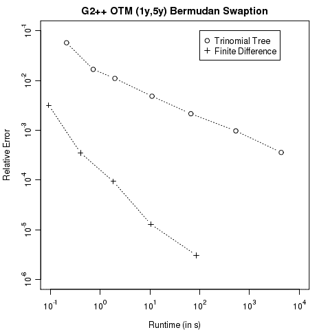
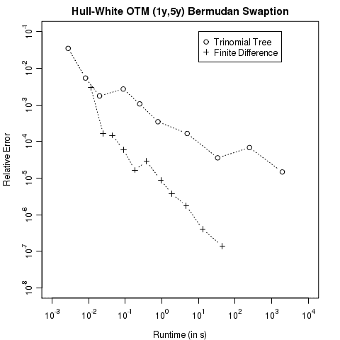

<!--yml
category: 未分类
date: 2024-05-17 23:38:50
-->

# Bermudan Swaption Pricing based on Finite Difference Methods – HPC-QuantLib

> 来源：[https://hpcquantlib.wordpress.com/2011/12/19/bermudan-swaption-pricing-based-on-finite-difference-methods/#0001-01-01](https://hpcquantlib.wordpress.com/2011/12/19/bermudan-swaption-pricing-based-on-finite-difference-methods/#0001-01-01)

Even though short rate models like the Hull-White model or the G2++ model are getting a bit long in the tooth these models are still used for risk management or as benchmark models. Since the early days QuantLib supports the pricing of Bermudan swaptions based on trinomial trees. It’s time to compare the performance and accuracy of the trinomial tree pricing algorithm with finite difference methods.

The G2++ model is defined by the following stochastic differential equation

where  is denoting the market instantaneous forward rate at time 0 for the maturity T (see. e.g. [1]). The Hull-White model can be seen as a one-dimensional simplification of the G2++ model. The corresponding partial differential equation (PDE) can be derived using the [Feynman-Kac](http://en.wikipedia.org/wiki/Feynman%E2%80%93Kac_formula) theorem.

QuantLib supports several operator splitting schemes to solve multi-dimensional PDEs.  The [SVN trunk](http://sourceforge.net/p/quantlib/code/HEAD/tree/) contains FDM engines to price Bermudan swaptions under the Hull-White and the G2++ model. Other short rate models like the CIR++ or Black-Karasinski model can be implemented in the same manner.

As can be seen in the diagrams below the finite difference method based pricing engines outperform the trinomial tree based engines.

[1] D. Brigo, F. Mercurio, [Interest Rate Models – Theory and Practice](http://www.fabiomercurio.it/contents2nd.html)