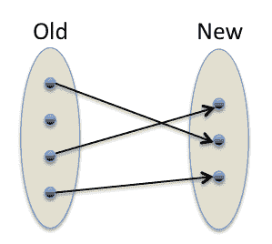
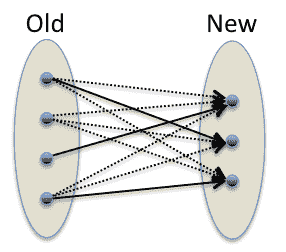
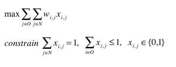
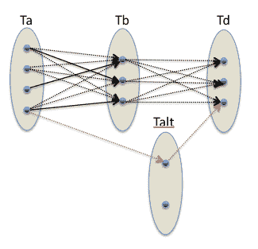

<!--yml
category: 未分类
date: 2024-05-18 15:30:19
-->

# Bipartite Matching | Tr8dr

> 来源：[https://tr8dr.wordpress.com/2011/02/17/bipartite-matching/#0001-01-01](https://tr8dr.wordpress.com/2011/02/17/bipartite-matching/#0001-01-01)

February 17, 2011 · 6:02 pm

For very low-level order analysis we try to determine continuity from one order to the next as a stream of orders across a period.   This is applicable for orders generated by a given trader (algo) that are more-or-less continually in the market.

In most cases an order near the top of book has a short lifetime, but an algo will maintain continuity through resubmission into the order book at a different price level.   This stream of orders is often masked in various ways, but often has discernable patterns, depending on the sophistication or consideration towards masking this in the algo.

Going from order deletions to new order insertions we want to attempt to match up the old and new orders (where applicable), to determine the continuity of an order stream.   We therefore want to map from an old-set to a new-set:

However, in order to determine, we have to explore all possible mappings with weights between these edges:

The optimal mapping will be one that finds the set of one-to-one edges that has maximal weight.   This is a problem in graph theory and optimisation theory.   This can be expressed rather neatly as a linear constraints problem where we have:

Where Xij is a matrix of 0 or 1, 1 indicating an edge and 0 no edge.  Wij is a corresponding matrix of weights for each edge.   Integer (or integral) linear programming solutions are classified as NP-hard and do not have an efficient algorithm.    We will be evaluating these on a relatively small # of orders each time, so the cost of a brute force solution is not bad.

The real trick is in determining the weights, representing the degree of similarity.  Going further, one may generate a tree of these (that spans out exponentially, but is trimmed regularly).   Some decisions on prior matches will be wrong and should be reevaluated holistically.

Is it worth the effort?   Depends on what information you are interested in and what your game is.   We do a mixture range ultra-high frequency to medium frequency.   This is one sub-problem of a bigger picture.

### Addendum

I should mention that the worst case brute-force approach involves examining combined weights for each permutation of edges.  This is a O(n!) algorithm that quickly becomes uncomputable.   For the specific bipartite matching problem, rather than the general Integral Linear Programming problem there are much more efficient solutions.   One of the simplest (though not the most efficient) is the “[Hungarian algorithm](http://en.wikipedia.org/wiki/Hungarian_algorithm)“.   A reader pointed out a paper for an “[online” approach](http://citeseerx.ist.psu.edu/viewdoc/download?doi=10.1.1.64.1078&rep=rep1&type=pdf) to matching as well.