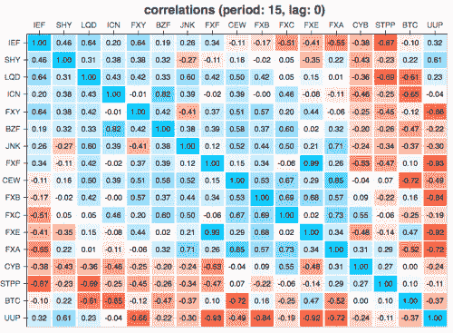
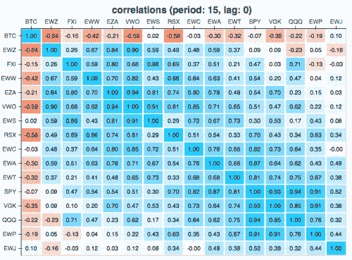
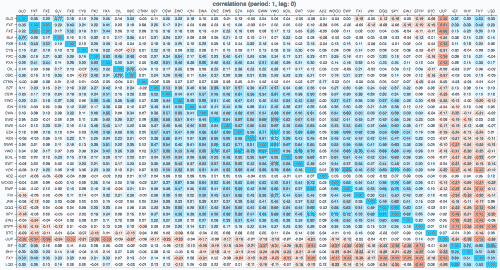
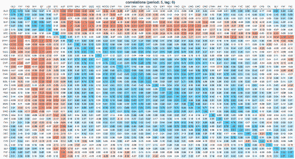
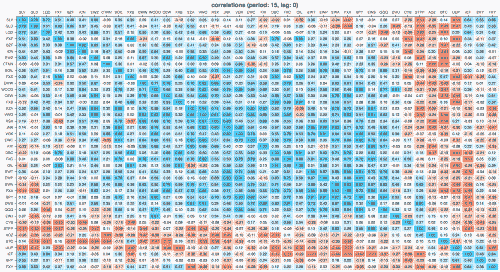

<!--yml
category: 未分类
date: 2024-05-18 15:27:57
-->

# Bitcoin, In its own Universe? | Tr8dr

> 来源：[https://tr8dr.wordpress.com/2015/03/29/bitcoin-in-its-own-universe/#0001-01-01](https://tr8dr.wordpress.com/2015/03/29/bitcoin-in-its-own-universe/#0001-01-01)

Investors are often looking for uncorrelated returns so as to better diversify.   If one looks at world indices &  equities, there is much less diversity between assets than there was a decade ago, indeed the cross-market correlations are remarkably high.

On the other hand, from a trading perspective, generally want to be able to reduce the risk by hedging or spreading against related assets.   For example in FX, when market making the G10 currencies, one typically offsets inventory risk with a position in another highly correlated currency or portfolio of currencies.

With that in mind let’s look at bitcoin (BTC) vs a variety of ETFs representing FX, IR, world indices, and commodities.

### **Correlations**

Below have computed 1day, 5day, and 15day return correlations across BTC + variety of FX, IR, Commodities, and world indices.   To reduce the impact of outliers (return spikes), made use of my Minimum Covariance Determinant covariance implementation.

**IR & FX**

[](https://tr8dr.wordpress.com/wp-content/uploads/2015/03/irfx-15.png)

**Commodities**

[](https://tr8dr.wordpress.com/wp-content/uploads/2015/03/commodities-15.png)

**World Indices**

[](https://tr8dr.wordpress.com/wp-content/uploads/2015/03/indices-15.png)

**All Together** (1day, 5days, 15days)

[](https://tr8dr.wordpress.com/wp-content/uploads/2015/03/1min.png)

[](https://tr8dr.wordpress.com/wp-content/uploads/2015/03/5min.png)

[](https://tr8dr.wordpress.com/wp-content/uploads/2015/03/15min.png)

### Cointegration

The VECM model can be used to express the co-movement of related assets across time, formulated as the change in asset prices as:

Δx[t] = δ0 + δ1 t + δ2 t² + … + Π x[t-1] + Φ1 Δx[t-1] + Φ1 Δx[t-2] + … + ε

or alternatively can be formulated as the VAR model:

x[t] = δ0 + δ1 t + δ2 t² + … + Γ1 x[t-1] + Γ2 x[t-2] + Γ3 x[t-3] + … + ε

The two variations of cointegration will look at are:

1.  constant drift, no time trend, lag 1:
    1.  x[t] = δ0 + Γ1 x[t-1] + ε
2.  constant drift + time trend, lag 1:
    1.  x[t] = δ0 + δ1 t + Γ1 x[t-1]  + ε

Finding cointegrated assets that do not drift away from each other, even “deterministically”, over time is far preferable to time-based drift.   I was not able to find any trivially cointegrated assets in my sample set, however, there were a number of assets with strong “type 2” cointegration.  Here is one of a number that showed 95% confidence:

```
BTCcoint1 = Johansen (Pbtc14[['BTC','IEF']], p=1, k=1)
BTCcoint1.critical_trace
```

|  | trace | 90% | 95% | 99% |
| --- | --- | --- | --- | --- |
| 0 | 19.298388 | 16.1619 | 18.3985 | 23.1485 |
| 1 | 5.768913 | 2.7055 | 3.8415 | 6.6349 |

```

BTCcoint1.eigenvectors
```

|  | 0 | 1 |
| --- | --- | --- |
| BTC | 0.037677 | -0.019919 |
| IEF | 0.999290 | 0.999802 |

### Findings

The key linkages between Bitcoin and other assets will be driven by investor trading patterns as opposed to fundamentals at this point.   Should Bitcoin become more of a transactional “currency” may start to see more fundamental linkages.

I am dusting off some code from a few yrs ago to create a rolling view on spread asset ratios.  Need to rework this and apply as pairs / basket strategy.   Will post some results at a later point in/out-of-sample.