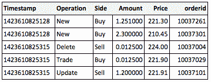
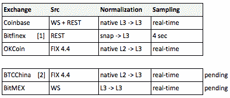

<!--yml
category: 未分类
date: 2024-05-18 15:28:22
-->

# Bitcoin L3 Feeds: Status | Tr8dr

> 来源：[https://tr8dr.wordpress.com/2015/02/10/bitcoin-l3-feeds-status/#0001-01-01](https://tr8dr.wordpress.com/2015/02/10/bitcoin-l3-feeds-status/#0001-01-01)

February 10, 2015 · 6:49 pm

I have implemented 4 bitcoin exchange interfaces now that produce a live L3 stream of orderbook updates + trades of the form:

Given the above, can reconstitute the orderbook as it moves through time, and can likewise be used to create BBO quotes and bars of different granularities.   The status of the exchange implementations is:

I am looking to run this on a remote machine (preferably linux) and write to an efficient hierarchical file-based tick DB format that I use for equities, FX, and other instruments.    Have not yet decided on a hosting service yet (welcome suggestions).

I am happy to share the collected data, though if becomes too burdensome, may need to find a way to host and serve it properly.

Once I get this running on a host, collecting data, want to get back to analysis of signals.  Will revisit new exchange implementations later.

**Notes**

[1] Bitfinex does not yet have a streaming API, so am polling the orderbook on a 4sec sample and determining the net transactions between snapshots.   Though the orderbook is sampled, no trades are missed, as queries relative to the last trade seen.   Expect that will see a new exchange implementation from AlphaPoint sometime later this year.

[2] BTCChina is implemented, however their FIX responses are not providing the documented data, so awaiting a solution from them.