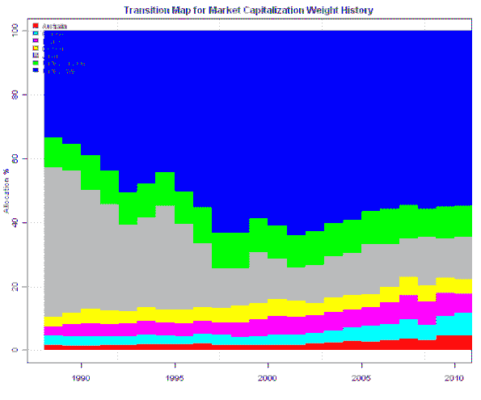
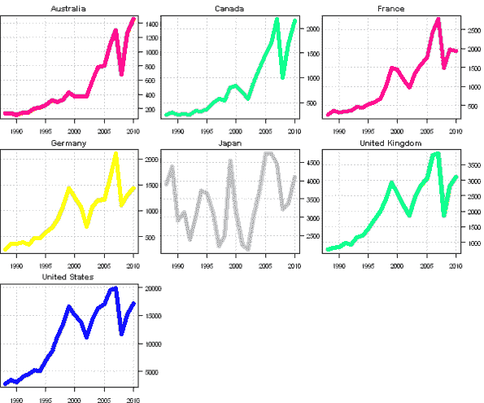
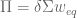
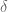
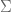
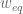
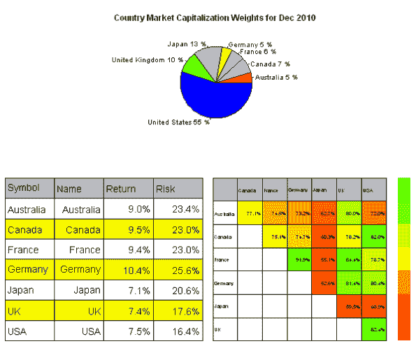
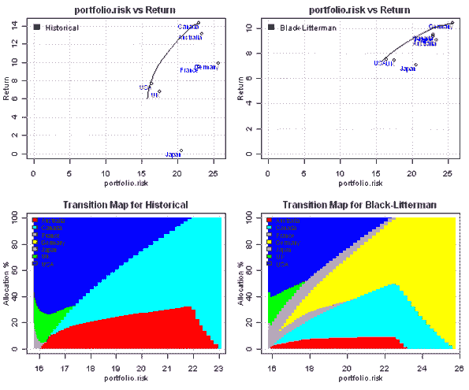
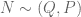
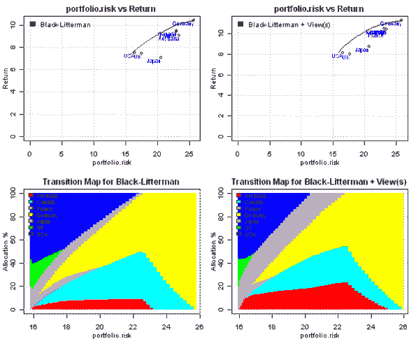

<!--yml
category: 未分类
date: 2024-05-18 14:43:55
-->

# Black-Litterman Model | Systematic Investor

> 来源：[https://systematicinvestor.wordpress.com/2011/11/16/black-litterman-model/#0001-01-01](https://systematicinvestor.wordpress.com/2011/11/16/black-litterman-model/#0001-01-01)

The [Black-Litterman Model](http://en.wikipedia.org/wiki/Black%E2%80%93Litterman_model) was created by Fischer Black and Robert Litterman in 1992 to resolve shortcomings of traditional Markowitz mean-variance asset allocation model. It addresses following two items:

*   Lack of diversification of portfolios on the mean-variance efficient frontier.
*   Instability of portfolios on the mean-variance efficient frontier: small changes in the input assumptions often lead to very different efficient portfolios.

I recommend a very good non-technical introduction to [The Black-Litterman Model, An Introduction for the Practitioner by T. Becker (2009)](http://www.styleadvisor.com/sites/default/files/IWM09JanFeb_BlackLittermanModel.pdf).

I will take the country allocation example presented in [The Intuition Behind Black-Litterman Model Portfolios by G. He, R. Litterman (1999)](http://www.cis.upenn.edu/~mkearns/finread/intuition.pdf) paper and update it using current market data.

First, I need market capitalization data for each country to compute equilibrium portfolio. I found following two sources of capitalization data:

I will use market capitalization data from World Databank.

```

# load Systematic Investor Toolbox
setInternet2(TRUE)
source(gzcon(url('https://github.com/systematicinvestor/SIT/raw/master/sit.gz', 'rb')))

	#--------------------------------------------------------------------------
	# Visualize Market Capitalization History
	#--------------------------------------------------------------------------

	hist.caps = aa.test.hist.capitalization()	
	hist.caps.weight = hist.caps/rowSums(hist.caps)

	# Plot Transition of Market Cap Weights in time
	plot.transition.map(hist.caps.weight, index(hist.caps.weight), xlab='', name='Market Capitalization Weight History')

	# Plot History for each Country's Market Cap
	layout( matrix(1:9, nrow = 3, byrow=T) )
	col = plota.colors(ncol(hist.caps))
	for(i in 1:ncol(hist.caps)) {
		plota(hist.caps[,i], type='l', lwd=5, col=col[i], main=colnames(hist.caps)[i])
	}

```

[](https://systematicinvestor.wordpress.com/wp-content/uploads/2011/11/plot1-small4.png)

[](https://systematicinvestor.wordpress.com/wp-content/uploads/2011/11/plot2-small4.png)

There is a major shift in weights between Japan and USA from 1988 to 2010\. In 1988 Japan represented 47% and USA 33%. In 2010 Japan represents 13% and USA 55%. The shift was driven by inflow of capital to USA, the Japaneses capitalization was pretty stable in time, as can be observed from time series plot for each country.

Second, I need historical prices series for each country to compute covariance matrix. I will use historical data from [Yahoo Fiance](http://finance.yahoo.com):

The first step of the Black-Litterman model is to find implied equilibrium returns using reverse optimization.



where  are equilibrium returns,  is risk aversion,  is covariance matrix, and  are market capitalization weights. The risk aversion parameter can be estimated from historical data by dividing the excess market portfolio return by its variance.

```

# Use reverse optimization to compute the vector of equilibrium returns
bl.compute.eqret <- function
(
	risk.aversion, 	# Risk Aversion
	cov, 		# Covariance matrix
	cap.weight, 	# Market Capitalization Weights
	risk.free = 0	# Rsik Free Interest Rate
)
{
	return( risk.aversion * cov %*% cap.weight +  risk.free)	
}

	#--------------------------------------------------------------------------
	# Compute Risk Aversion, prepare Black-Litterman input assumptions
	#--------------------------------------------------------------------------
	ia = aa.test.create.ia.country()

	# compute Risk Aversion
	risk.aversion = bl.compute.risk.aversion( ia$hist.returns$USA )

	# the latest market capitalization weights
	cap.weight = last(hist.caps.weight)	

	# create Black-Litterman input assumptions	
	ia.bl = ia
	ia.bl$expected.return = bl.compute.eqret( risk.aversion, ia$cov, cap.weight )

	# Plot market capitalization weights and implied equilibrium returns
	layout( matrix(c(1,1,2,3), nrow=2, byrow=T) )
	pie(coredata(cap.weight), paste(colnames(cap.weight), round(100*cap.weight), '%'), 
		main = paste('Country Market Capitalization Weights for', format(index(cap.weight),'%b %Y'))
		, col=plota.colors(ia$n))

	plot.ia(ia.bl, T)

```

[](https://systematicinvestor.wordpress.com/wp-content/uploads/2011/11/plot3-small3.png)

Next, let’s compare the efficient frontier created using historical input assumptions and Black-Litterman input assumptions

```

	#--------------------------------------------------------------------------
	# Create Efficient Frontier(s)
	#--------------------------------------------------------------------------
	n = ia$n

	# -1 <= x.i <= 1
	constraints = new.constraints(n, lb = 0, ub = 1)

	# SUM x.i = 1
	constraints = add.constraints(rep(1, n), 1, type = '=', constraints)		

	# create efficient frontier(s)
	ef.risk = portopt(ia, constraints, 50, 'Historical', equally.spaced.risk = T)		
	ef.risk.bl = portopt(ia.bl, constraints, 50, 'Black-Litterman', equally.spaced.risk = T)	

	# Plot multiple Efficient Frontiers and Transition Maps
	layout( matrix(1:4, nrow = 2) )
	plot.ef(ia, list(ef.risk), portfolio.risk, T, T)			
	plot.ef(ia.bl, list(ef.risk.bl), portfolio.risk, T, T)			

```

[](https://systematicinvestor.wordpress.com/wp-content/uploads/2011/11/plot4-small1.png)

Comparing the transition maps, the Black-Litterman efficient portfolios are well diversified. Efficient portfolios have allocation to all asset classes at various risk levels. By its construction, the Black-Litterman model is well suited to address the diversification problems.

The Black-Litterman model also introduces a mechanism to incorporate investor’s views into the input assumptions in such a way that small changes in the input assumptions will NOT lead to very different efficient portfolios. The Black-Litterman model adjusts expected returns and covariance:

![\bar{\mu} = \left [ (\tau \Sigma)^{-1}+P'\Omega^{-1}P \right ]^{-1}  \left [ (\tau \Sigma)^{-1}\Pi + P'\Omega^{-1}Q  \right ]  \newline\newline  \bar{\Sigma}=\Sigma+\left [ (\tau \Sigma)^{-1}+P'\Omega^{-1}P \right ]^{-1}   ](img/e960f9efabadbe868d19331626495be2.png)

where P is Views pick matrix, and Q Views mean vector. The Black-Litterman model assumes that views are .

```

bl.compute.posterior <- function
(
	mu, 		# Equilibrium returns
	cov, 		# Covariance matrix
	pmat=NULL, 	# Views pick matrix
	qmat=NULL, 	# Views mean vector
	tau=0.025 	# Measure of uncertainty of the prior estimate of the mean returns
)
{
	out = list()	
	omega = diag(c(1,diag(tau * pmat %*% cov %*% t(pmat))))[-1,-1]

	temp = solve(solve(tau * cov) + t(pmat) %*% solve(omega) %*% pmat)	
	out$cov = cov + temp

	out$expected.return = temp %*% (solve(tau * cov) %*% mu + t(pmat) %*% solve(omega) %*% qmat)
	return(out)
}

	#--------------------------------------------------------------------------
	# Create Views
	#--------------------------------------------------------------------------
	temp = matrix(rep(0, n), nrow = 1)
		colnames(temp) = ia$symbols

	# Relative View
	# Japan will outperform UK by 2%
	temp[,'Japan'] = 1
	temp[,'UK'] = -1

	pmat = temp
	qmat = c(0.02)

	# Absolute View
	# Australia's expected return is 12%
	temp[] = 0
	temp[,'Australia'] = 1

	pmat = rbind(pmat, temp)	
	qmat = c(qmat, 0.12)

	# compute posterior distribution parameters
	post = bl.compute.posterior(ia.bl$expected.return, ia$cov, pmat, qmat, tau = 0.025 )

	# create Black-Litterman input assumptions with Views	
	ia.bl.view = ia.bl
		ia.bl.view$expected.return = post$expected.return
		ia.bl.view$cov = post$cov
		ia.bl.view$risk = sqrt(diag(ia.bl.view$cov))

	# create efficient frontier(s)
	ef.risk.bl.view = portopt(ia.bl.view, constraints, 50, 'Black-Litterman + View(s)', equally.spaced.risk = T)	

	# Plot multiple Efficient Frontiers and Transition Maps
	layout( matrix(1:4, nrow = 2) )
	plot.ef(ia.bl, list(ef.risk.bl), portfolio.risk, T, T)			
	plot.ef(ia.bl.view, list(ef.risk.bl.view), portfolio.risk, T, T)			

```

[](https://systematicinvestor.wordpress.com/wp-content/uploads/2011/11/plot5-small1.png)

Comparing the transition maps, the Black-Litterman + Views efficient portfolios have more allocation to Japan and Australia, as expected. The portfolios are well diversified and are not drastically different from the Black-Litterman efficient portfolios.

The Black-Litterman model provides an elegant way to resolve shortcomings of traditional Markovitz mean-variance asset allocation model based on historical input assumptions. It addresses following two items:

*   Lack of diversification of portfolios on the mean-variance efficient frontier. The Black-Litterman model uses equilibrium returns implied from the current market capitalization weighs to construct well diversified portfolios.
*   Instability of portfolios on the mean-variance efficient frontier. The Black-Litterman model introduces a mechanism to incorporate investor’s views into the input assumptions in such a way that small changes in the input assumptions will NOT lead to very different efficient portfolios.

I highly recommend exploring and reading following articles and websites for better understanding of the Black-Litterman model:

To view the complete source code for this example, please have a look at the [aa.black.litterman.test() function in aa.test.r at github](https://github.com/systematicinvestor/SIT/blob/master/R/aa.test.r).