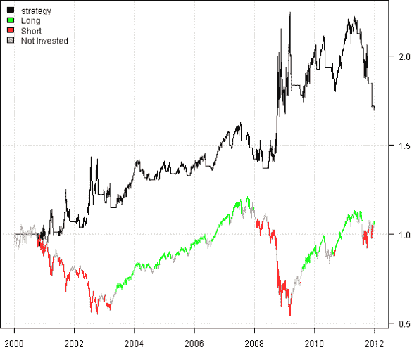
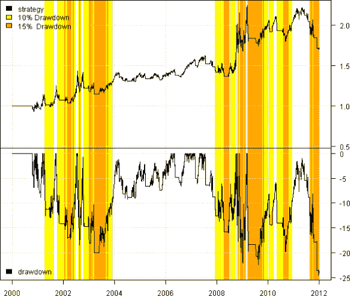
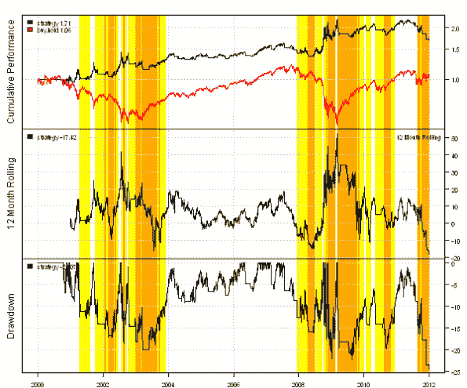

<!--yml
category: 未分类
date: 2024-05-18 14:41:25
-->

# Borrowing Ideas from Timely Portfolio | Systematic Investor

> 来源：[https://systematicinvestor.wordpress.com/2012/04/16/borrowing-ideas-from-timely-portfolio/#0001-01-01](https://systematicinvestor.wordpress.com/2012/04/16/borrowing-ideas-from-timely-portfolio/#0001-01-01)

I want to highlight two great Visualization techniques I discovered by reading the fine blog from [Timely Portfolio](http://timelyportfolio.blogspot.com).

First method is based on the [lm System on Nikkei with New Chart](http://timelyportfolio.blogspot.ca/2011/08/lm-system-on-nikkei-with-new-chart.html). Let’s visualize Strategy’s Long/Short/Not Invested periods by highlighting the underlying (i.e. buy & hold) with green/red/gray. Following is a sample code that implements this idea using [Systematic Investor Toolbox](https://github.com/systematicinvestor/SIT).

```

###############################################################################
# Load Systematic Investor Toolbox (SIT)
# https://systematicinvestor.wordpress.com/systematic-investor-toolbox/
###############################################################################
con = gzcon(url('http://www.systematicportfolio.com/sit.gz', 'rb'))
    source(con)
close(con)

	#*****************************************************************
	# Load historical data
	#****************************************************************** 
	load.packages('quantmod')	
	tickers = spl('SPY')

	data <- new.env()
	getSymbols(tickers, src = 'yahoo', from = '1970-01-01', env = data, auto.assign = T)
		for(i in ls(data)) data[[i]] = adjustOHLC(data[[i]], use.Adjusted=T)		
	bt.prep(data, align='keep.all', dates='2000::2011')

	#*****************************************************************
	# Code Strategies
	#****************************************************************** 
	prices = data$prices    

	# Buy & Hold	
	data$weight[] = 1
	buy.hold = bt.run(data)	

	# Strategy
	ma10 = bt.apply.matrix(prices, EMA, 10)
	ma50 = bt.apply.matrix(prices, EMA, 50)
	ma200 = bt.apply.matrix(prices, EMA, 200)
	data$weight[] = NA;
		data$weight[] = iif(ma10 > ma50 & ma50 > ma200, 1, 
				iif(ma10 < ma50 & ma50 < ma200, -1, 0))
	strategy = bt.run.share(data, clean.signal=F)	

	#*****************************************************************
	# Visualization of system Entry and Exit based on
	# http://timelyportfolio.blogspot.ca/2011/08/lm-system-on-nikkei-with-new-chart.html
	#****************************************************************** 	
	layout(1)
	plota(strategy$eq, type='l', ylim=range(buy.hold$eq,strategy$eq))

	col = iif(strategy$weight > 0, 'green', iif(strategy$weight < 0, 'red', 'gray'))
	plota.lines(buy.hold$eq, type='l', col=col)			
		plota.legend('strategy,Long,Short,Not Invested','black,green,red,gray')		

```

[](https://systematicinvestor.wordpress.com/wp-content/uploads/2012/04/plot1-small1.png)

We can visually attribute from the plot periods when Strategy is Long/Short/Not Invested.

Another method is based on the [Drawdown Visualization](http://timelyportfolio.blogspot.ca/2011/08/drawdown-visualization.html) . Let’s visualize Drawdowns by highlighting periods when drawdown is large than 10% with yellow and larger than 15% with orange.

```

	#*****************************************************************	
	# Drawdown Visualization 
	# 10% drawdowns in yellow and 15% drawdowns in orange
	# http://timelyportfolio.blogspot.ca/2011/08/drawdown-visualization.html
	#*****************************************************************	
	layout(1:2)
	drawdowns = compute.drawdown(strategy$eq)
	highlight = drawdowns < -0.1

	plota.control$col.x.highlight = iif(drawdowns < -0.15, 'orange', iif(drawdowns < -0.1, 'yellow', 0))	

	plota(strategy$eq, type='l', plotX=F, x.highlight = highlight, ylim=range(buy.hold$eq,strategy$eq))
		plota.legend('strategy,10% Drawdown,15%  Drawdown','black,yellow,orange')

	plota(100*drawdowns, type='l', x.highlight = highlight)
		plota.legend('drawdown', 'black', x='bottomleft')

```

[](https://systematicinvestor.wordpress.com/wp-content/uploads/2012/04/plot2-small1.png)

The next logical step is to introduce highlighting into the backtest plots. This is extremely easy to do because I use plota library to create backtesting reports.

```

	#*****************************************************************
	# Create Report
	#****************************************************************** 		
	plota.control$col.x.highlight = iif(drawdowns < -0.15, 'orange', iif(drawdowns < -0.1, 'yellow', 0))				
	highlight = drawdowns < -0.1

	plotbt.custom.report.part1(strategy, buy.hold, x.highlight = highlight)

```

[](https://systematicinvestor.wordpress.com/wp-content/uploads/2012/04/plot3-small1.png)

Please let me know what other Visualization techniques do you use.

To view the complete source code for this example, please have a look at the [bt.timelyportfolio.visualization.test() function in bt.test.r at github](https://github.com/systematicinvestor/SIT/blob/master/R/bt.test.r).