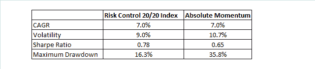
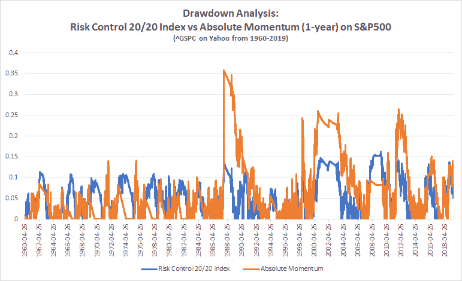

<!--yml
category: 未分类
date: 2024-05-12 17:41:26
-->

# Building a Risk Control Index with Drawdown Protection (Part 1) | CSSA

> 来源：[https://cssanalytics.wordpress.com/2019/07/09/building-a-risk-control-index-with-drawdown-protection-part-1/#0001-01-01](https://cssanalytics.wordpress.com/2019/07/09/building-a-risk-control-index-with-drawdown-protection-part-1/#0001-01-01)

**Introduction**

Both trend-following and absolute momentum are well established methods for managing risk. Another method for managing risk is to use volatility targeting. The former are superior for reducing large drawdowns in bear markets while the latter tends to reduce kurtosis by normalizing the daily bet size. The combination of the two tends to increase the sharpe ratio while generally reducing both kurtosis and skew. For a great review of the subject check out [Rob Carver’s post](https://qoppac.blogspot.com/2018/07/vol-targeting-and-trend-following.html). One of the concepts Rob brings up is that part of the challenge of trend-following and absolute momentum is that they are binary in nature– you are either “all-in” or “all-out” and this is suboptimal.

There are no magical numbers in finance- if the 1 year excess return of the stock market is 1% does this mean that you should have the same conviction as if it is up 10% or more? Clearly the slope has some relationship with forward risk. Is a -1% excess return that much worse than a 1% excess return? These levels are more arbitrary than you think. Exiting or reducing a position can be done profitably at a wide range of levels.

Another disadvantage of binary trend/momentum systems from a variance or luck standpoint is that by going all-in or all-out you can be hurt a lot more by the arbitrary execution timing of any one trade. (One way to reduce this problem is to use multiple lookbacks for a good review see this [post by Newfound Research](https://blog.thinknewfound.com/2019/01/tightening-the-uncertain-payout-of-trend-following/). This is also used within our [“Trend Strength” indicator within Investor IQ](https://cssanalytics.wordpress.com/investor-iq-etf-digest/)) In contrast a strategy that employs a continuous position size has the benefit of scaling exposure as a function of conviction and is less susceptible to timing risk.

Lastly, the biggest challenge to trend/momentum systems is that **they are not tied directly to any financial or risk-based objective**. There is no limit on how much you can lose in any given time frame given either repeated whipsaws or large short-term corrections that occur before your signals trigger. In high momentum markets or situations like 1987, this added tail-risk can be significant as the binary trend/momentum signals will often still be 100% invested.

**Risk Control**

The concept of risk control is used more frequently in the annuity market or in various programs run by insurance companies to manage equity risk. Typically these are exactly the same as using volatility targeting ([see this example here](http://www.annuityadvisors.com/forms/great-american/S&P-500-Risk-Control-Index.pdf)). However, there are more exotic strategies that add a type of dynamic overlay in order to further reduce risk. Regardless of the exact method used, this second layer is designed to be a form of drawdown protection. This feature is important given that a traditional risk control/vol targeting with a moderate risk profile will still have plenty of equity exposure through bear markets.

To build a risk control index with drawdown protection, I propose that investors use a drawdown target or “floor” that has some time frame attached to it. For example, many investors have a risk preference for not losing more than -20% on their portfolio in one year (this choice of floor and lookback is optional). You can directly control for this risk by scaling the size of your positions as a function of the current drawdown of your portfolio’s equity curve. This method roughly mimics a synthetic put option designed to insure losses below -20%. Here are the steps to building a risk control index with drawdown protection. For this example we can call this the “**Risk Control 20/20 Index**” (20% risk target, 20% drawdown target):

**STEP 1**: **Risk Exposure (RE):** Develop a volatility targeting method with a chosen volatility forecast or realized volatility forecast window (I chose 20-day realized historical in this example). Scale positions by target volatility (20% in this case) divided by current volatility whereby there is some maximum leverage permitted (no leverage in this case). Track the equity curve of this strategy for step #2

**STEP 2**: **Drawdown Exposure (DE):** Choosing some target drawdown (I chose 20% in this example) the equity “floor” (F) is equal to 1 minus the target drawdown. The current equity level (CE) is the value of yesterday’s risk control/vol target equity curve divided by the maximum price over the past n-days (I chose 1-year for this example). The formula for drawdown exposure (DE) is: **MAX((1/(1-F)) x (CE-F)),0)**

**STEP 3: Total Exposure (TE):** The final portfolio exposure that gets applied for the following day is calculated as: **TE= RE x DE**

The advantage of this approach is that you respond in a continuous manner to market drawdowns while scaling by volatility to improve risk-adjusted returns. Keep in mind that a 20% risk target and a 20% floor is fairly generous, so we can readily compare this Risk Control 20/20 index to standard absolute momentum (1-year return minus t-bills). The results of this comparison applied to the S&P500 index can be seen in the table below using daily execution to avoid bias (the choice of index price data allows for observing action across a wider array of different market regimes):

Both methods have nearly equal performance, but the Risk Control 20/20 index has better risk statistics with lower volatility, higher sharpe ratio and a much lower maximum drawdown. It is hard to see the difference between the two equity curves, but the rolling drawdown analysis is far more revealing:

In this chart you can clearly see that the Risk Control 20/20 Index does a much better job of controlling large drawdowns. In fact, the largest drawdown for absolute momentum occurred in 1987, when momentum was high and the signal failed to change in time for the crash. In contrast, the risk control index gradually shifted to a lower level of equity exposure. There are several other large drawdowns in the last thirty years where the risk control index with drawdown protection was superior owing to its ability to continuously size positions. *Of course nothing can prevent against jump risk or large one day declines*, but for most cases in theory the risk control index with drawdown protection should provide more explicit protection for investors. In the next post we will look at various methods to improve upon this original method along with some heuristics to make it more practical for real trading.