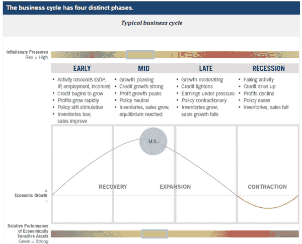
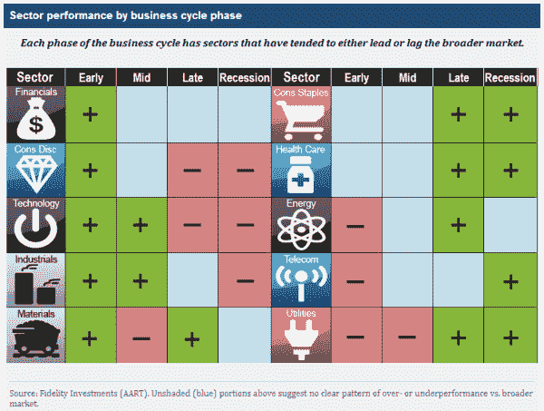
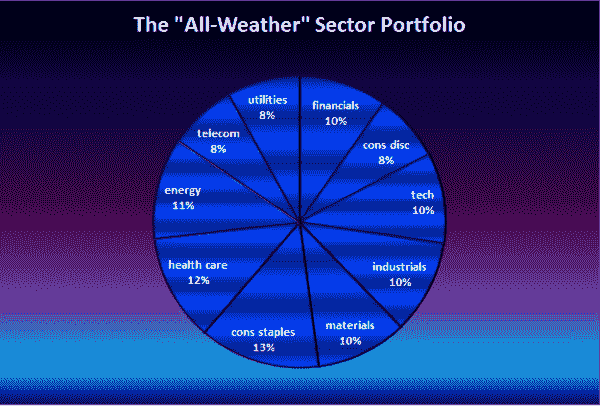

<!--yml
category: 未分类
date: 2024-05-12 18:01:33
-->

# Building an “All-Weather” Sector Portfolio | CSSA

> 来源：[https://cssanalytics.wordpress.com/2013/02/11/building-an-all-weather-sector-portfolio/#0001-01-01](https://cssanalytics.wordpress.com/2013/02/11/building-an-all-weather-sector-portfolio/#0001-01-01)

The central concept of the [“All-Weather” portfolio](https://cssanalytics.wordpress.com/2012/11/07/the-all-weather-portfolio-derivation/ "The “All-Weather” Portfolio Derivation") is balance: having an allocation that will perform equally well across different economic regimes.  The original portfolio balances portfolio risk and performance with broad asset classes to be neutral to changes in  economic growth and inflation.This basic concept can be extended to create an “All-Weather” equity sector portfolio. One of the traditional ways to look at sector rotation  is to use the economic “business-cycle” to determine which sectors are the most favorable. In this view, the economy goes through four distinct phases that progress in sequential order and repeat in a multi-year cycle: 1) early 2) mid 3) late and 4) recession. In this context, economic growth is highest at the earliest stages and the rate of change declines as the business cycle progresses. Inflation is low at the earliest stages and builds over time to the point where there is “over-heating” at the late stage prior to a recession where inflationary pressures cool down.   Fidelity has [conducted a study](https://www.fidelity.com/viewpoints/how-to-use-business-cycle) spanning over 50 years to determine the sectors that perform best in each stage. Below is a graphic (*Source:* Fidelity Asset Allocation Research) that depicts the business cycle and the expected relative sector performance by stage:

The [results of the study](https://www.fidelity.com/viewpoints/how-to-use-business-cycle) indicate some very robust and significant differences in sector performance. ***The problem with applying this approach is that there is considerable uncertainty as to both which stage the economy is at in a given point of time and how long the current business cycle will last (they can vary from 6 months to several years)*.** It therefore makes logical sense  to create a sector portfolio that is effectively neutral to the business cycle– an **“All-Weather” Sector portfolio**. This can be accomplished by generating four different portfolios that perform the best in each stage of the cycle and then weight them to account for differences in stage length and performance. The resulting portfolio should perform very well over time with greater consistency than a more naaive allocation.

To create the “All-Weather” Sector Portfolio, I used a simple scoring system to capture relative differences in sector and stage performance. The choice of  using a ranking/scoring model in favor of the actual data avoids the noise associated with using past sector returns and also the historical stage of cycle lengths which can be more difficult to extrapolate in terms of raw magnitude. Theoretically, the relative favorability and length of cycle should be more stable. Both the length of stage and relative performance by stage are ranked (highest to lowest). The cumulative weight is generating by multiplying the length ranking by the relative performance ranking. This determines the relative weighting of each of the four portfolios (early, mid, late and recession). Within each portfolio, each sector is assigned a score according to relative favorability. A score of 3 is given to the historically best performing sector for a given stage, a score of 2 is given to sectors that have outperformed significantly, a score of 1 is given to sectors that have neutral performance (match the market) and a score of 0 is given to sectors that have historically under-performed the market. I have compiled a [All Weather Sector Worksheet](https://cssanalytics.files.wordpress.com/2013/02/all-weather-sector-worksheet.xlsx) to show the breakdown of the calculations in greater detail. Below is the final composite and allocation breakdown of the “All-Weather” Sector Portfolio:

