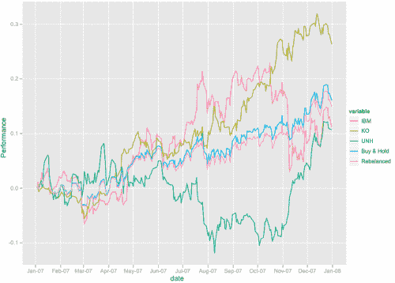

<!--yml
category: 未分类
date: 2024-05-18 15:35:59
-->

# CRP = CR*P? | Tr8dr

> 来源：[https://tr8dr.wordpress.com/2009/12/17/crp-crp/#0001-01-01](https://tr8dr.wordpress.com/2009/12/17/crp-crp/#0001-01-01)

Procrastinating on a hard problem, I decided to take a brief diversion to look at Constant Rebalanced Portfolios and Universal Portfolios, lured by Max Dama’s [post](http://www.maxdama.com/2009/12/universal-portfolio-thesis.html) on UP (Universal Portfolios).   I had read papers on these in the past but never explored them empirically.

CRP is the underpinning of Universal Portfolios, so will focus on CRPs.   Simply stated the CRP approach allocates a fixed % of capital to each asset in the portfolio.   The portfolio is rebalanced each period as some assets will have disproportionally increased or decreased in value.   As Max points out, this is basically a mean-reversion scheme.

Unfortunately, this is a “blind” mean-reversion scheme in the sense that there is no measure of the likelihood of mean-reversion or the period over which it will take place.   The implicit assumption is that mean-reversion will occur between rebalancing periods.    The more worrying aspect is that money in “winning” assets will be diverted to “losing” assets (where by losing, refer to assets that trend downward with little MR in the upward direction).

**Examples** The classic (and absurd) example where CRP does phenomenally well, is of a pair of assets where one asset is constant and the other asset appreciates and depreciates on alternating periods (in this case up 25% and down 25% repeatedly).   Needless to say, this provides exponential growth (I could only plot the first 100 days without obscuring the other detail):

**Empirical Tests** I did not find that CRP did much better than the equivalent Buy & Hold portfolio with the same weightings.  Indeed, depending on transaction costs, could do significantly worse.     There are some asset sets, undoubtedly, that would do much better than Buy & Hold over specific periods, but would be few and far between given the fragility of CRP assumptions.

**Making the Concept Work** The CRP concept is one of moving money away from assets we expect will mean-revert (in the negative direction) and increasing money in assets that will mean-revert (in the positive direction).   This is done in a rigid fashion and makes no observation as to whether a devaluing asset is likely to mean-revert in the next period.

It had occurred to me that modifying the rebalancing to take into account the likelihood of mean-reversion or more generally, the likelihood of appreciation or depreciation in the next period would be a better guide in rebalancing the portfolio.    Of course, the performance of such a scheme depends on the degree of accuracy of such measures.

Not surprisingly, there has been work in this area, for instance the ANTICOR algorithm described by (Borodin, El-Taniv, and Gogan) in “Can We Learn to Beat the Best Stock”.    Their approach is to use the autocorrelation and cross-correlation of prior periods to adjust the portfolio weighting in a CRP portfolio.

The fragility in this approach is two-fold:

1.  relies on fixed windows as a means to determine correlation or anti-correlation
    I would expect that mean-reversion cycle periods would differ for different assets.   That said, they need a way to compare across assets, so may be a reasonable compromise.
2.  correlation is a coarse measure
    There are other measures that may be more effective in determining future mean-reversion or direction.

That said, the approach is parsimonious and seems to have performed quite well in the empirical tests.

**Pattern / Sequence Learning Approaches** There have been a number of papers describing approaches where the choice of weightings for the portfolio in the next period is determined based on finding prior patterns that match the current local pattern in past data.   I.e. the prior K returns are converted to a series of symbols and compared to historical sequences.   One attempts to locate the approximate sequence one or more more times in past history and observe the optimal portfolio weights that maximized cumulative return in the past.    This is repeated with varying length and discretization “fuzziness”.

The observed weights are blended based on the performance of the past weightings and degree of match with the current sequence.    The authors point to excellent results on empirical data.   It is surprising that there is a reasonable amount of information in the daily returns, I had thought would be more dominated by noise.

**One Final Note** Although I have been “disparaging”  CRP, it can be shown that some weighting of CRP will yield the most optimal portfolio provided returns are i.i.d.   There lies the rub.