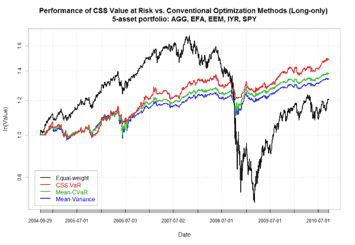

<!--yml
category: 未分类
date: 2024-05-12 18:17:18
-->

# CSS Value at Risk (CSS VaR): Improving Upon Popular Portfolio Optimization Procedures | CSSA

> 来源：[https://cssanalytics.wordpress.com/2010/10/07/css-value-at-riskcss-var-improving-upon-popular-portfolio-optimization-procedures/#0001-01-01](https://cssanalytics.wordpress.com/2010/10/07/css-value-at-riskcss-var-improving-upon-popular-portfolio-optimization-procedures/#0001-01-01)

*David Varadi with Henry Bee*

Having spent the bulk of research efforts at CSS on alpha-generating strategies, we decided to allocate some time towards the burgeoning  field of portfolio allocation and risk-management technology. In this case our approach to the problem was similar to what we have typically done in the past: 1) question key assumptions underlying conventional theory 2) modify unsuitable assumptions to account for the “real-world” of financial markets. Surprisingly these modifications were especially prominent in improving conventional optimization procedures. In this case our goal was to have higher returns with less risk and more importantly–a lower probability of a major drawdown. The “Value-at-Risk” framework was immediately appealing and we created an algorithm around this concept. In this test we used identical return inputs into each model, and thus we did not try to improve optimization through superior return inputs. Instead we focused on the engineering concept itself. We compare our model– CSS Value at Risk or CSS VaR using the industry version of CVaR and conventional Markowitz mean-variance optimization. So far in our testing, our method is universally superior due to some key properties that make it better suited to financial data. In this test, we used five different major asset classes via ETFs with the three different optimization methods. The result was superior return relative to risk and a lower maximum drawdown to the other methods. While this may not seem like an exciting result to traders, it is important to consider that using for example good systems or relative strength as inputs for expected returns would substantially boost the performance of all three models. Ultimately most of us pay too little attention to portfolio allocation and risk management, when this is the only true “free lunch” in financial markets.

