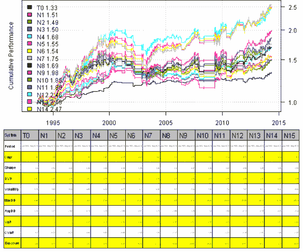
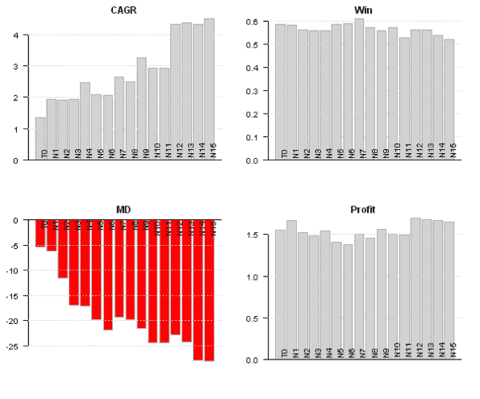
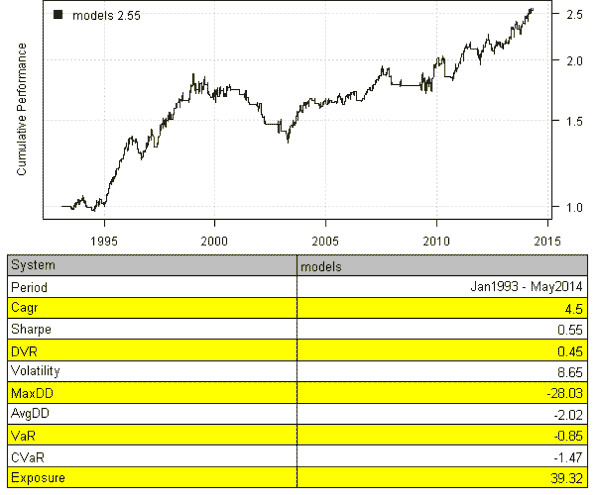
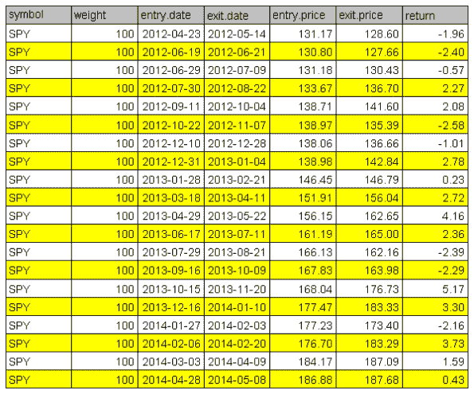
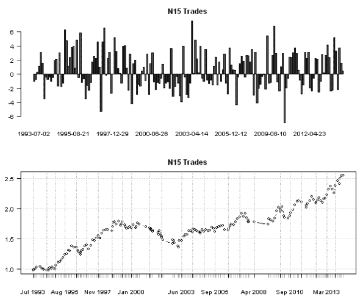

<!--yml
category: 未分类
date: 2024-05-18 14:29:54
-->

# Calendar Strategy: Fed Days | Systematic Investor

> 来源：[https://systematicinvestor.wordpress.com/2014/05/06/calendar-strategy-fed-days/#0001-01-01](https://systematicinvestor.wordpress.com/2014/05/06/calendar-strategy-fed-days/#0001-01-01)

**UPDATE**: I was pointed out a problem with original post due to look ahead bias introduced by prices > SMA(prices,100) statement. In the calendar strategy logic I did not use a usual lag of one day because important days are known before hand. However, the prices > SMA(prices,100) statement should be lagged by one day. I updated plots and source code.

Today, I want to follow up with the [Calendar Strategy: Option Expiry](https://systematicinvestor.wordpress.com/2014/05/03/calendar-strategy-option-expiry/) post. Let’s examine the importance of the [FED meeting](http://www.federalreserve.gov/monetarypolicy/fomccalendars.htm) days as presented in the [Fed Days And Intermediate-Term Highs](http://quantifiableedges.blogspot.ca/search/label/Fed%20Study) post.

Let’s dive in and examine historical perfromance of SPY during [FED meeting](http://www.federalreserve.gov/monetarypolicy/fomccalendars.htm) days:

```

###############################################################################
# Load Systematic Investor Toolbox (SIT)
# https://systematicinvestor.wordpress.com/systematic-investor-toolbox/
###############################################################################
setInternet2(TRUE)
con = gzcon(url('http://www.systematicportfolio.com/sit.gz', 'rb'))
    source(con)
close(con)
	#*****************************************************************
	# Load historical data
	#****************************************************************** 
	load.packages('quantmod')

	tickers = spl('SPY')

	data <- new.env()
	getSymbols.extra(tickers, src = 'yahoo', from = '1980-01-01', env = data, set.symbolnames = T, auto.assign = T)
		for(i in data$symbolnames) data[[i]] = adjustOHLC(data[[i]], use.Adjusted=T)
	bt.prep(data, align='keep.all', fill.gaps = T)

	#*****************************************************************
	# Setup
	#*****************************************************************
	prices = data$prices
		n = ncol(prices)

	dates = data$dates	

	models = list()

	universe = prices > 0
		# 100 day SMA filter
		universe = universe & prices > SMA(prices,100)

	# Find Fed Days
	info = get.FOMC.dates(F)
		key.date.index = na.omit(match(info$day, dates))

	key.date = NA * prices
		key.date[key.date.index,] = T

	#*****************************************************************
	# Strategy
	#*****************************************************************
	signals = list(T0=0)
		for(i in 1:15) signals[[paste0('N',i)]] = 0:i	
	signals = calendar.signal(key.date, signals)
	models = calendar.strategy(data, signals, universe = universe)

	strategy.performance.snapshoot(models, T, sort.performance=F)

```

[](https://systematicinvestor.wordpress.com/wp-content/uploads/2014/05/plot12.png)

Please note 100 day moving average filter above. If we take it out, the performance deteriorates significantly.

```

	# custom stats	
	out = sapply(models, function(x) list(
		CAGR = 100*compute.cagr(x$equity),
		MD = 100*compute.max.drawdown(x$equity),
		Win = x$trade.summary$stats['win.prob', 'All'],
		Profit = x$trade.summary$stats['profitfactor', 'All']
		))	
	performance.barchart.helper(out, sort.performance = F)

	strategy.performance.snapshoot(models$N15, control=list(main=T))

	last.trades(models$N15)

	trades = models$N15$trade.summary$trades
		trades = make.xts(parse.number(trades[,'return']), as.Date(trades[,'entry.date']))
	layout(1:2)
		par(mar = c(4,3,3,1), cex = 0.8) 
	barplot(trades, main='N15 Trades', las=1)
	plot(cumprod(1+trades/100), type='b', main='N15 Trades', las=1)

```

**N15 Strategy:**

[](https://systematicinvestor.wordpress.com/wp-content/uploads/2014/05/plot22.png)

[](https://systematicinvestor.wordpress.com/wp-content/uploads/2014/05/plot32.png)

[](https://systematicinvestor.wordpress.com/wp-content/uploads/2014/05/plot42.png)

[](https://systematicinvestor.wordpress.com/wp-content/uploads/2014/05/plot52.png)

With this post I wanted to show how easily we can study calendar strategy performance using the [Systematic Investor Toolbox](https://systematicinvestor.wordpress.com/systematic-investor-toolbox/).

Next, I will look at the importance of the [Dividend](http://en.wikipedia.org/wiki/Dividend) days.

To view the complete source code for this example, please have a look at the [bt.calendar.strategy.fed.days.test() function in bt.test.r at github](https://github.com/systematicinvestor/SIT/blob/master/R/bt.test.r).