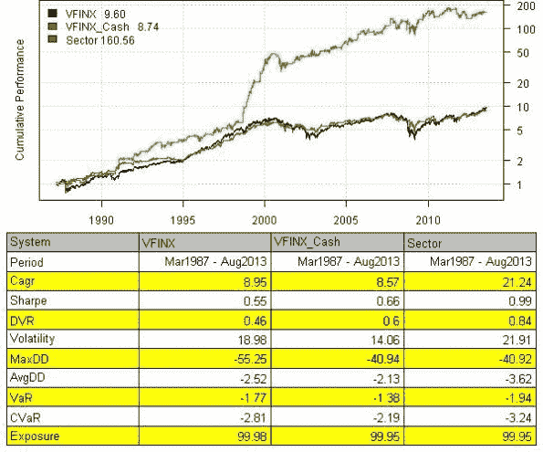
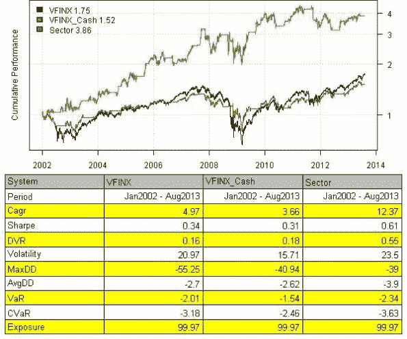

<!--yml
category: 未分类
date: 2024-05-18 14:32:11
-->

# Calendar-based Sector Strategy | Systematic Investor

> 来源：[https://systematicinvestor.wordpress.com/2013/08/05/calendar-based-sector-strategy/#0001-01-01](https://systematicinvestor.wordpress.com/2013/08/05/calendar-based-sector-strategy/#0001-01-01)

I recently came across the [Kaeppel’s Sector Seasonality Strategy](http://www.cxoadvisory.com/2785/calendar-effects/kaeppels-sector-seasonality-strategy/) which is described in [Kaeppel’s Corner: Sector Seasonality](http://www.optionetics.com/marketdata/article.aspx?aid=13623) and updated in [Kaeppel’s Corner: Get Me Back, Clarence](http://www.optionetics.com/marketdata/article.aspx?aid=18343).

Today I want to show how to back-test the [Kaeppel’s Sector Seasonality Strategy](http://www.cxoadvisory.com/2785/calendar-effects/kaeppels-sector-seasonality-strategy/) using the [Systematic Investor Toolbox](https://systematicinvestor.wordpress.com/systematic-investor-toolbox/). Following are the strategy rules:

*   Buy Fidelity Select Technology (FSPTX) at the October close.
*   Switch from FSPTX to Fidelity Select Energy (FSENX) at the January close.
*   Switch from FSENX to cash at the May close.
*   Switch from cash to Fidelity Select Gold (FSAGX) at the August close.
*   Switch from FSAGX to cash at the September close.
*   Repeat by switching from cash to FSPTX at the October close.

Let’s start by loading historical data

```

###############################################################################
# Load Systematic Investor Toolbox (SIT)
# https://systematicinvestor.wordpress.com/systematic-investor-toolbox/
###############################################################################
setInternet2(TRUE)
con = gzcon(url('http://www.systematicportfolio.com/sit.gz', 'rb'))
    source(con)
close(con)

    #*****************************************************************
    # Load historical data
    #****************************************************************** 
    load.packages('quantmod')  

    tickers = spl('FSPTX,FSENX,FSAGX,VFINX,BIL') 

    data <- new.env()
        getSymbols(tickers, src = 'yahoo', from = '1970-01-01', env = data, auto.assign = T)

    #--------------------------------   
    # BIL     30-May-2007 
    # load 3-Month Treasury Bill from FRED
    TB3M = getSymbols('DTB3', src='FRED', auto.assign = FALSE)		
    TB3M[] = ifna.prev(TB3M)	
    TB3M = processTBill(TB3M, timetomaturity = 1/4, 261)	
    #--------------------------------       	

    # extend BIL with 3-Month Treasury Bills
    data$BIL = extend.data(data$BIL, TB3M, scale=T)	

        for(i in ls(data)) data[[i]] = adjustOHLC(data[[i]], use.Adjusted=T)						
    bt.prep(data, align='remove.na')

```

Next let’s create 2 benchmark strategies:

*   Vanguard 500 Index Investor (VFINX)
*   VFINX from the October close through the May close and cash otherwise (VFINX /Cash)

```

    #*****************************************************************
    # Code Strategies
    #****************************************************************** 
    prices = data$prices 
    dates = data$dates	

    models = list()

    # find period ends
    period.ends = endpoints(prices, 'months')
        period.ends = period.ends[period.ends > 0]	

    months = date.month(dates[period.ends])

    #*****************************************************************
    # Code Strategies
    #****************************************************************** 
    # Vanguard 500 Index Investor (VFINX)
    data$weight[] = NA
        data$weight$VFINX[] = 1
    models$VFINX  = bt.run.share(data, clean.signal=F) 

    # VFINX from the October[10] close through the May[5] close and cash otherwise (VFINX /Cash)
    data$weight[] = NA
        data$weight$VFINX[period.ends] = iif( months >= 10 | months <= 5, 1, 0)
        data$weight$BIL[period.ends] = iif( !(months >= 10 | months <= 5), 1, 0)
    models$VFINX_Cash  = bt.run.share(data, clean.signal=F) 	

```

And finally, let’s create the [Kaeppel’s Sector Seasonality Strategy](http://www.cxoadvisory.com/2785/calendar-effects/kaeppels-sector-seasonality-strategy/) and make reports

```

    #*****************************************************************
    # Calendar-based sector strategy
    #****************************************************************** 	
    # Buy Fidelity Select Technology (FSPTX) at the October close.
    # Switch from FSPTX to Fidelity Select Energy (FSENX) at the January close.
    # Switch from FSENX to cash at the May close.
    # Switch from cash to Fidelity Select Gold (FSAGX) at the August close.
    # Switch from FSAGX to cash at the September close.
    # Repeat by switching from cash to FSPTX at the October close.
    data$weight[] = NA
        # Buy Fidelity Select Technology (FSPTX) at the October close.
        data$weight$FSPTX[period.ends] = iif( months >= 10 | months < 1, 1, 0)

        # Switch from FSPTX to Fidelity Select Energy (FSENX) at the January close.
        data$weight$FSENX[period.ends] = iif( months >= 1 & months < 5, 1, 0)

        # Switch from cash to Fidelity Select Gold (FSAGX) at the August close.
        data$weight$FSAGX[period.ends] = iif( months >= 8 & months < 9, 1, 0)

        # Rest time in Cash
        data$weight$BIL[period.ends] = 1 - rowSums(data$weight[period.ends], na.rm = T)
    models$Sector  = bt.run.share(data, clean.signal=F) 	

    #*****************************************************************
    # Create Report
    #****************************************************************** 
    strategy.performance.snapshoot(models, T)

```

[](https://systematicinvestor.wordpress.com/wp-content/uploads/2013/08/plot1.jpg)

The Technology exposure is surely made a big difference from 1998 to 2000\. But looking at the strategy perfromance since 2002, the strategy is still doing better than our benchmarks.

[](https://systematicinvestor.wordpress.com/wp-content/uploads/2013/08/plot2.jpg)

To view the complete source code for this example, please have a look at the [bt.calendar.based.sector.strategy.test() function in bt.test.r at github](https://github.com/systematicinvestor/SIT/blob/master/R/bt.test.r).