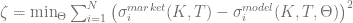
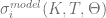
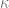
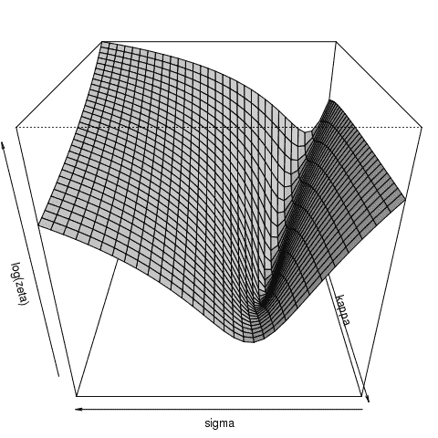
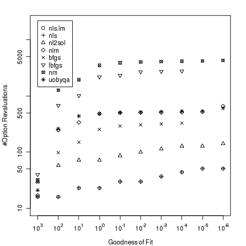

<!--yml
category: 未分类
date: 2024-05-17 23:43:23
-->

# Calibration: Comparison of deterministic Optimizers – HPC-QuantLib

> 来源：[https://hpcquantlib.wordpress.com/2011/05/17/calibration-comparison-of-deterministic-optimizers/#0001-01-01](https://hpcquantlib.wordpress.com/2011/05/17/calibration-comparison-of-deterministic-optimizers/#0001-01-01)

The gaol is to calibrate a time dependent Heston model defined by the following SDE

[ &=& \mu_t S dt + \sqrt{v} S dW_1 \\ dv(t, S) &=& \kappa_t (\theta_t - v) dt + \sigma_t \sqrt{v} dW_2 \\ dW_1 dW_2 &=& \rho_t dt \end{array}")](http://www.codecogs.com/eqnedit.php?latex=%5Cbegin%7Barray%7D%7Brcl%7D%20dS%28t,%20S%29%20&=&%20%5Cmu_t%20S%20dt%20@plus;%20%5Csqrt%7Bv%7D%20S%20dW_1%20%5C%5C%20dv%28t,%20S%29%20&=&%20%5Ckappa_t%20%28%5Ctheta_t%20-%20v%29%20dt%20@plus;%20%5Csigma_t%20%5Csqrt%7Bv%7D%20dW_2%20%5C%5C%20dW_1%20dW_2%20&=&%20%5Crho_t%20dt%20%5Cend%7Barray%7D)

The parameter set  is supposed to be piecewise constant in time. This model has a semi-closed solution for plain vanilla European put/call options based on the characteristic function method [1].

The DAX implied volatility surface based on July 5, 2002 data taken from [2] defines the “benchmark” calibration problem. The benchmark model parameters for the optimization problem are given by

.

The non-linear least square optimization problem is defined by the goodness of fit measure

where  is the market implied volatility for strike K and maturity T and  is the corresponding Black-Scholes volatility implied from the model price. The optimal solution for this problem is

leading to a goodness of fit measure of  (Please keep in mind that this result is the outcome of a naive calibration procedure. Due to the large  and  values I’d not use these parameters to price a derivative.).

  The diagram above shows the “goodness of fit”-surface for the parameter sets in

![\Theta = \{ 0.2231, 39.651, \kappa_{0.25 \leq t} \in [0, 16], 0.0954, \sigma \in [0, 16], -0.5004 \}](img/d52373188e27bca6a1db73e6254d0d80.png)

To be able to compare a larger number of deterministic optimizers the model calibration will be carried out using [R](http://www.r-project.org/) and with help of the additional packages [minpack.lm](http://cran.r-project.org/web/packages/minpack.lm/index.html) and [minqa](http://cran.r-project.org/web/packages/minqa/index.html).

**Non-linear Least Square Optimization:**

1.  **nls.lm**: Levenberg-Marquardt algorithm(based on [MINPACK](http://www.netlib.org/minpack), also available in [QuantLib](http://quantlib.org/))
2.  **nls**: Gauss-Newton algorithm
3.  **nl2sol**:based on the [PORT](../www.bell-labs.com/project/PORT) library.

**Non-linear (trusted region) Minimization**:

1.  **nlm**:Newton style minizer
2.  **bfgs:** quasi-Newton method published by Broyden, Fletcher, Goldfarb and Shanno
3.  **l-bfgs-b**: limited memory BFGS algorithm incl.box constraints
4.  **cg**: conjugate gradient algorithm
5.  **nm**: Nelder-Mead method
6.  **bobyqa**:trust region method that forms quadratic models by interpolation.
7.  **newuoa**: trust region method that forms quadratic models by interpolation.
8.  **uobyqa**:trust region method that forms quadratic models by interpolation.

The particular result dependents on the starting vector but the following diagram shows a common outcome.

  The best methods are the non-linear least square algorithms nls.lm and nls followed by nl2sol. Algorithms not included in the diagram have performed even worse than “nm” for this problem.

The goodness of fit measure is calculated in C++ based on the [QuantLib](http://quantlib.org) and exposed to [R](http://www.r-project.org/) using [RCPP](http://cran.r-project.org/web/packages/Rcpp/index.html). The C++ code and the R scripts to perform the optimizations and to create the plots can be found [here](http://hpc-quantlib.de/src/optimproblem.zip).

1] A. Elices, [Models with time-dependent parameters using transform methods: application to Heston’s model](http://arxiv.org/pdf/0708.2020),

[2]  A. Sepp, [Pricing European-Style Options under Jump Diffusion Processes with Stochastic Volatility: Applications of Fourier Transform.](http://math.ut.ee/%7Espartak/papers/stochjumpvols.pdf)