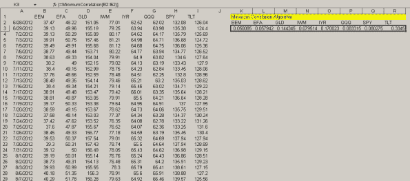

<!--yml
category: 未分类
date: 2024-05-18 14:37:22
-->

# Calling Minimum Correlation Algorithm from Excel using RExcel & VBA | Systematic Investor

> 来源：[https://systematicinvestor.wordpress.com/2012/09/27/calling-minimum-correlation-algorithm-from-excel-using-rexcel-vba/#0001-01-01](https://systematicinvestor.wordpress.com/2012/09/27/calling-minimum-correlation-algorithm-from-excel-using-rexcel-vba/#0001-01-01)

I want to show the example of calling the Minimum Correlation Algorithm from Excel. I will use [RExcel](http://rcom.univie.ac.at/download.html) to connect R and Excel and will create a small VBA cell array function to communicate between Excel and R.

I have previously discussed the concept of connecting R and Excel in the [“Calling Systematic Investor Toolbox from Excel using RExcel & VBA”](https://systematicinvestor.wordpress.com/2012/04/10/calling-systematic-investor-toolbox-from-excel-using-rexcel-vba/) post. Please read [this](https://systematicinvestor.wordpress.com/2012/04/10/calling-systematic-investor-toolbox-from-excel-using-rexcel-vba/) post for the instructions to setup [RExcel](http://rcom.univie.ac.at/download.html).

Following is a screen shot of the complete workbook:

[](https://systematicinvestor.wordpress.com/wp-content/uploads/2012/09/snapshot.png)

You can download the [MinimumCorrelation.xls](https://systematicinvestor.wordpress.com/wp-content/uploads/2012/09/minimumcorrelation1.xls) workbook and experiment with it while you keep reading.

I created the “MinimumCorrelation” cell array function in VBA. *Do not forget to use CTRL+SHIFT+ENTER to enter “MinimumCorrelation” function into your workbooks*. The “MinimumCorrelation” function will send historical price information from Excel to the R environment. It will next execute the R script to construct weights using the Minimum Correlation Algorithm, and finally it will collect R calculations of portfolio weights and transfer them back to Excel.

Here is the R script that calls min.corr.portfolio() function. I created a VBA function “create_rcode” to create this file automatically for this example.

```

###############################################################################
# Load Systematic Investor Toolbox (SIT)                                       
# https://systematicinvestor.wordpress.com/systematic-investor-toolbox/         
###############################################################################
if(!exists('min.corr.portfolio')) {                                            
   setInternet2(TRUE)                                                          
   con = gzcon(url('http://www.systematicportfolio.com/sit.gz', 'rb'))         
       source(con)                                                             
   close(con)                                                                  
}                                                                              

   #*****************************************************************          
   # Setup                                                                     
   #*****************************************************************          
   n = ncol(hist_prices)                                                       
   hist = na.omit(hist_prices / mlag(hist_prices) - 1)                         

   # create historical input assumptions                                       
   ia = list()                                                                 
       ia$n = n                                                                
       ia$risk = apply(hist, 2, sd)                                            
       ia$correlation = cor(hist, use='complete.obs', method='pearson')        
       ia$cov = ia$correlation * (ia$risk %*% t(ia$risk))                      

   # portfolio allocation                                                      
   weights = min.corr.portfolio(ia, null)                                      
   dim(weights)=c(1,n)                                                         

```

Next, the “MinimumCorrelation” cell array function in VBA that calls min.corr.portfolio() function in R:

```

'Minimum Correlation Algorithm
Public Function MinimumCorrelation(ByRef r_values As Range) As Variant
    ' Start R connection
    RInterface.StartRServer

    ' Write R code to file
    create_rcode

    ' Put Historical Asset Prices into R
    RInterface.PutArray "hist_prices", r_values

    ' Executes the commands in filename
    RInterface.RunRFile r_filename

    ' Get Portfolio Allocation determined by the Minimum Correlation Algorithm into Excel
    MinimumCorrelation = RInterface.GetArrayToVBA("weights")
End Function

```

The complete working copy of the [MinimumCorrelation.xls](https://systematicinvestor.wordpress.com/wp-content/uploads/2012/09/minimumcorrelation1.xls) workbook.

*Please do not forget to use CTRL+SHIFT+ENTER to enter “MinimumCorrelation” function into your workbooks*.