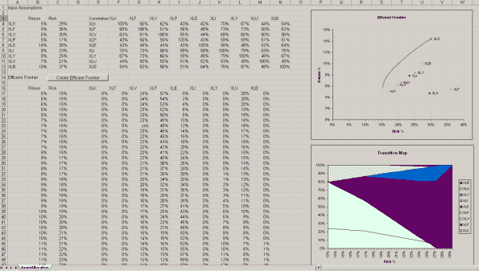
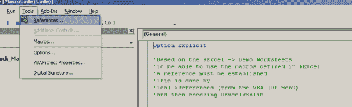
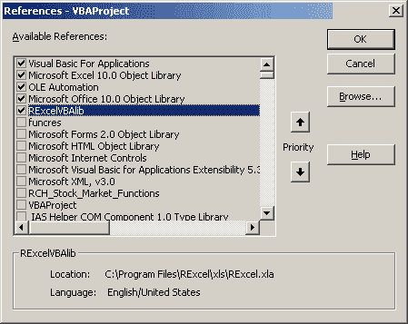

<!--yml
category: 未分类
date: 2024-05-18 14:37:14
-->

# Calling Systematic Investor Toolbox from Excel using RExcel & VBA | Systematic Investor

> 来源：[https://systematicinvestor.wordpress.com/2012/04/10/calling-systematic-investor-toolbox-from-excel-using-rexcel-vba/#0001-01-01](https://systematicinvestor.wordpress.com/2012/04/10/calling-systematic-investor-toolbox-from-excel-using-rexcel-vba/#0001-01-01)

[RExcel](http://rcom.univie.ac.at/download.html) is a great tool to connect R and Microsoft Excel. With a press of a button, I can easily execute my R scripts and present output interactively in Excel. This easy integration allows non-R users to explore the power of the R language. As an example of this approach, I want to show how to create an Efficient Frontier using [Systematic Investor Toolbox](https://systematicinvestor.wordpress.com/systematic-investor-toolbox/) and display it in Excel.

First, you need to install [RExcel](http://rcom.univie.ac.at/download.html) from [http://rcom.univie.ac.at/download.html](http://rcom.univie.ac.at/download.html) I used the following guide to help with my installation [http://homepage.univie.ac.at/erich.neuwirth/php/rcomwiki/doku.php?id=wiki:how_to_install](http://homepage.univie.ac.at/erich.neuwirth/php/rcomwiki/doku.php?id=wiki:how_to_install)

Next, please check that [RExcel](http://rcom.univie.ac.at/download.html) is working properly by trying some examples from
[http://homepage.univie.ac.at/erich.neuwirth/php/rcomwiki/doku.php?id=wiki:excel_worksheet_functions_using_r](http://homepage.univie.ac.at/erich.neuwirth/php/rcomwiki/doku.php?id=wiki:excel_worksheet_functions_using_r)

Now, we are ready to design the workbook to run mean-variance optimization to create an Efficient Frontier. Following is a screen shot of the complete interface:

[](https://systematicinvestor.wordpress.com/wp-content/uploads/2012/04/snapshot.png)

You can download the [AssetAllocation.xls](https://systematicinvestor.wordpress.com/wp-content/uploads/2012/04/assetallocation.xls) workbook and experiment with it while you keep reading.

Let’s put our Input Assumptions into Excel: Return, Risk, and Correlation matrix in rows 1:12\. Let’s make a button at row 14 to construct an Efficient Frontier and associate it with our **“create_efficient_frontier”** VBA macro.

The **“create_efficient_frontier”** VBA macro will collect our Input Assumptions from Excel and send them to the R environment. It will next execute the R script to construct the Efficient Frontier, and finally it will collect R calculations of Risk, Return, and Weights of portfolios lying on the Efficient Frontier and transfer them back to Excel.

Here is the R script to construct the Efficient Frontier. I created a VBA function **“create_rcode”** to create this file automatically for this example. In practice this can be a static file containing all the logic for your algorithm.

```

###############################################################################
# Load Systematic Investor Toolbox (SIT)                                       
# https://systematicinvestor.wordpress.com/systematic-investor-toolbox/         
###############################################################################
if(!exists('portopt')) {                                                       
   con = gzcon(url('http://www.systematicportfolio.com/sit.gz', 'rb'))         
       source(con)                                                             
   close(con)                                                                  
}                                                                              

   #--------------------------------------------------------------------------
   # Create Efficient Frontier                                                
   #--------------------------------------------------------------------------
     ia = list()                                                              
       ia$symbols = ia.name                                                   
       ia$n = len(ia$symbols)                                                 
       ia$expected.return = ia.return                                         
       ia$risk = ia.risk                                                      
       ia$correlation = ia.correlation                                        
   n = ia$n                                                                   

   # 0 <= x.i <= 1                                                            
   constraints = new.constraints(n, lb = 0, ub = 1)                           

   # SUM x.i = 1                                                              
   constraints = add.constraints(rep(1, n), 1, type = '=', constraints)       

   # create efficient frontier                                                
   ef.risk = portopt(ia, constraints, 50)                                     

```

The **“create_efficient_frontier”** VBA macro will collect Input Assumptions and send them to R environment, it will next execute the R script to construct the Efficient Frontier, and finally it will collect the Risk, Return, and Weights of portfolios lying on the Efficient Frontier and transfer it back to Excel.

Here is the **“create_efficient_frontier”** VBA macro that automates all the functionality:

```

' Create Efficient Frontier
Sub create_efficient_frontier()
    ' Start R connection
    RInterface.StartRServer

    ' Write R code to file
    create_rcode

    ' Clean Output Area
    Sheets("AssetAllocation").Range("A17:IV10000").ClearContents

    ' Put Input Assumptions into R
    RInterface.PutArray "ia.name", Range("AssetAllocation!A4:A12")
    RInterface.PutArray "ia.return", Range("AssetAllocation!B4:B12")
    RInterface.PutArray "ia.risk", Range("AssetAllocation!C4:C12")
    RInterface.PutArray "ia.correlation", Range("AssetAllocation!F4:N12")

    ' Executes the commands in R script
    RInterface.RunRFile r_filename

    ' Get Efficient Frontier into Excel
    RInterface.GetArray "ef.risk$return", Range("AssetAllocation!B17")
    RInterface.GetArray "ef.risk$risk", Range("AssetAllocation!C17")
    RInterface.GetArray "ef.risk$weight", Range("AssetAllocation!E17")     
End Sub

```

Here is a complete [AssetAllocation.xls](https://systematicinvestor.wordpress.com/wp-content/uploads/2012/04/assetallocation.xls) workbook that creates an Efficient Frontier with user specified Input Assumptions. This workbook can be used by non-R users to explore the power of the R language, as long as [RExcel](http://rcom.univie.ac.at/download.html) is installed.

Please make sure that you add the RExcel library to the references. First, click on the Tool->References (from the VBA IDE menu)

[](https://systematicinvestor.wordpress.com/wp-content/uploads/2012/04/rexcel-ref1-small.png)

Next select RExcelVBAlib and press Ok

[](https://systematicinvestor.wordpress.com/wp-content/uploads/2012/04/rexcel-ref2-small.png)