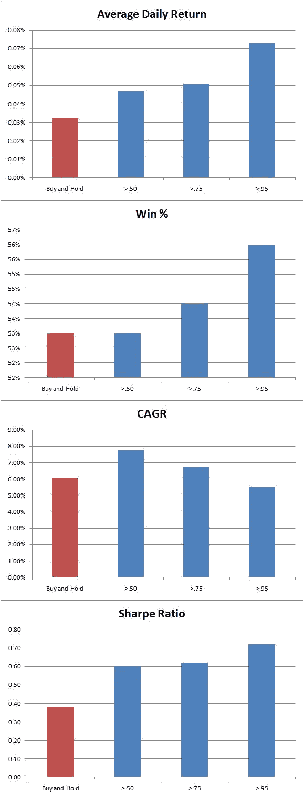
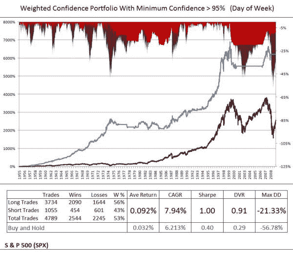

<!--yml
category: 未分类
date: 2024-05-12 18:47:18
-->

# Can Seasonality Be Traded Profitably? A Time Machine Test (Part 1 of 4) | CSSA

> 来源：[https://cssanalytics.wordpress.com/2009/09/28/the-adaptive-time-machine-is-seasonality-a-real-effect-part-1-of-4/#0001-01-01](https://cssanalytics.wordpress.com/2009/09/28/the-adaptive-time-machine-is-seasonality-a-real-effect-part-1-of-4/#0001-01-01)

*Note: be sure to check out the second part of this post:* [https://cssanalytics.wordpress.com/2009/09/29/is-the-day-of-the-week-phenomenon-tradeable-it-was-for-a-long-time-but-not-any-more/](https://cssanalytics.wordpress.com/2009/09/29/is-the-day-of-the-week-phenomenon-tradeable-it-was-for-a-long-time-but-not-any-more/)

Seasonality is yet another effect worth exploring in the stock market. There are numerous components, and we will delve into a few different categories. Using a time machine test is ideal to test seasonality because  1) it is unbiased and makes no prior assumptions other than an understanding of basic statistics  2) it tells us whether seasonality could have actually been taken advantage of in real-time because it uses a rolling-window method.  That is, it starts  in 1950 and learns for 5 years and chooses statistically significant effects, and than constantly rolls forward make trades according to its own research out of sample. Of course, it constantly adjusts and adapts along the way, but it never gets a chance to peek at the future. Seasonality is also a good test for the robustness of the time machine because it is generally one of the weakest effects and is hard to identify. So along those lines, I figured that the hardest test for the time machine would be the **“Day of Week”** effect. That is, presumably Mondays perform better than Tuesdays etc, feasibly certain days of the week may be more profitable than others. Of course, there is little in the way of logic to dictate why certain days perform better than others–however many traders seem to incorporate daily seasonality into their work so it is worth exploring. You can’t find UFO’s if you don’t look for them! So in the spirit of Mulder from the X-Files, I will presume that the truth is out there waiting to be discovered.

As a brief review, the Adaptive Time Machine is a proprietary tool developed in collaboration with Corey Rittenhouse that uses ARO technology (stands for Adaptive, Robust, and Optimal) and is essentially a hybrid between machine learning  and a statistical evaluation device.  This makes it unique from any other method. The actual combined ARO technology is very powerful, and not only learns, but has an entire algorithm designed to monitor its own performance (think of a stoplight that gradually moves you in or out of a given strategy or indicator) . This makes it ideal for 1) creating trading strategies 2) figuring out optimal indicator parameters and entry/exits 3) figuring out what are the best indicators, and which indicators are no longer working. For all of these studies, we are simply using one of the statistical testing tools in the time machine (not ARO)–the T-test [http://en.wikipedia.org/wiki/T-test#Uses](http://en.wikipedia.org/wiki/T-test#Uses).  To keep things very simple we are only doing a one-sample test which means that we are looking to see if a given trading day for example–Tuesday– is statistically significantly different from zero. This of course is not optimal but this is not a stats course, and most traders are better off keeping things simple first before getting fancy.

Our methodology was to take a 5-year lookback window (note that an equation in the machine evaluates the parameter length,strength/weakness, and stability of the effect and chooses a range of suggested time frames for lookbacks) and conduct a t-test of confidence . Every 10 days, we conducted a new test while trading on the basis of our findings. If a given day was consistently negative then we would short it subject to minimum confidence levels, the opposite was true for longs. Typically scientists use 95% confidence as a benchmark, but greater than 50% is reasonable for the stock market to at least differentiate between a possible effect and randomness. This is because if you wait too long for perfect statistical confirmation, the effect will be likely to be discovered and whittled down by the time you start trading it. That is why it is a mere academic excercise to be ultra-scientific and skeptical—as long as you are willing to adapt and change your mind–ie use a mental stoplight—you should be content with trading the best observable effects at a given time subject to minimum statistical tests of confidence. What other alternative is there unless you want to be like most professors and invest in index funds?

I myself was very surprised by the results—I didn’t think it was possible that there was a consistent day(s) of the week, that were more profitable than others. There is a linear increase in out of sample returns depending on confidence level–the higher the confidence the higher the average return per day. All confidence levels beat buy and hold on a raw per day return and risk-adjusted basis. The last chart shows a test where only “statistically significant” days are selected for either long or shorts. A portfolio is created that weights position sizes based on confidence subject to the constraint that confidence be >95%. In this case we also used a weighted combination of time windows for calculating confidence from 5 years and down to make it more adaptive.  The weighted portfolio handily beats buy and hold with less risk, and with less time in the market (note the flat lines in the chart represent periods where cash was held earning no interest). Now I am no longer a skeptic, until someone proves otherwise.  This series of posts will run throughout the week covering a variety of seasonal effects.

