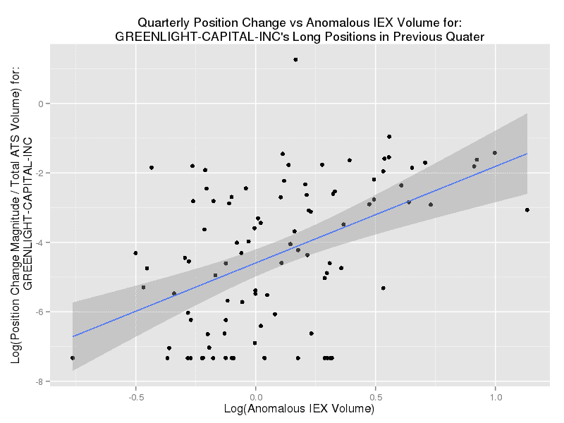
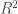
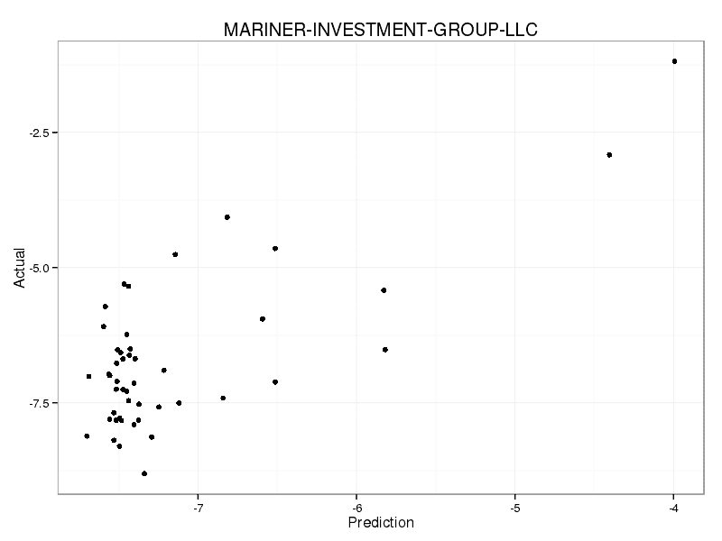
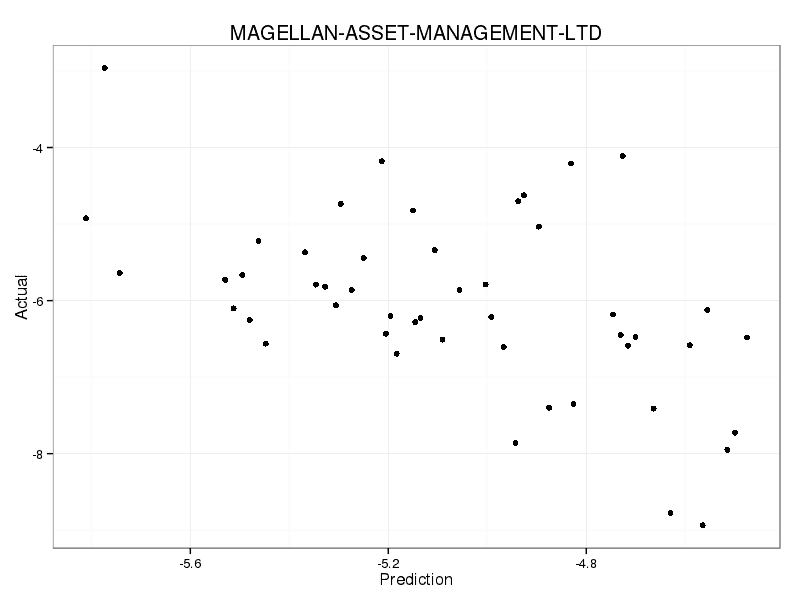
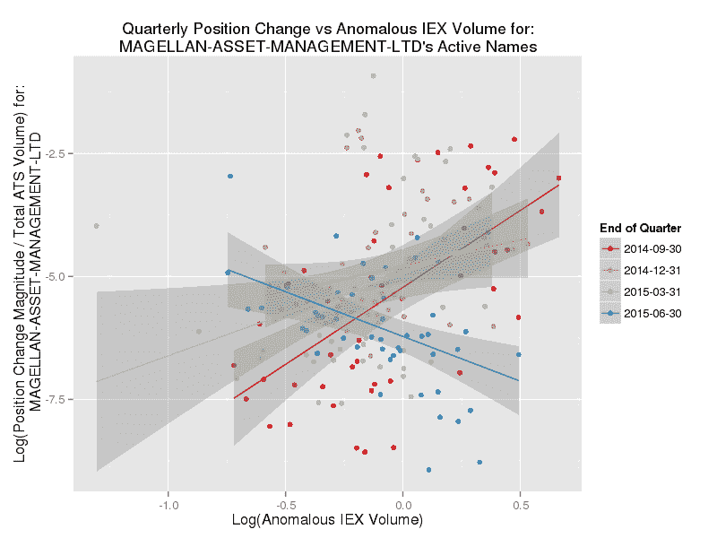

<!--yml
category: 未分类
date: 2024-05-18 06:42:37
-->

# Can We Tell Who Trades on Which Dark Pools? | Mechanical Markets

> 来源：[https://mechanicalmarkets.wordpress.com/2015/11/15/who-trades-on-which-dark-pools/#0001-01-01](https://mechanicalmarkets.wordpress.com/2015/11/15/who-trades-on-which-dark-pools/#0001-01-01)

Marketplace transparency ensures that investors receive a fair price and have accurate data to conduct their research. But, transparency can also make it harder for traders to conceal their intentions from competitors and counterparties. Exchanges and regulators are tasked with balancing the transparency needs of a market’s customers. Dark pools, by operating with the minimal amount of transparency permitted, are meant to help institutions hide their order flow. They do this, roughly speaking, in two ways:

1.  Lack of pre-trade transparency. Orders are invisible on dark pools until they execute.
2.  Reduced post-trade transparency. Dark pools are required to quickly report trades to the consolidated tape, but this process is not instant. Subscribers to the public tape also don’t know which dark pool (or wholesaler/ELP) reported a given trade.

Market structure is always changing, and there’s a new wrinkle to #2\. FINRA [Rule 4552](https://www.finra.org/industry/rule-filings/sr-finra-2013-042) specifies that weekly dark pool volume be [published](https://ats.finra.org/) per security.[*](#bottom*atsf) The data is made public on a 2-week delayed basis, but as we’ll see, it may still have some informational value.

# 13F Holdings Data

Regulation also [requires](http://www.sec.gov/answers/form13f.htm) that large asset managers report their end-of-quarter long positions, within 45 days. [[1](#bottom1atsf)] Many hedge funds wait until the last minute to file their 13Fs, which suggests that they consider the disclosed information to be valuable.

Some hedge funds, like Greenlight Capital, publicly [promote](http://www.cnbc.com/2014/04/22/david-einhorn-takes-stake-in-hft-nemesis-iex.html) the dark pool IEX. Greenlight also owns a stake in IEX, so it may make sense for it to preferentially trade there. We can combine the 13F-reported changes in Greenlight’s long positions with the FINRA 4552 data to get an idea of whether it trades disproportionate volume on IEX. Here’s a density plot of Greenlight’s quarterly trading activity versus IEX’s:

It does look like something is going on here. The above is for the entire universe of NMS Tier 1 stocks. What if we limit it to stocks that we suspect Greenlight is more likely to trade? Here is a similar plot, restricted to stocks in which Greenlight reported long positions in their previous quarter’s 13F:

Similar to above. Includes a linear regression with shaded 95% confidence intervals.

Obviously, correlation is different from causation, but this relationship indicates that Greenlight may direct a lot of volume to IEX. IEX also reports near-realtime volume on its [website](http://iextrading.com/tops/), so one could potentially detect when Greenlight is currently trading a stock. Pershing Square, another backer of IEX, trades too infrequently to make a similar analysis worthwhile, but it may be more than coincidence that IEX’s share of VRX volume was anomolously high when Pershing Square recently [bought](http://www.businessinsider.com/bill-ackman-buys-more-valeant-2015-10) 2 million shares. [[2](#bottom2atsf)]

It’s (almost) too easy to mention the irony if valued information has leaked because of Greenlight’s or Pershing Square’s support for IEX. Ackman’s paranoia about front-running features prominently in “Flash Boys.” [[3](#bottom3atsf)] And Greenlight sometimes [has felt](http://www.bloombergview.com/articles/2014-02-14/david-einhorn-will-say-what-stocks-he-owns-when-he-s-good-and-ready) that even 13F disclosure harms its business. [[4](#bottom4atsf)]

# A Broader Analysis

It seemed fun to check if any other hedge funds had easily-detected dark pool preferences. I selected the top 100 funds listed on [Octafinance](http://www.octafinance.com/hedge-funds/top-hedge-funds/) and attempted to query [Jive Data](https://api.jivedata.com/documentation/) for their 13F data for the 5 quarters leading up to June 30, 2015\. I then did a [Lasso](http://statweb.stanford.edu/~tibs/lasso.html) regression of the relative volume of each hedge fund on the relative volume of all dark pools (these volume measures are defined in the caption of the first plot), using the first 4 quarters of data. The 5th quarter was used as test data. The regression only includes data points where the given fund was active in a stock that quarter. [[5](#bottom5atsf)] It’s not anything fancy, but this process hopefully catches some superficial relationships like Greenlight’s with IEX. Here’s the [R script](https://mechanicalmarkets.wordpress.com/wp-content/uploads/2015/11/ats-13f-rscript.zip) used, as well as the [plots and tables](https://mechanicalmarkets.wordpress.com/wp-content/uploads/2015/11/ats-13f-output.zip) it outputs.

See “lassoResultsWhenFundTraded_LogHFAnomVol_on_LogAtsAnomVol.csv” (in the second zip file above) for a summary table of the Lasso results. [[6](#bottom6atsf)] Care is needed when assigning statistical significance to such a large number of regressions, but lots of things stick out. Mariner Investment Group appears to be one of the more detectable funds [[7](#bottom7atsf)], with test-set  not much below 0.5.

Predicted and actual volume measures for Mariner Investment Group’s test data.

It appears as if Mariner likes to trade on Level ATS, and tends to avoid Sigma-X and the UBS dark pool. We can’t disentangle a fund’s routing decisions from other reasons for these correlations — e.g. a fund may be more likely to trade a stock if high retail participation has distorted its price, making the fund’s activity correlated with that of Interactive Brokers’ ATS (IATS), even if the fund doesn’t trade there. [[8](#bottom8atsf)] But, there appears to be a tendency for hedge funds to route away from UBS’s ATS; Tortoise Capital Advisors is the only fund with a positive coefficient for UBS, and many have large negative coefficients. I don’t know the reason for that, it may be that hedge funds are displeased with the execution quality, or just that they’re not UBS’s clientele. If it’s the former, this analysis raises a sticky dilemma for traders who want to hide their intentions: If you don’t like a certain venue, your information leakage might rise if you avoid it. If that’s really the case, you may want to route there even if you think they do [shady stuff](http://www.bloomberg.com/news/articles/2015-08-12/itg-pays-record-dark-pool-fine-for-running-secret-trading-desk). Sometimes, fixing market structure requires collective action, and we need regulators to effect that action on our behalf.

Some highly active funds have a surprisingly large test . It’s possible that whenever you can make a confident prediction about a fund’s volume, it may turn out to be especially hard to predict the direction of that volume. I wonder if that’s the case for Citadel Advisors (their prediction has an  near 0.1), because I really would expect Citadel to be sophisticated enough to cloak their trading. Some highly active funds that appear to have more detectable flows include: Bridgewater ( ~ 0.07) , Millenium ( ~ 0.05), Royce ( ~ 0.1, which apparently likes Morgan Stanley’s ATS, and avoids JP Morgan’s), BlueMountain ( ~ 0.07, possibly likes MS, and avoids UBS), Tudor ( ~ 0.1, possibly avoids UBS), Carlson ( ~ 0.13, which may have prefered ITG [[9](#bottom9atsf)], and traded more volume on stocks less active on Fidelity’s and Interactive Brokers’ ATSs), and Ellington ( ~ 0.2). Highbridge, Adage, D.E. Shaw, and both Two Sigma entities have very weak detectability ( ~ 0.03). AQR, Renaissance, and Visium probably leak little or no volume information this way.

Plenty of less active funds have sizable s too. But I do find it interesting to discuss the example where the prediction arguably fails most. The prediction for Magellan Asset Management does not do well during the test quarter:

Predicted and actual volume measures for Magellan Asset Management’s test data.

The largest component in its regression was an apparent tendency to trade on IEX. This relationship suddenly reversed in the last quarter:

Magellan’s relative volume vs anomalous IEX volume, for stocks that Magellan traded in the given quarter. A linear regression is shown with 95% confidence bands, for each quarter’s relationship.

Was Magellan formerly a big user of IEX, but started avoiding it in Q2? We can’t be sure because the tendency was found via data snooping, but it is suggestive. If so, Magellan may have taken the easiest countermeasure of all, changing their behavior.

# Unpredictable Trading

The key to avoiding this sort of leakage is to trade unpredictably, or at least, to trade in the same manner as the population norm. Which, in my view, means that Einhorn’s reasoning [described](https://books.google.com/books?id=AarfAgAAQBAJ&lpg=PP1&dq=editions%3A36ZaAiOcQqEC&pg=PT83#v=onepage&q=%22Why%20aren't%20we%20all%20just%20picking%20the%20same%20exchange?%22&f=false) in “Flash Boys” could be almost exactly wrong:

> After listening to Brad’s pitch, Einhorn asked him a simple question: **Why aren’t we all just picking the same exchange?** Why don’t investors organize themselves to sponsor a single stock exchange entrusted with guarding their interests and protecting them from Wall Street predators?

Block trading can be a valuable service, but its utility has a limit. To see why, say that 100 high-alpha investors agree to exclusively trade on a single venue, and public documents show that only one of them owns Micron stock. Suddenly, that venue reports an unusual volume of Micron trades. With a bit of ancillary data (perhaps news articles or observed price impact), other traders might ascertain whether that investor is reducing or adding to her position.

I imagine that this type of information leakage can occur on lit exchanges too. The major exchanges have more volume to camouflage institutional executions. But if a hedge fund were to preferentially trade at a minor exchange (or blacklist a major one) their activity may leave a signature. Investors who persistently use the same [execution algorithms](https://mechanicalmarkets.wordpress.com/2015/04/30/market-data-patterns-order-anticipation-and-an-example-trading-strategy/) (or algorithmic order types) could perhaps even leak the side of their transactions. [[10](#bottom10atsf)]

The premise of Reg. NMS is that competition between exchanges lowers costs and prevents [abuses](https://www.sec.gov/news/press/2005-53.htm). If an upstart venue is widely seen as superior, it will rapidly attract market share. People dissatisfied with the major exchanges have yet to reach consensus on an alternative. Which means that if they unreservedly support their favorite upstart, their execution quality can suffer. That must be frustrating. It’s understandable then if upstarts try schemes that force participants to use their venue. NYSE has [suggested](http://www.sec.gov/comments/10-222/10222-19.pdf) that IEX’s design includes anti-competitive routing practices and [peg order](https://mechanicalmarkets.wordpress.com/2015/10/05/iex-peg-orders-last-look-for-equity-markets/) handling. Unless traders disaffected by market fragmentation stop being fragmented themselves, their only way forward is to attack the fundamentals of Reg. NMS. I’m not sure it’s the answer [[11](#bottom11atsf)], but it shouldn’t be a surprise if market critics are wistful for the days when they traded on a single, monolithic exchange.

[[1](#1atsf)] Particularly large positions have to be reported [sooner](http://www.sec.gov/answers/sched13.htm). Short positions do not have to reported in the US, though there is a [movement](http://www.bloomberg.com/news/articles/2015-10-21/nyse-pleads-for-rules-to-make-hedge-funds-reveal-short-positions) to change this. Large short positions in [European equities](https://www.esma.europa.eu/page/Short-selling) have to be reported quickly, and I’d be curious to see this post’s analysis repeated with the higher resolution European data.

[[2](#2atsf)] Here’s a [screenshot](https://mechanicalmarkets.wordpress.com/wp-content/uploads/2015/11/iex-tops-screenshot-4pm-oct21.png) of IEX’s most traded stocks on Oct 21, shortly after the close. A very large chunk of this volume appeared before Pershing Square announced that they had traded (though I didn’t take a screenshot). This is a good opportunity for me to remind you that nothing on this blog is trading or investment advice.

[[3](#3atsf)] From “[Flash Boys](http://www.nytimes.com/2014/04/06/magazine/flash-boys-michael-lewis.html)” (emphasis added):

> Bill Ackman runs a famous hedge fund, Pershing Square, that often buys large chunks of companies. In the two years before Katsuyama turned up in his office to explain what was happening, Ackman had started to suspect that people might be using the information about his trades to trade ahead of him. “I felt that there was a leak every time,” Ackman says. “I thought maybe it was the prime broker. **It wasn’t the kind of leak that I thought**.”

It never is, is it?

[[4](#4atsf)] Greenlight has also [said](http://www.cnbc.com/2014/04/22/david-einhorn-takes-stake-in-hft-nemesis-iex.html):

> We believe that the best response for any investors that are worried about fast computers taking advantage of them is to ask that their orders be routed to IEX.

But what about investors worried about slow traders “taking advantage” of them? In that case, maybe they should think twice before sending all of their volume to IEX?

[[5](#5atsf)] Which means that in order to use this particular method to predict the volume of a fund’s activity in a given stock, you’d need to know whether they’re likely to be trading it at all. Perhaps that’s doable sometimes. But, in any case, it’s not what I’m trying to do here. This post is just to see whether funds might have any detectable preferences, not to determine if those preferences create trading opportunities.

[[6](#6atsf)] Which contains coefficients given by the Lasso regression of each hedge fund’s relative volume on ATS’s anomalous volume. Each (quarter, stock) pair is a data point. Mean-square error is given for the training set (Total_MSE_Train) and test set (Total_MSE_test). A measure of  is given for the training set (R-Squared_MSE_Test) and test set (R-Squared_MSE_Test) — note that the  is a bit unusual for the test set, in that it uses the mean from the training set as its “null prediction.” Sample sizes for each set are given by n_Train and n_Test.

[[7](#7atsf)] Their equity [portfolio](http://www.nasdaq.com/quotes/institutional-portfolio/mariner-investment-group-llc-69114) consists mostly of ETFs and biotech, so this could be an artifact.

[[8](#8atsf)] In that instance, IATS trading activity could still be a useful predictor of hedge fund volume.

[[9](#9atsf)] ITG’s volume has [collapsed](http://meanderful.blogspot.com/2015/09/ubs-and-iex-gain-itg-lose-finra-ats.html) after being [fined](http://www.bloomberg.com/news/articles/2015-08-12/itg-pays-record-dark-pool-fine-for-running-secret-trading-desk) for prop trading in its own dark pool. I would imagine that they’ve lost many customers since the end of the last quarter in this dataset (June 30), so prediction accuracy may be lower for later quarters.

[[10](#10atsf)] If there’s demand for it, maybe I can look into whether any market data patterns are correlated with institutional flows.

[[11](#11atsf)] For one thing, it’s not clear why a movement to make trading infrastructure more utility-like should stop with exchanges. What about brokers, execution algorithms, and intermediaries? I think that similar game-theoretical dilemmas could apply to those groups too. Restructuring a competitive industry into a state-supervised monopoly is partly an admission that there’s no prospect of further value-adding innovation. As Cliff Asness [says](http://www.bloombergview.com/articles/2014-06-20/why-i-love-high-speed-trading):

> [I]t’s the argument monopolists always make — that they are really only trying to create efficiencies and eliminate waste for the customer.

[*](#*atsf) ATS data is provided via [http://www.FINRA.org/ATS](http://www.FINRA.org/ATS) and is copyrighted by FINRA 2015\.