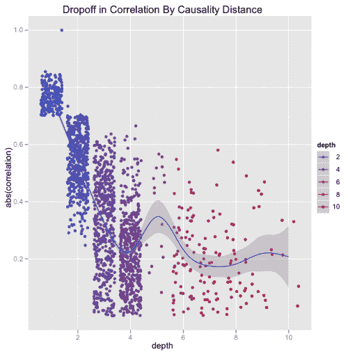
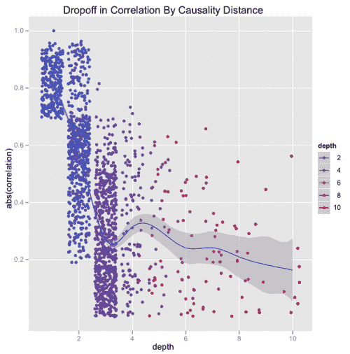

<!--yml
category: 未分类
date: 2024-05-18 15:31:33
-->

# Causality & Transitivity | Tr8dr

> 来源：[https://tr8dr.wordpress.com/2010/09/12/causality-transitivity/#0001-01-01](https://tr8dr.wordpress.com/2010/09/12/causality-transitivity/#0001-01-01)

September 12, 2010 · 1:13 pm

I have a number of different graphs of causality relationships amongst equities (one measure I use is granger based).   I was interested in knowing to what extent if  A ↔ B ↔ C implies a weak A ↔ C, where am using ” ↔” to indicate granger causes in either or both directions.

In most cases the spearman correlations of A ↔ B are high, so thought as a very rough analog to observe the falloff in correlation as one progresses farther along the relationship path.   So if one has a graph of “directs” from A with associated correlations to A, what are the correlations of  the directs directs back to A, and so on:

*   **A**
    ρ(A,A) = 1
*   **A ↔ {B,C,D}**
    ρ(A, {B,C,D}) =  0.84, 0.76, 0.90
*   **B ↔{E,F}, C↔G, D↔{H,I,J}**
    ρ(A, {E,F,G,H,I,J})  = 0.62, 0.54, 0.59, …

Well, it turns out that the correlation falls off dramatically.  This does not prove anything directly about causality, but seems to imply that  transitivity is limited or near non-existant or at least falls off very quickly.

Here is an analysis done for 2 different equities:

