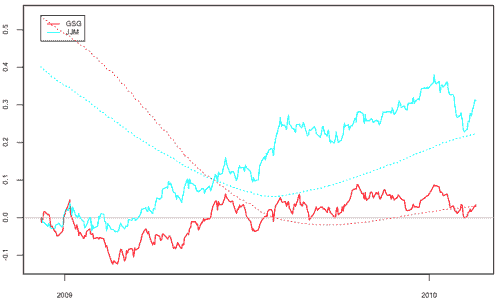
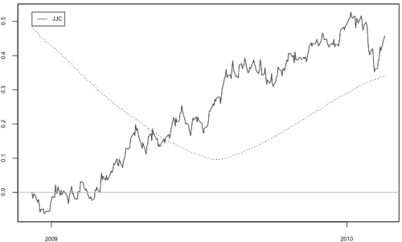

<!--yml
category: 未分类
date: 2024-05-18 15:33:58
-->

# Chinese Bubble | Tr8dr

> 来源：[https://tr8dr.wordpress.com/2010/02/18/chinese-bubble/#0001-01-01](https://tr8dr.wordpress.com/2010/02/18/chinese-bubble/#0001-01-01)

February 18, 2010 · 10:18 am

Just a quick note.  Wanted to point to this presentation on the Chinese bubble: “[China the Mother of All Black Swans](http://ContrarianEdge.com/2010/02/12/china-the-mother-of-all-black-swans/)“.   His conclusions on commodity prices and interest rates are right on the mark, stating:

1.  interest rates will go up
    Ok this is a no-brainer for a number of reasons, one being that US interest rates are about as low as they can go.  Also, given the large amount of new debt issue and increasing stockpiles in China, Japan, and elsewhere, would expect reduced appetite at current interest levels.   That said, in uncertain markets, where else should China or Japan park their $ inflows?
2.  commodity prices will revert
    Well, most commodity prices already reverted to historical levels in 2008 during the market crisis.    This can be seen in a number of commodity indices.    That said, there are specific commodities that are at premiums to historical levels (ones that China has been buying).

Here we can see that commodities, as a broad index, have fallen back to historical levels and stayed there since 2009, however industrial commodities have increased in price by 30%:

I’m going to ignore Gold at the moment, as I don’t believe China is the major driver behind its rise (that said, gold would appear to be ripe for a huge reset, similar to the buildup and reset in the 80s).   Copper on the other hand, has had a 50% rise since 2009 that can be attributed to demand from China:

Apparently China is buying copper not only for internal demand, but as a way to invest its huge inflow of $s as opposed to investing entirely in US treasuries.   So really we have to be looking at significantly less US consumption of Chinese products or a change in policy around stockpiling industrial commodities, before we see these commodities reverting to historic levels.