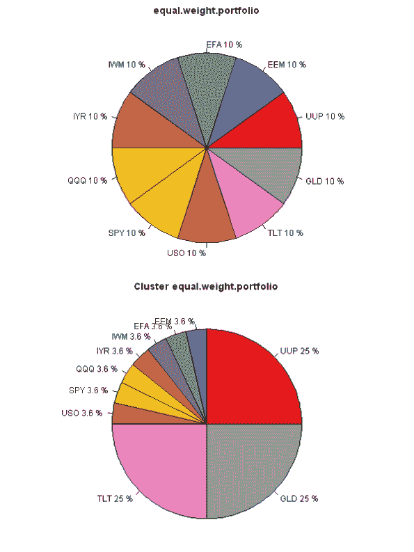
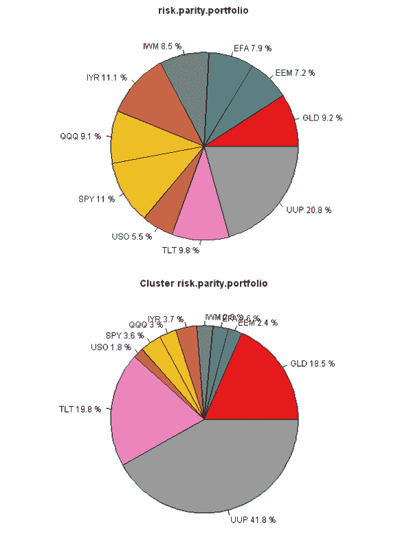

<!--yml
category: 未分类
date: 2024-05-18 14:33:57
-->

# Cluster Portfolio Allocation | Systematic Investor

> 来源：[https://systematicinvestor.wordpress.com/2013/02/12/cluster-portfolio-allocation/#0001-01-01](https://systematicinvestor.wordpress.com/2013/02/12/cluster-portfolio-allocation/#0001-01-01)

Today, I want to continue with clustering theme and show how the portfolio weights are determined in the Cluster Portfolio Allocation method. One example of the Cluster Portfolio Allocation method is [Cluster Risk Parity](http://cssanalytics.wordpress.com/) (Varadi, Kapler, 2012).

The Cluster Portfolio Allocation method has 3 steps:

*   Create Clusters
*   Allocate funds within each Cluster
*   Allocate funds across all Clusters

I will illustrate below all 3 steps using “Equal Weight” and “Risk Parity” portfolio allocation methiods. Let’s start by loading historical prices for the 10 major asset classes.

```

###############################################################################
# Load Systematic Investor Toolbox (SIT)
# https://systematicinvestor.wordpress.com/systematic-investor-toolbox/
###############################################################################
setInternet2(TRUE)
con = gzcon(url('http://www.systematicportfolio.com/sit.gz', 'rb'))
    source(con)
close(con)
	#*****************************************************************
	# Load historical data for ETFs
	#****************************************************************** 
	load.packages('quantmod')

	tickers = spl('GLD,UUP,SPY,QQQ,IWM,EEM,EFA,IYR,USO,TLT')

	data <- new.env()
	getSymbols(tickers, src = 'yahoo', from = '1900-01-01', env = data, auto.assign = T)
		for(i in ls(data)) data[[i]] = adjustOHLC(data[[i]], use.Adjusted=T)

	bt.prep(data, align='remove.na')

	#*****************************************************************
	# Setup
	#****************************************************************** 
	# compute returns
	ret = data$prices / mlag(data$prices) - 1

	# setup period
	dates = '2012::2012'
	ret = ret[dates]

```

Next, let’s compute “Plain” portfolio allocation (i.e. no Clustering)

```

	fn.name = 'equal.weight.portfolio'				
	fn = match.fun(fn.name)

	# create input assumptions
	ia = create.historical.ia(ret, 252) 

	# compute allocation without cluster, for comparison
	weight = fn(ia)

```

Next, let’s create clusters and compute portfolio allocation within each Cluster

```

	# create clusters
	group = cluster.group.kmeans.90(ia)
	ngroups = max(group)

	weight0 = rep(NA, ia$n)

	# store returns for each cluster
	hist.g = NA * ia$hist.returns[,1:ngroups]

	# compute weights within each group	
	for(g in 1:ngroups) {
		if( sum(group == g) == 1 ) {
			weight0[group == g] = 1
			hist.g[,g] = ia$hist.returns[, group == g, drop=F]
		} else {
			# create input assumptions for the assets in this cluster
			ia.temp = create.historical.ia(ia$hist.returns[, group == g, drop=F], 252) 

			# compute allocation within cluster
			w0 = fn(ia.temp)

			# set appropriate weights
			weight0[group == g] = w0

			# compute historical returns for this cluster
			hist.g[,g] = ia.temp$hist.returns %*% w0
		}
	}

```

Next, let’s compute portfolio allocation across all Clusters and compute final portfolio weights

```

	# create GROUP input assumptions
	ia.g = create.historical.ia(hist.g, 252) 

	# compute allocation across clusters
	group.weights = fn(ia.g)

	# mutliply out group.weights by within group weights
	for(g in 1:ngroups)
		weight0[group == g] = weight0[group == g] * group.weights[g]

```

Finally, let’s create reports and compare portfolio allocations

```

	#*****************************************************************
	# Create Report
	#****************************************************************** 			
	load.packages('RColorBrewer')
	col = colorRampPalette(brewer.pal(9,'Set1'))(ia$n)

	layout(matrix(1:2,nr=2,nc=1))
	par(mar = c(0,0,2,0))
	index = order(group)

	pie(weight[index], labels = paste(colnames(ret), round(100*weight,1),'%')[index], col=col, main=fn.name)

	pie(weight0[index], labels = paste(colnames(ret), round(100*weight0,1),'%')[index], col=col, main=paste('Cluster',fn.name))	

```

[](https://systematicinvestor.wordpress.com/wp-content/uploads/2013/02/equal-weight-portfolio-plot-small.png)

The difference is most striking in the “Equal Weight” portfolio allocation method. The Cluster version allocates 25% to each cluster first, and then allocates equally within each cluster. The Plain version allocates equally among all assets. The “Risk Parity” version below works in similar way, but instead of having equal weights, the focus is on the equal risk allocations. I.e. UUP gets a much bigger allocation because it is far less risky than any other asset.

[](https://systematicinvestor.wordpress.com/wp-content/uploads/2013/02/risk-parity-portfolio-plot-small.png)

Next week, I will show how to back-test Cluster Portfolio Allocation methods.

To view the complete source code for this example, please have a look at the [bt.cluster.portfolio.allocation.test() function in bt.test.r at github](https://github.com/systematicinvestor/SIT/blob/master/R/bt.test.r).