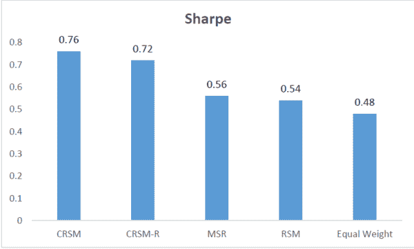
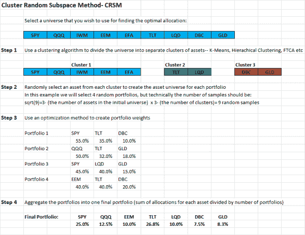

<!--yml
category: 未分类
date: 2024-05-12 17:51:41
-->

# Cluster Random Subspace- A Process Diagram | CSSA

> 来源：[https://cssanalytics.wordpress.com/2014/11/05/cluster-random-subspace-a-process-diagram/#0001-01-01](https://cssanalytics.wordpress.com/2014/11/05/cluster-random-subspace-a-process-diagram/#0001-01-01)

In the last post, I introduced a method for improving portfolio optimization called the [Cluster Random Subspace Method](https://cssanalytics.wordpress.com/2014/11/04/cluster-random-subspace-method-for-portfolio-management/ "Cluster Random Subspace Method for Portfolio Management") (CRSM). The paper was written by Michael Guan for his thesis in computer science, and in case you missed it a link to the paper can be found here: [CRSM Thesis](https://cssanalytics.files.wordpress.com/2014/11/crso-thesis1.pdf). CRSM has demonstrated considerable advantages versus using conventional Markowitz tangency/max-sharpe (MSR) portfolios especially on either large-scale or homogeneous universes. This can be expected because CRSM is designed to reduce variance by aggregation or use of a statistical ensemble approach. Conventional MSR suffers from the “[curse of dimensionality](https://cssanalytics.wordpress.com/2013/10/03/mean-variance-optimization-and-statistical-theory/ "Mean-Variance Optimization and Statistical Theory")” in these situations and tends to serve more as an “error-maximizer” rather than produce effective portfolio allocations. Since MSR is used within CRSM to maximize the portfolio sharpe ratio in this paper, it can be directly compared to using a standard MSR approach along with using RSM/[RSO](https://cssanalytics.wordpress.com/2013/10/10/rso-mvo-vs-standard-mvo-backtest-comparison/ "RSO MVO vs Standard MVO Backtest Comparison")– the original random subspace method which also uses MSR, and just an equal weight portfolio. CRSM-R is just a variant of CRSM that uses replacement in the sampling process. I took this chart from the paper which aggregates the results across six different universes using each algorithm type. For a more in depth breadown, I would suggest reading the original paper:

In terms of the objective function- maximizing the sharpe ratio- CRSM is by far the best algorithm and vastly superior to MSR across the universes tested in the paper. While I don’t want to spoil the surprise, this does not come at the cost of a reduced CAGR- as is typically the case with say Michaud resampling etc. In fact CRSM also has the highest CAGR- beating out equal weight, which is impressive especially for homoegeneous universes. To get a better sense of how CRSM works, it is useful to look at the process diagram below:
