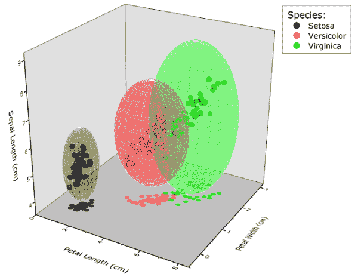

<!--yml
category: 未分类
date: 2024-05-12 17:51:56
-->

# Cluster Random Subspace Method for Portfolio Management | CSSA

> 来源：[https://cssanalytics.wordpress.com/2014/11/04/cluster-random-subspace-method-for-portfolio-management/#0001-01-01](https://cssanalytics.wordpress.com/2014/11/04/cluster-random-subspace-method-for-portfolio-management/#0001-01-01)

href=”[https://cssanalytics.files.wordpress.com/2014/11/cluster-image-3.png”&gt](https://cssanalytics.files.wordpress.com/2014/11/cluster-image-3.png%E2%80%9D&gt);

One of the many areas that I have explored in my own research is creating new methods to improve upon [mean-variance optimization](https://cssanalytics.wordpress.com/2013/10/03/mean-variance-optimization-and-statistical-theory/ "Mean-Variance Optimization and Statistical Theory"). A while back I wrote about the concept of applying the [Random Subspace Method](http://en.wikipedia.org/wiki/Random_subspace_method) (RSM) as a viable alternative to improve upon some of the deficiencies in standard portfolio optimization . I called the application of RSM to optimization [RSO](https://cssanalytics.wordpress.com/2013/10/06/random-subspace-optimization-rso/ "Random Subspace Optimization (RSO)")– which showed promise versus traditional mean-variance for homogeneous universes. The original concept for random subspaces originated at the famous Bell Labs, and was designed to reduce dimensionality for prediction or classification. The most popular application of RSM is in “Random Forests” which is used for generating more robust “decision trees” in machine learning. RSM uses bagging to draw samples of predictors and combine their estimates together in an “ensemble.” The primary advantage is that the noise created by each group of predictors tends to be somewhat unrelated to other randomly selected groups. As a consequence, the noise gets “cancelled out” and what remains is a more stable and accurate predictor ensemble.

While the RSM framework is statistically sound, it does have some obvious areas of weakness that require a more refined approach. I worked together with Michael Guan of [Systematic Edge](http://systematicedge.wordpress.com/) as an advisor for his computer science thesis on a superior approach called “Cluster Random Subspace Method” (CRSM). Michael is a very smart guy, and it was a lot of fun working with him. We also received some valuable feedback from Adam Butler of [GestaltU](http://gestaltu.com/). The application we used to demonstrate the advantages of CRSM was portfolio optimization, but the concept can be applied to prediction and classification as well (including Random Forests). The thesis can be found here: [CRSO Thesis](https://cssanalytics.files.wordpress.com/2014/11/crso-thesis1.pdf)<a . I would encourage everyone to read the thesis, but for those that want more of a simple overview, I will be providing a summary in the next post.