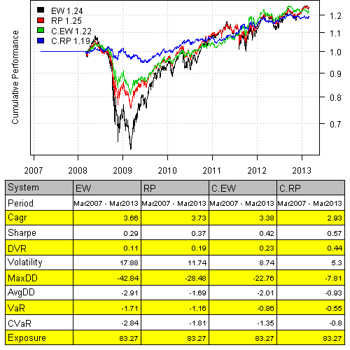

<!--yml
category: 未分类
date: 2024-05-18 14:33:26
-->

# Cluster Risk Parity back-test | Systematic Investor

> 来源：[https://systematicinvestor.wordpress.com/2013/03/05/cluster-risk-parity-back-test/#0001-01-01](https://systematicinvestor.wordpress.com/2013/03/05/cluster-risk-parity-back-test/#0001-01-01)

In the [Cluster Portfolio Allocation](https://systematicinvestor.wordpress.com/2013/02/12/cluster-portfolio-allocation/) post, I have outlined the 3 steps to construct Cluster Risk Parity portfolio. At each rebalancing period:

*   Create Clusters
*   Allocate funds within each Cluster using Risk Parity
*   Allocate funds across all Clusters using Risk Parity

I created a helper function [distribute.weights() function in strategy.r at github](https://github.com/systematicinvestor/SIT/blob/master/R/strategy.r) to automate these steps. It has 2 parameters:

*   Function to allocate funds. For example, risk.parity.portfolio, will use use risk parity to allocate funds both within and across clusters.
*   Function to create clusters. For example, cluster.group.kmeans.90, will create clusters using k-means algorithm

Here is the example how to put it all together. Let’s first load historical prices for the 10 major asset classes:

```

###############################################################################
# Load Systematic Investor Toolbox (SIT)
# https://systematicinvestor.wordpress.com/systematic-investor-toolbox/
###############################################################################
setInternet2(TRUE)
con = gzcon(url('http://www.systematicportfolio.com/sit.gz', 'rb'))
    source(con)
close(con)

	#*****************************************************************
	# Load historical data for ETFs
	#****************************************************************** 
	load.packages('quantmod')

	tickers = spl('GLD,UUP,SPY,QQQ,IWM,EEM,EFA,IYR,USO,TLT')

	data <- new.env()
	getSymbols(tickers, src = 'yahoo', from = '1900-01-01', env = data, auto.assign = T)
		for(i in ls(data)) data[[i]] = adjustOHLC(data[[i]], use.Adjusted=T)

	bt.prep(data, align='remove.na')

```

Next, let’s run the 2 versions of [Cluster Portfolio Allocation](https://systematicinvestor.wordpress.com/2013/02/12/cluster-portfolio-allocation/) using Equal Weight and Risk Parity algorithms to allocate funds:

```

	#*****************************************************************
	# Code Strategies
	#****************************************************************** 	
	periodicity = 'months'
	lookback.len = 250
	cluster.group = cluster.group.kmeans.90

	obj = portfolio.allocation.helper(data$prices, 
		periodicity = periodicity, lookback.len = lookback.len,
		min.risk.fns = list(
				EW=equal.weight.portfolio,
				RP=risk.parity.portfolio,

				C.EW = distribute.weights(equal.weight.portfolio, cluster.group),
				C.RP=distribute.weights(risk.parity.portfolio, cluster.group)
			)
	) 		

	models = create.strategies(obj, data)$models

```

Finally, let’s examine the results:

```

	#*****************************************************************
	# Create Report
	#****************************************************************** 	
	strategy.performance.snapshoot(models, T)

```

[](https://systematicinvestor.wordpress.com/wp-content/uploads/2013/03/plot1-small.png)

The [Cluster Portfolio Allocation](https://systematicinvestor.wordpress.com/2013/02/12/cluster-portfolio-allocation/) produce portfolios with better risk-adjusted returns and smaller drawdowns.

To view the complete source code for this example, please have a look at the [bt.cluster.portfolio.allocation.test1() function in bt.test.r at github](https://github.com/systematicinvestor/SIT/blob/master/R/bt.test.r).