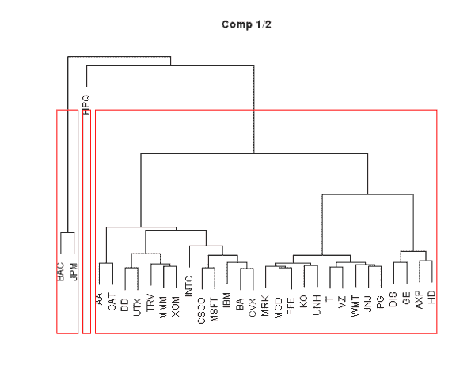
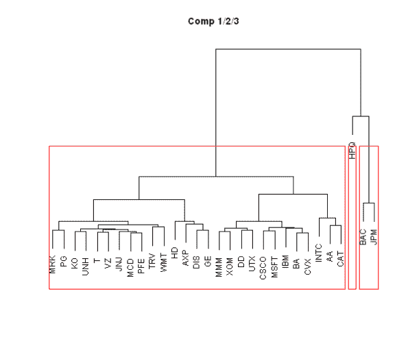
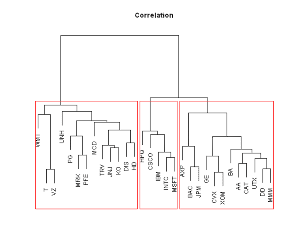

<!--yml
category: 未分类
date: 2024-05-18 14:35:06
-->

# Clustering with selected Principal Components | Systematic Investor

> 来源：[https://systematicinvestor.wordpress.com/2012/12/29/clustering-with-selected-principal-components/#0001-01-01](https://systematicinvestor.wordpress.com/2012/12/29/clustering-with-selected-principal-components/#0001-01-01)

In the [Visualizing Principal Components](https://systematicinvestor.wordpress.com/2012/12/22/visualizing-principal-components/) post, I looked at the [Principal Components](http://en.wikipedia.org/wiki/Principal_component_analysis) of the companies in the [Dow Jones Industrial Average index](http://en.wikipedia.org/wiki/Dow_Jones_Industrial_Average) over 2012\. Today, I want to show how we can use [Principal Components](http://en.wikipedia.org/wiki/Principal_component_analysis) to create [Clusters](http://home.dei.polimi.it/matteucc/Clustering/tutorial_html/) (i.e. form groups of similar companies based on their distance from each other)

Let’s start by loading the historical prices for the the companies in the [Dow Jones Industrial Average index](http://en.wikipedia.org/wiki/Dow_Jones_Industrial_Average) that we saved in the [Visualizing Principal Components](https://systematicinvestor.wordpress.com/2012/12/22/visualizing-principal-components/) post.

```

###############################################################################
# Load Systematic Investor Toolbox (SIT)
# https://systematicinvestor.wordpress.com/systematic-investor-toolbox/
###############################################################################
setInternet2(TRUE)
con = gzcon(url('http://www.systematicportfolio.com/sit.gz', 'rb'))
    source(con)
close(con)

	#*****************************************************************
	# Load historical data
	#****************************************************************** 
	load.packages('quantmod')	

	# load data saved in the bt.pca.test() function
	load(file='bt.pca.test.Rdata')

	#*****************************************************************
	# Principal component analysis (PCA), for interesting discussion
	# http://machine-master.blogspot.ca/2012/08/pca-or-polluting-your-clever-analysis.html
	#****************************************************************** 
	prices = data$prices	
	ret = prices / mlag(prices) - 1

	p = princomp(na.omit(ret))

	loadings = p$loadings[]

	x = loadings[,1]
	y = loadings[,2]
	z = loadings[,3]	

```

To create [Clusters](http://home.dei.polimi.it/matteucc/Clustering/tutorial_html/), I will use the hierarchical cluster analysis, hclust function, in stats package. The first argument in the hclust function is the distance (dissimilarity) matrix. To compute distance matrix, let’s take the first 2 principal components and compute the [Euclidean distance](http://en.wikipedia.org/wiki/Euclidean_distance) between each company:

```

	#*****************************************************************
	# Create clusters
	#****************************************************************** 		
	# create and plot clusters based on the first and second principal components
	hc = hclust(dist(cbind(x,y)), method = 'ward')
	plot(hc, axes=F,xlab='', ylab='',sub ='', main='Comp 1/2')
	rect.hclust(hc, k=3, border='red')

```

[](https://systematicinvestor.wordpress.com/2012/12/29/clustering-with-selected-principal-components/plot1-png-small-69/)

Similarly we can use the first three principal components:

```

	# create and plot clusters based on the first, second, and third principal components
	hc = hclust(dist(cbind(x,y,z)), method = 'ward')
	plot(hc, axes=F,xlab='', ylab='',sub ='', main='Comp 1/2/3')
	rect.hclust(hc, k=3, border='red')

```

[](https://systematicinvestor.wordpress.com/2012/12/29/clustering-with-selected-principal-components/plot2-png-small-66/)

Another option is to use the [Correlation matrix](http://en.wikipedia.org/wiki/Correlation_and_dependence) as a proxy for a distance matrix:

```

	# create and plot clusters based on the correlation among companies
	hc = hclust(as.dist(1-cor(na.omit(ret))), method = 'ward')
	plot(hc, axes=F,xlab='', ylab='',sub ='', main='Correlation')
	rect.hclust(hc, k=3, border='red')

```

[](https://systematicinvestor.wordpress.com/2012/12/29/clustering-with-selected-principal-components/plot3-png-small-46/)

Please note that [Clusters](http://home.dei.polimi.it/matteucc/Clustering/tutorial_html/) will be quite different, depending on the distance matrix you use.

To view the complete source code for this example, please have a look at the [bt.clustering.test() function in bt.test.r at github](https://github.com/systematicinvestor/SIT/blob/master/R/bt.test.r).