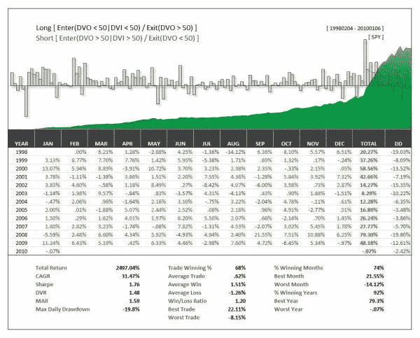

<!--yml
category: 未分类
date: 2024-05-12 18:38:17
-->

# Combining Binary Short-term and Intermediate-term Mean-Reversion Indicators (DVI and DVO) | CSSA

> 来源：[https://cssanalytics.wordpress.com/2010/01/07/combining-binary-short-and-intermediate-mean-reversion-indicators-dvi-and-dvo/#0001-01-01](https://cssanalytics.wordpress.com/2010/01/07/combining-binary-short-and-intermediate-mean-reversion-indicators-dvi-and-dvo/#0001-01-01)

Here is a backtest of using the DVO and DVI together (see [www.dvindicators.com](http://www.dvindicators.com)). No curve fitting or filtering was done, just buy when the DVO (short-term) is below the median (50) and DVI (intermediate-term) is below the median (50). Reverse the rules for shorts. The results were even better across many of the major ETFs. Of course, there is plenty of room for improvement here–but its a start!
