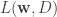

<!--yml
category: 未分类
date: 2024-05-18 13:53:12
-->

# Combining Regression & Ranking | Quantivity

> 来源：[https://quantivity.wordpress.com/2010/09/06/combining-regression-and-ranking/#0001-01-01](https://quantivity.wordpress.com/2010/09/06/combining-regression-and-ranking/#0001-01-01)

Many types of trading analysis problems boil down to a combination of [*regression*](http://en.wikipedia.org/wiki/Regression_analysis) and [*ranking*](http://en.wikipedia.org/wiki/Ranking), in one guise or another (*e.g.* classical or minimizing custom loss functions). Yet, the relationship between these two techniques is subtle and their interdependence subject to myriad practical difficulties. One familiar example is the lack of necessary performance equivalence, meaning excellent regression may result in poor ranking and vice versa.

[KDD-2010](http://www.sigkdd.org/kdd2010/) recently included a paper, [Combined Ranking and Regression](http://www.eecs.tufts.edu/~dsculley/papers/combined-ranking-and-regression.pdf) by [Sculley](http://www.eecs.tufts.edu/~dsculley/), which describes an approach combining both techniques by simultaneously optimizing dual objective functions. Specifically, from p. 1:

> Model that performs well on two distinct families of metrics. The first set of metrics are regression based metrics, such as Mean Squared Error, which reward a model for predicting a numerical value y′ that is near to the true target value y for a given example, and penalize predictions far from y. The second set are rank-based metrics, such as Area under the ROC curve (AUC), which reward a model for producing predicted values with the same pairwise ordering y′[1] > y′[2] as the true values y[1] > y[2] for a pair of given examples.

Purported benefits of this combined approach are quite interesting, given financial data:

*   *Stability*: Guards against learning degenerate models that perform well on one set of metrics but poorly on another
*   *Non-normal distributions*: Improve regression performance in the case of rare events, including long-tailed and extreme minority class distributions

The optimization objective is, (3) from p. 3:

     ![\min_{{\bf w} \in \mathbb{R}^m} [ \alpha L({\bf w}, D) + (1 - \alpha) L({\bf w}, P) + \frac{\lambda}{2} ||{\bf w}||^2_2 ] ](img/53095a8a1d902f2a26cdc8586f4a7fb9.png)

Where  is regression loss,  is ranking loss, and ![\alpha \in [0, 1] ](img/53f0dd9b602ff1f4d81daf74b8444c4b.png) is loss weight parameter. Algorithm uses [stochastic gradient descent](http://en.wikipedia.org/wiki/Stochastic_gradient_descent).