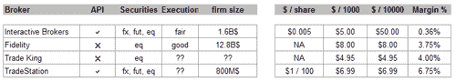

<!--yml
category: 未分类
date: 2024-05-18 15:34:22
-->

# Commissions | Tr8dr

> 来源：[https://tr8dr.wordpress.com/2010/02/01/commissions/#0001-01-01](https://tr8dr.wordpress.com/2010/02/01/commissions/#0001-01-01)

February 1, 2010 · 2:23 pm

It is quite frustrating that commissions arrangements are so opaque.   Basically professional trading firms have to negotiate with the venues (if you are big enough to go direct) or with your prime broker.

I was previously on the “sell side” so have a pretty good idea of what commissions were in the FX & Rates markets.   I don’t have much idea about this on the equity side though.

I have a new strategy in the equities markets and trying to determine what sort of commissions would be involved.   It would be good to know what the sell side and hedge funds “see” in terms of fees as a point of reference.    What sort of upside woud one have in terms of commissions should one structure as a well capitalized fund?

So I did a bit of digging on the web.   The only information out there that I can find is for retail.   On the retail side (I use IB at the moment):

I’ve run across a number of articles like [this](http://www.advancedtrading.com/managingthedesk/showArticle.jhtml?articleID=218401221), indicating commission costs of ~ **2 cents / share** for institutional trading (this must be a typo or I am misunderstanding the article).

I’m sure fees on the equity venues are much less than the bid/ask spread (which for liquid issues is 1 cent or less).   In fact some venues provide rebates (give you money) if you are providing liquidity rather than aggressing.   Now for a buy-side firm with a prime-brokerage arrangement, whose goal is not equities market making, the costs must be quite a bit higher than going direct.   I would guess would still be less than 1/100th of retail.

In any case, I am trying to get a better handle on what the true costs are for different situations.   If anyone has some indicative #s for commissions on the buy side would be appreciated.