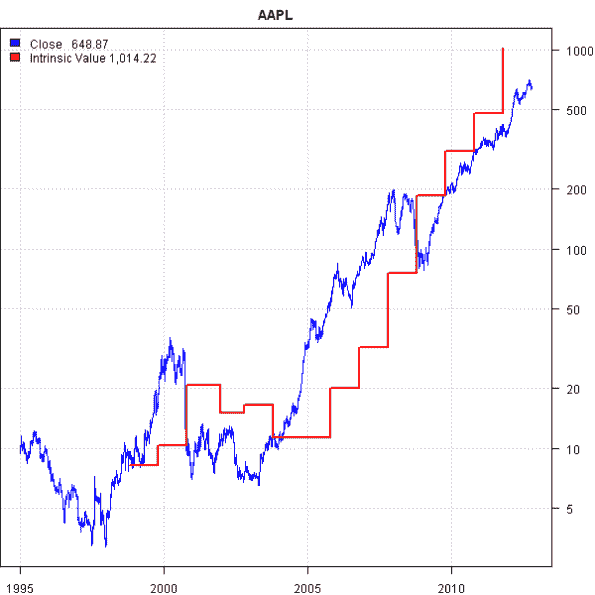
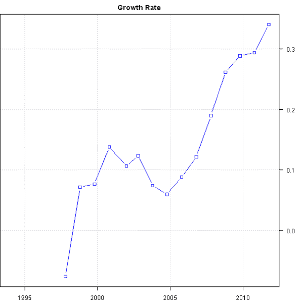
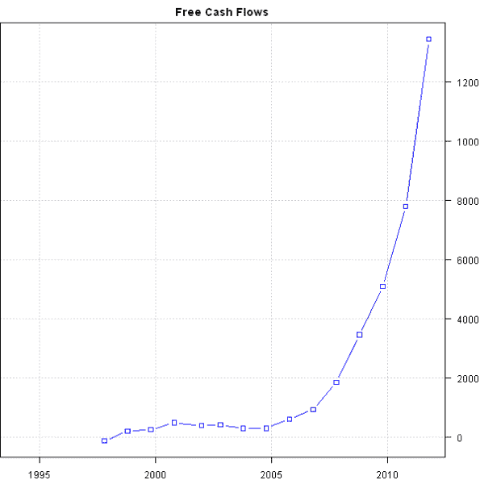

<!--yml
category: 未分类
date: 2024-05-18 14:36:33
-->

# Company Valuation using Discounted Cash Flows | Systematic Investor

> 来源：[https://systematicinvestor.wordpress.com/2012/10/19/company-valuation-using-discounted-cash-flows/#0001-01-01](https://systematicinvestor.wordpress.com/2012/10/19/company-valuation-using-discounted-cash-flows/#0001-01-01)

Today I want to show a simple example of how we can value a company using [Discounted Cash Flow (DCF) analysis](http://en.wikipedia.org/wiki/Discounted_cash_flow). The idea is to compute the company’s Intrinsic Value based on the discounted future cash-flows. To compute future cash-flows I will use the historical Free Cash Flow growth rate. To compute present value of these cash flows I will use a conservative 9% discount rate. If you want to read more about the [Discounted Cash Flow (DCF) analysis](http://en.wikipedia.org/wiki/Discounted_cash_flow), I recommend following references:

First let’s load historical prices and fundamental data for Apple (AAPL) using the [Systematic Investor Toolbox](https://systematicinvestor.wordpress.com/systematic-investor-toolbox/).

```

###############################################################################
# Load Systematic Investor Toolbox (SIT)
# https://systematicinvestor.wordpress.com/systematic-investor-toolbox/
###############################################################################
setInternet2(TRUE)
con = gzcon(url('http://www.systematicportfolio.com/sit.gz', 'rb'))
    source(con)
close(con)

	#*****************************************************************
	# Load historical fundamental and pricing data
	#****************************************************************** 
	load.packages('quantmod') 
	tickers = spl('AAPL')
	tickers.temp = spl('NASDAQ:AAPL')

	# get fundamental data
	data.fund <- new.env()
	for(i in 1:len(tickers))
		data.fund[[tickers[i]]] = fund.data(tickers.temp[i], 80, 'annual')

	# get pricing data
	data <- new.env()
	getSymbols(tickers, src = 'yahoo', from = '1970-01-01', env = data, auto.assign = T)
		for(i in ls(data)) data[[i]] = adjustOHLC(data[[i]], use.Adjusted=T)			

	# prepare data
	fund = data.fund[[tickers[1]]]
	fund.date = date.fund.data(fund)			
	price = Cl(data[[tickers[1]]]['1995::'])

```

Next let’s extract fundamental data for [Discounted Cash Flow (DCF) analysis](http://en.wikipedia.org/wiki/Discounted_cash_flow)

```

	#*****************************************************************
	# Extract Inputs for DCF Valuation
	#****************************************************************** 				
	# Free Cash Flows
	FCF = get.fund.data('free cash flow', fund, fund.date)

	# Invested Capital
	IC = get.fund.data('invested capital', fund, fund.date)

	# Sales
	SALE = get.fund.data('total revenue', fund, fund.date)

	# Common Equity
	CEQ = get.fund.data('total equity', fund, fund.date)

	# Common Shares Outstanding
	CSHO = get.fund.data('total common shares out', fund, fund.date)

	# Growth Rate
	CROIC = FCF/IC

	# Average inputs
	g = runMean(CROIC, 5)
	cash = runMean(FCF, 5)

```

Next I created a simple function to estimate company’s Intrinsic Value using [Discounted Cash Flow (DCF) analysis](http://en.wikipedia.org/wiki/Discounted_cash_flow).

```

	#*****************************************************************
	# Helper function to compute Intrinsic Value
	#****************************************************************** 				
	compute.DCF.IV <- function(cash, eqity, shares, g, R) {
		if( cash <= 0 ) return(NA)

		if( len(R) == 1 ) R = rep(R, len(g))

		value = eqity + sum(cash * cumprod(1 + g) / cumprod(1 + R))
		return( value / shares )
	}

```

Finally, let’s compute AAPL’s Intrinsic Value and create plots

```

	#*****************************************************************
	# Compute Intrinsic Value, assumptions:
	# Company will grow for the first 3 years at current Growth Rate
	# slowed down by 20% for the next 4 years, and slowed down by a further 20% for the next 3 years
	# and finally 3% growth for the next 10 years
	#
	# The Discount Rate is 9%
	#
	# http://www.oldschoolvalue.com/blog/stock-analysis/apple-aapl-valuation/
	#****************************************************************** 				
	dcf.price = NA * g
	i.start = which(!is.na(g))[1] 

	for(i in i.start : nrow(g)) {
		# Create Growth Rate scenario: 		
		g.scenario = c(rep(g[i],3), rep(g[i],4)*0.8, rep(g[i],3)*0.8*0.8, rep(3/100,10))

		# Compute Intrinsic Value
		dcf.price[i] = compute.DCF.IV(cash[i], CEQ[i], CSHO[i], g.scenario, 9/100)
	}

	#*****************************************************************
	# Create Plots
	#****************************************************************** 
	plota(price, type='l', log = 'y', col='blue', main=tickers[1],
		ylim=range(price,dcf.price,na.rm=T))
	plota.lines(dcf.price, type='s', col='red', lwd=2)
	plota.legend('Close,Intrinsic Value', 'blue,red', list(price, dcf.price))	

	plota(g, type='b', col='blue', pch=0, main='Growth Rate')	

	plota(cash, type='b', col='blue', pch=0, main='Free Cash Flows')	

```

[](https://systematicinvestor.wordpress.com/wp-content/uploads/2012/10/plot1.png)

[](https://systematicinvestor.wordpress.com/wp-content/uploads/2012/10/plot2.png)

[](https://systematicinvestor.wordpress.com/wp-content/uploads/2012/10/plot3.png)

The Intrinsic Value calculations are highly sensitive to your assumptions about the company’s Growth Rate and Discount Rate used in the [Discounted Cash Flow (DCF) analysis](http://en.wikipedia.org/wiki/Discounted_cash_flow).

AAPL has experienced the amazing Growth Rate over the last 5 years and the big question is whether AAPL will be able to maintain this Growth Rate in the future. If yes, then the stock price can easily reach new highs as suggested by the [Discounted Cash Flow (DCF) analysis](http://en.wikipedia.org/wiki/Discounted_cash_flow).

To view the complete source code for this example, please have a look at the [fundamental.dcf.test() function in fundamental.test.r at github](https://github.com/systematicinvestor/SIT/blob/master/R/fundamental.test.r).