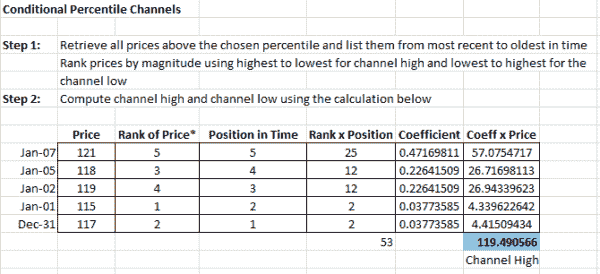
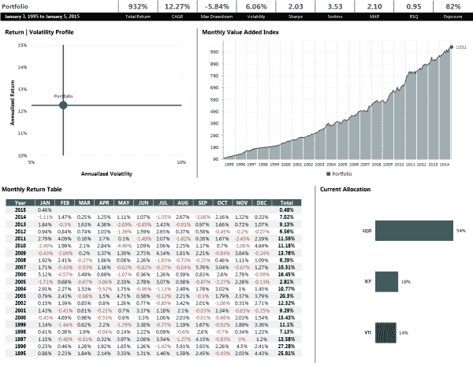

<!--yml
category: 未分类
date: 2024-05-12 17:48:09
-->

# Conditional Percentile Channels | CSSA

> 来源：[https://cssanalytics.wordpress.com/2015/02/20/conditional-percentile-channels/#0001-01-01](https://cssanalytics.wordpress.com/2015/02/20/conditional-percentile-channels/#0001-01-01)

Ilya Kipnis at Quantstrat [recently posted some R code](https://quantstrattrader.wordpress.com/2015/02/17/an-attempt-at-replicating-david-varadis-percentile-channels-strategy/) attempting to replicate the ever-popular [Percentile Channel Tactical Strategy](https://cssanalytics.wordpress.com/2015/02/08/a-simple-tactical-asset-allocation-portfolio-with-percentile-channels-for-dummies/ "A “Simple” Tactical Asset Allocation Portfolio with Percentile Channels (for Dummies)"). The results are similar but not exactly in line- which may have to do with the percentile function as Ilya has pointed out in the comments. In either case, the general spirit remains the same and readers are encouraged to take a look at his analysis of the strategy.

In quantitative finance there is the concept of “[Conditional Value at Risk](http://www.investopedia.com/terms/c/conditional_value_at_risk.asp)” (CVaR) which is a calculation frequently used in risk management. The general idea is that you are trying to capture the expectation beyond a certain tail of the distribution. The CVaR is preferred to the value at risk because it more comprehensive than looking a just one value. Likewise, Percentile Channels are similar to value at risk in that context as well as traditional Donchian Channels which only look at one reference price. Perhaps a logical improvement would be like CVaR to use the average of the prices above a certain percentile threshold. This is more like calculating the **expected** upper or lower bound for prices. Furthermore to account for the fact that recent data is progressively more important than older data, we can weight such prices accordingly.In theory, the most important prices are at the extremes and should also be weighted as such. So Conditional Percentile Channels is simply a twist on Percentile Channels incorporating these two ideas. Here is how it would be calculated:

Basically you select a threshold like .75 and .25, and then you weight the prices that are above those thresholds according to both position in time (like a weighted moving average) and distance to max or min. This gives you a more accurate expected upper or lower bound for support and resistance (at least in theory). I know I am going to regret this, but using the same strategy ie- Percentile Channel Tactical Strategy in the last few posts- I substituted in the Conditional Percentile Channels using the same threshold of .75 and .25\. All other parameters are identical. Here is how that looks:

Looks like a slight improvement over the original strategy in both returns and risk-adjusted returns. In general, I just like the concept better since it condenses more information about support/resistance than either Donchian Channels or Percentile Channels. It also represents a good complement to moving averages which capture central tendency rather than price movement at the extremes. So there you have it- yet another twist on using channels.