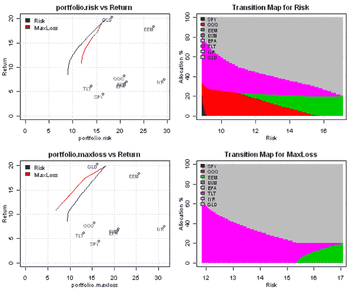
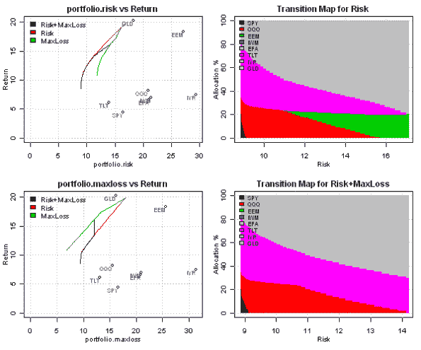

<!--yml
category: 未分类
date: 2024-05-18 14:47:54
-->

# Controlling multiple risk measures during construction of efficient frontier | Systematic Investor

> 来源：[https://systematicinvestor.wordpress.com/2011/10/26/controlling-multiple-risk-measures-during-construction-of-efficient-frontier/#0001-01-01](https://systematicinvestor.wordpress.com/2011/10/26/controlling-multiple-risk-measures-during-construction-of-efficient-frontier/#0001-01-01)

In the last few posts I introduced [Maximum Loss, Mean-Absolute Deviation](https://systematicinvestor.wordpress.com/2011/10/14/maximum-loss-and-mean-absolute-deviation-risk-measures/), and [Expected shortfall (CVaR) and Conditional Drawdown at Risk (CDaR)](https://systematicinvestor.wordpress.com/2011/10/25/expected-shortfall-cvar-and-conditional-drawdown-at-risk-cdar-risk-measures/) risk measures. These risk measures can be formulated as linear constraints and thus can be combined with each other to control multiple risk measures during construction of efficient frontier.

Let’s examine efficient frontiers computed under different risk measures using historical input assumptions presented in the [Introduction to Asset Allocation](https://systematicinvestor.wordpress.com/2011/10/13/introduction-to-asset-allocation/) post:

```

# load Systematic Investor Toolbox
setInternet2(TRUE)
source(gzcon(url('https://github.com/systematicinvestor/SIT/raw/master/sit.gz', 'rb')))

#--------------------------------------------------------------------------
# Create Efficient Frontier
#--------------------------------------------------------------------------
	ia = aa.test.create.ia()
	n = ia$n		

	# 0 <= x.i <= 0.8
	constraints = new.constraints(n, lb = 0, ub = 0.8)

	# SUM x.i = 1
	constraints = add.constraints(rep(1, n), 1, type = '=', constraints)		

	# create efficient frontier(s)
	ef.risk = 	portopt(ia, constraints, 50, 'Risk')
	ef.maxloss = 	portopt(ia, constraints, 50, 'MaxLoss',	min.maxloss.portfolio)

	# Plot multiple Efficient Frontiers
	layout( matrix(1:4, nrow = 2) )
	plot.ef(ia, list(ef.risk, ef.maxloss), portfolio.risk, F)	
	plot.ef(ia, list(ef.risk, ef.maxloss), portfolio.maxloss, F)	

	plot.transition.map(ef.risk)
	plot.transition.map(ef.maxloss)

```

[](https://systematicinvestor.wordpress.com/wp-content/uploads/2011/10/plot1-small7.png)

To construct a new mean-variance efficient frontier that only contains portfolios with Max Loss less than 12%

```

	#--------------------------------------------------------------------------
	# Add MaxLoss <= 12 constraint
	#--------------------------------------------------------------------------

	constraints = add.constraint.maxloss(ia, 12/100, '<=', constraints)	

	ef.risk.maxloss = portopt(ia, constraints, 50, 'Risk+MaxLoss')
		ef.risk.maxloss$weight = ef.risk.maxloss$weight[, 1:n]

	# Plot multiple Efficient Frontiers
	layout( matrix(1:4, nrow = 2) )
	plot.ef(ia, list(ef.risk.maxloss, ef.risk, ef.maxloss), portfolio.risk, F)	
	plot.ef(ia, list(ef.risk.maxloss, ef.risk, ef.maxloss), portfolio.maxloss, F)	

	plot.transition.map(ef.risk)
	plot.transition.map(ef.risk.maxloss)

```

[](https://systematicinvestor.wordpress.com/wp-content/uploads/2011/10/plot2-small7.png)

The new efficient frontier, labeled ‘Risk+MaxLoss’, is located between ‘Risk’ and ‘MaxLoss’ efficient frontiers in both Risk, measure by Standard Deviation, and Maximum Loss plots. The main difference between original ‘Risk’ and new ‘Risk+MaxLoss’ portfolios can be seen for their Transition Maps. To control Maximum Loss during mean-variance optimization, the ‘Risk+MaxLoss’ portfolios do not have allocation to Emerging Markets (EEM – highlighted with green).

To view the complete source code for this example and other examples, please have a look at the [aa.multiple.risk.measures.test() function in aa.test.r at github](https://github.com/systematicinvestor/SIT/blob/master/R/aa.test.r).