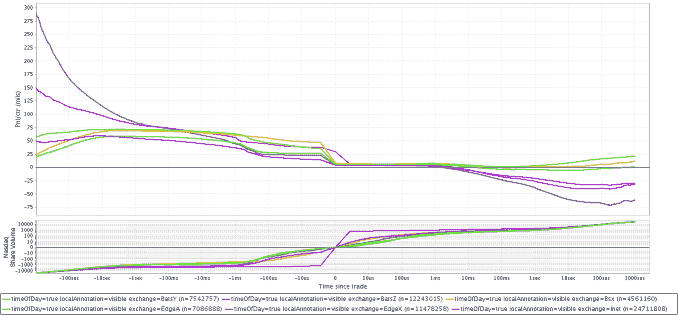
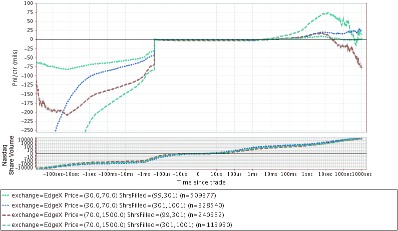

<!--yml
category: 未分类
date: 2024-05-18 06:44:41
-->

# Creating an HFT Strategy: Identifying Trader Type Pt. 2 | Mechanical Markets

> 来源：[https://mechanicalmarkets.wordpress.com/2015/01/20/identifying-trader-type-pt-2/#0001-01-01](https://mechanicalmarkets.wordpress.com/2015/01/20/identifying-trader-type-pt-2/#0001-01-01)

We saw in [part 1](https://mechanicalmarkets.wordpress.com/2015/01/13/trader-type-and-order-age/ "part 1") that orders that have been sitting on an exchange for a while don’t do as well versus the market price as their short-lived peers. In this post I discuss whether this tendency can be made into a viable trading strategy. The most boneheadedly obvious basis for a strategy would be to do the following:

*   When we see a sufficiently old order execute in the market data feed, immediately send a marketable order at the same price, attempting to trade against any liquidity remaining in the book.

While doing this sort of thing results in better executions than simply copying all executions, it won’t get anywhere near profitability. To do that, we need to know a few other things about the structure of the US equities market. Probably the most important fact would be that resting orders on DirectEdge’s EdgeX tend to perform much worse after execution than on other conventional exchanges. I don’t know the reason for it, but every exchange has a different mix of traders and order flow. EdgeX could have incoming marketable orders with unusually high alpha, resting passive orders with unusually low alpha, or both.

Performance of visible orders executed on various exchanges. Chart is generally the same as those in Part 1\. Note that exchange rebates are not included, so the enhanced performance of the passive orders on the inverted exchanges, Nasdaq Bx (Bsx) ; Bats BYX (BatsY); DirectEdge EdgeA (EdgeA), is largely due to the difference in rebate.

Another important fact is that trades on ‘expensive’ stocks (those with a high per-share price, not valuation) also have their passive side tend to perform poorly after execution in comparison with ‘cheap’ stocks. This is an interesting phenomenon all by itself and could be a sign of reduced market making activity in expensive stocks – possibly due to reduced liquidity, the tick size and exchange rebates being less significant compared to volatility, the SEC fee (which is charged per dollar value traded) being higher per-share, or even just the tradition that orders are submitted in 100-share increments (making the ‘minimum’ counterparty order size of 100 shares too big for market makers to deal with profitably). For similar reasons, strategies that lean towards removing resting liquidity may find the economics better on expensive stocks. A more bizarre attribute of EdgeX is that its large resting orders make for favorable counterparties. For a wide class of trading activity across many exchanges, having a large order partially execute leaving a significant quantity of it un-executed probably means that the large order is getting the better side of the deal than whoever traded with it. The reason for this behavior is intuitive; at the least you’d expect that if the smaller trader in this example were confident about the direction of the price then that trader would have traded the entire quantity available. If all high-alpha traders behave optimally in this way, then the trades that only nip at the large orders will be sent by relatively more noise-traders and those who will not be following up with additional orders (e.g. they filled their allotment or reached a position limit). For some reason, on EdgeX, this isn’t really the case. For example if I simulate a ‘strategy’ that copies all aggressive executions (trading with the resting passive orders), it actually performs better when EdgeX has more quantity available at the price level.

The performance of simulated 1000-share orders that simply copy executions seen on EdgeX, split by share price and filled quantity. The enhanced performance of the larger fills is highly unusual.

To see why this is so bizarre, imagine going to a Best Buy and seeing some bigshot buy out almost all the Dell laptops in stock. Imagine also that someone ordinary comes and buys a single Mac, leaving 50 on the shelves. You’d probably expect the guy who bought the Dells, having done his homework, would have gotten a better price than the Mac buyer. But it turns out that if Best Buy sells its goods on EdgeX, the Mac buyer tends to be a much smarter buyer. Maybe the Dell guy is buying all those computers on a corporate expense account and doesn’t care about the price, but that’s not really what you expect in a world of professional traders who supposedly have their performance carefully tracked. We can also think a little bit about our specific edge and whether we’re implementing it well by looking only at the age of the order that traded. It’d make far more sense to have our strategy look at all orders across all exchanges and trade only when all of those orders are sufficiently old. Doing that gets us another 0.1 – 0.15 cents per share. There’s surely a way to optimize the age cutoffs by exchange, but we’ll just slap a uniform threshold of 5 seconds across every resting order on every exchange. To summarize, our proposed strategy does the following:

1.  Looks for 100 shares on EdgeX to trade with an order that is at least 5 seconds old.
2.  If every order we see market-wide is older than 5 seconds, submit an order intending to execute against any quantity remaining on EdgeX.
3.  Send a large order (e.g. 1000 shares) to do more volume and preferentially trade during times when there’s a large volume still available on EdgeX (or alternatively, send orders of any size, only when there’s at least 300 shares available).
4.  Do this on stocks over 70$ per share and, to do more volume, price our order 1 cent more aggressively than the trade we just saw.

How does it perform?

Simulated performance of trades done by the strategy outlined above. Some important exchanges are missing from the simulated data, which can only hurt the performance of our strategy, since it’s not able to take into account the age of these exchanges’ orders. Note that (like all the previous plots), this plot weights a trade’s market pnl by its executed quantity. Simulation is over about 2.5 weeks in Aug. 2014, not a particularly special time for this strategy. Simulated fills are split by filled quantity for illustration. Note that there is no huge spike in volume on Nasdaq (the largest and fastest exchange) after our simulated trade. On average 10-20 shares have traded 1ms after we have, similar to the number seen in the much less discriminating simulation directly above. A volume spike would be indicative of simultaneous algorithmic trading activity, suggesting few automated traders are doing something related to this strategy.

I think the result is pretty shocking. All the facts used in the strategy are readily seen in the market data and it’s really not doing anything fancy. In terms of HFT, this is about as simple a strategy as you can get; it has undergone virtually no optimization, has no statistical model, limited logic, and uses few features in the market data. It does somewhat fly in the face of the wisdom that successful trading strategies are extremely complex and take years to construct. Of course, it doesn’t make all that much money (by HFT standards) and is lacking a method to exit its positions in a timely fashion, but it’s not hard to imagine that some more serious work could turn it into something that does much more volume. The way it is now, it makes about 1 cent per share before fees on the relevant trades, trading around 7000 times per day, with an average execution size of about 350 shares. After paying fees of roughly 0.5 cents per share (0.3 cent exchange fee, around 0.2 cent SEC fee on these stocks, clearing fees are usually not more than a few hundredths of a cent), we’re looking at around 10k/day profit. I haven’t run this strategy in a production environment; it’s just a simulation and sometimes real-world results vary. But generally speaking there’s less that can go wrong in simulations that trade aggressively compared to market-making simulations. In some situations, it’s possible for a market inefficiency to persist, even with the presence of vigilant traders. Often in such cases the inefficiency is squeezed into the so-called micro-structure, the time-scale of the fastest traders on the market. We can imagine a situation where there’s a few sloppy traders responsible for those old, large orders that perform poorly. A possibility that keeps the inefficiency visible to us would be a stampede to trade with any quantity remaining after these older orders execute. In that case, we’d expect a spike in volume right after these executions as well as substantial latency sensitivity in the simulation, neither of which I see. Adding an extra 100 microseconds (a long time to an HFT) to the simulated latency doesn’t make a huge difference. It’s commonly said that market inefficiencies tend to exist only in the micro-structure. This example shows not just an inefficiency at a middling time scale, but one that is sizable enough in principle to generate a profit. It does make me wonder whether all those supposedly sophisticated execution algorithms and quantitative strategies are capturing even the most basic features of the market.