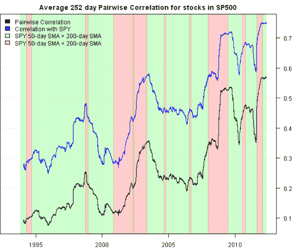

<!--yml
category: 未分类
date: 2024-05-18 14:41:12
-->

# Cross Sectional Correlation | Systematic Investor

> 来源：[https://systematicinvestor.wordpress.com/2012/05/08/cross-sectional-correlation/#0001-01-01](https://systematicinvestor.wordpress.com/2012/05/08/cross-sectional-correlation/#0001-01-01)

Diversification is hard to find nowadays because financial markets are becoming increasingly correlated. I found a good visually presentation of Cross Sectional Correlation of stocks in the S&P 500 index in the [Trading correlation by D. Varadi and C. Rittenhouse](http://www.activetradermag.com/index.php/c/Trading_Strategies/d/Trading_correlation) article.

Let’s compute and plot the average correlation among stocks in the S&P 500 index and the the average correlation between SPY and stocks in the S&P 500 index using the [Systematic Investor Toolbox](https://systematicinvestor.wordpress.com/systematic-investor-toolbox/):

```

###############################################################################
# Load Systematic Investor Toolbox (SIT)
# https://systematicinvestor.wordpress.com/systematic-investor-toolbox/
###############################################################################
con = gzcon(url('http://www.systematicportfolio.com/sit.gz', 'rb'))
    source(con)
close(con)

	#*****************************************************************
	# Load historical data
	#****************************************************************** 
	load.packages('quantmod')	
	tickers = sp500.components()$tickers

	data <- new.env()
	getSymbols(tickers, src = 'yahoo', from = '1970-01-01', env = data, auto.assign = T)
		for(i in ls(data)) data[[i]] = adjustOHLC(data[[i]], use.Adjusted=T)		
	bt.prep(data, align='keep.all', dates='1970::')

	spy = getSymbols('SPY', src = 'yahoo', from = '1970-01-01', auto.assign = F)
		ret.spy = coredata( Cl(spy) / mlag(Cl(spy))-1 )

	#*****************************************************************
	# Code Logic
	#****************************************************************** 
	prices = data$prices['1993:01:29::']  
		nperiods = nrow(prices)

	ret = prices / mlag(prices) - 1
		ret = coredata(ret)

	# require at least 100 stocks with prices
	index = which((count(t(prices)) > 100 ))
		index = index[-c(1:252)]

	# average correlation among S&P 500 components
	avg.cor = NA * prices[,1]

	# average correlation between the S&P 500 index (SPX) and its component stocks
	avg.cor.spy = NA * prices[,1]

	for(i in index) {
		hist = ret[ (i- 252 +1):i, ]
		hist = hist[ , count(hist)==252, drop=F]
			nleft = ncol(hist)

		correlation = cor(hist, use='complete.obs',method='pearson')
		avg.cor[i,] = (sum(correlation) - nleft) / (nleft*(nleft-1))

		avg.cor.spy[i,] = sum(cor(ret.spy[ (i- 252 +1):i, ], hist, use='complete.obs',method='pearson')) / nleft

		if( i %% 100 == 0) cat(i, 'out of', nperiods, '\n')
	}

	#*****************************************************************
	# Create Report
	#****************************************************************** 				
 	sma50 = SMA(Cl(spy), 50)
 	sma200 = SMA(Cl(spy), 200)

 	cols = col.add.alpha(spl('green,red'),50)
	plota.control$col.x.highlight = iif(sma50 > sma200, cols[1], cols[2])
	highlight = sma50 > sma200 | sma50 < sma200

	plota(avg.cor, type='l', ylim=range(avg.cor, avg.cor.spy, na.rm=T), x.highlight = highlight,
			main='Average 252 day Pairwise Correlation for stocks in SP500')
		plota.lines(avg.cor.spy, type='l', col='blue')
		plota.legend('Pairwise Correlation,Correlation with SPY,SPY 50-day SMA > 200-day SMA,SPY 50-day SMA < 200-day SMA', 
		c('black,blue',cols))

```

[](https://systematicinvestor.wordpress.com/wp-content/uploads/2012/05/plot-sp500-cor-small.png)

The overall trend for correlations is up. Moreover, correlations are usually rising in the bear markets, when SPY 50-day SMA < 200-day SMA.

To view the complete source code for this example, please have a look at the [bt.rolling.cor.test() function in bt.test.r at github](https://github.com/systematicinvestor/SIT/blob/master/R/bt.test.r).