<!--yml
category: 未分类
date: 2024-05-18 13:52:45
-->

# Cross Sectional Volatility | Quantivity

> 来源：[https://quantivity.wordpress.com/2011/03/02/cross-sectional-volatility/#0001-01-01](https://quantivity.wordpress.com/2011/03/02/cross-sectional-volatility/#0001-01-01)

[Delay Embedding as Regime Signal](https://quantivity.wordpress.com/2011/02/24/delay-embedding-as-regime-signal/) prompted enough questions to warrant further commentary on the *principal component space*  and *cross-sectional volatility*  models, from which the regime signal 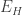 is derived. Understanding both are worthwhile for two reasons:

*   Lineage: this model is *stylistically* representative of the statarb tradition, spanning from [Computational Methodology for Modeling the Dynamics of Statistical Arbitrage](http://citeseerx.ist.psu.edu/viewdoc/summary?doi=10.1.1.99.6514) (Burgess, 1999) to [Statistical Arbitrage in the US Equities Market](http://papers.ssrn.com/sol3/papers.cfm?abstract_id=1153505) (Avellaneda and Lee, 2008); on the practical side, both Burgess and Neil Yelsey (acknowledged by Infantino and Itzhaki) are reputed to have run arbitrage desks
*   Exemplary: this illustrates how to build models which are *transformations of returns* (commonly via [dimensional reduction](http://en.wikipedia.org/wiki/Dimension_reduction)), rather than returns themselves—as Paul Grimoldi commented; this also speaks to Jeff’s question last year regarding the contrast of classic technical analysis with quantitative methods: visual pattern analysis of returns versus statistical analysis / ML on transformed returns

Intuition of this model is compelling, albeit obfuscated fairly heavily by its rough mathematical presentation: *mean-reverting convergence can be predicted via a dimensionally-reduced (principal components) [space](http://en.wikipedia.org/wiki/Vector_space) of returns from an equity portfolio*. The following seeks to explain this intuition, including use of more standard mathematical language than found in § 2.4 and § 3.1\.

First step is to choose a dimensional reduction to *denoise the returns*, providing a transformed basis for predicting returns. Doing so is justified by the assumption that “main risk factors should drive the stock’s returns in a systematic way, and the residuals as the noise to get rid” (p. 30), thus echoing [CAPM](http://en.wikipedia.org/wiki/CAPM) in that return is justified by risk (yet another [wonder of residuals](https://quantivity.wordpress.com/2009/08/02/wonder-of-residuals/)).

The trick is identifying anonymous equity *risk factors*, and using them to guide denoising and [feature extraction](http://en.wikipedia.org/wiki/Feature_extraction). [Principal component analysis](http://en.wikipedia.org/wiki/Principal_component_analysis) (PCA) is a natural choice, as principal components are chosen to maximize variance and thus naturally capture “risk” in the realized sense. PCA is further compelling as the corresponding eigenspace defines a *principal component space* which naturally serves as a [feature vector](http://en.wikipedia.org/wiki/Feature_vector) for statistic / ML analysis.

Denoising occurs by choosing a small number of the dominant PCA eigenvectors and composing them into the matrix . The eigenvectors which are omitted, those which only explain a small percent of variance, are thus considered “noise”. Presumably assumed justification is again based on CAPM: any eigenvector which does not explain systematic variance (*i.e.* risk) cannot explain systematic return. The number of  is remarked to be 4 – 5, collectively explaining over 80% of variance (footnote 19).

Second step is to define *prediction via the dimensionally-reduced principal component space*:

     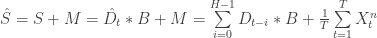

where 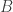 are estimates from a long-horizon regression and  are the return means. Recall that PCA assumes *de-meaned* returns (see [Karhunen–Loève](http://en.wikipedia.org/wiki/Karhunen%E2%80%93Lo%C3%A8ve_theorem) for explanation why), thus the mean must be added back to generate the prediction.

Use of a *long-horizon regression* to generate  is particularly interesting, as one is left to speculate given lack of stated justification (and authors’ misspelling). Historically, long-horizon regression were used to evaluate returns *predictability* and *component decomposition* (*e.g.* stationary, drift, and random walk). Early literature includes [Forward Exchange Rates as Optimal Predictors of Future Spot Rates](http://www.jstor.org/pss/1833137) (Hansen and Hodrick, 1980) and [Permanent and Temporary Components of Stock Prices](http://ideas.repec.org/a/ucp/jpolec/v96y1988i2p246-73.html) (Fama and French, 1988). Yet, the apparent intent for use in prediction differs from this precedence.

Instead, 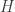-period *future* accumulated log returns are regressed against *lagging* -period eigenvectors from the principal component space:

     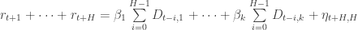

In other words, predict future returns based upon the past. Yet, the past is defined by principal components plus a noise term. One way to better understand this is to consider when 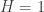:

     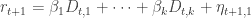

Thus, the one-step ahead return is equal to -scaled *eigenportfolio* from the previous step plus noise. Extending this logic, long-horizon can be interpreted as a longitudinal extension of the eigenportfolio with constant -scaled weights.

In this interpretation, extending the eigenportfolio longitudinally introduces the advantage of being able to observe the noise 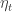 over  periods and calculate the hyperplane which simultaneously minimizes the sum of squared residuals over those periods. This insight opens the door to linear machine learning: instead of trying to estimate a single point  (which is pretty tough), a hyperplane can be estimated. Note this interpretation highlights a caveat: predicting accumulated future returns using this model *presumes the noise is stationary for the 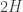 period* (provided 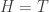, if not, then period is ). Otherwise, the regression assumptions are violated. Hence, duration of  must be sufficiently short for this assumption to be valid.

The trade signal is generated by *assuming mean-reverting convergence* of the residuals 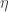 between predicted last  period of accumulated log returns versus the actual accumulated returns:

     ![\eta  = [ r_{t+1} + \cdots + r_{t + H} ] - [ \beta_1 \sum\limits_{i = 0}^{H-1} D_{t - i, 1} + \cdots + \beta_k \sum\limits_{i = 0}^{H-1} D_{t - i, k} ] ](img/add048b58ffda2905404fafd927ab1a9.png)

This convergence arises *by construction* from least squares regression estimation of the  hyperplane: residuals are stationary around zero. Thus, divergence from zero at  will converge back to zero at a nearby point.

Or, in trading speak: if actual returns are larger than predicted returns, then assume the corresponding stock is overvalued and sell; otherwise, buy.

*   **Cross Sectional Volatility**

Finally, a *cross sectional volatility* metric  can be defined within the principal component space . This metric is a *realized* volatility estimator, namely the [sample standard deviation](http://en.wikipedia.org/wiki/Standard_deviation), of the principal components (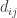 is the i-th, j-th element in ):

      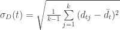

where the cross sectional mean is defined in the standard way:

      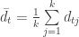

Hence, coming full circle:  defines the volatility which is delay embedded to measure volatility-regime correlation, as described in [Delay Embedding as Regime Signal](https://quantivity.wordpress.com/2011/02/24/delay-embedding-as-regime-signal/).