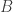
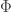

<!--yml
category: 未分类
date: 2024-05-18 13:43:29
-->

# Curiosity of LPPL | Quantivity

> 来源：[https://quantivity.wordpress.com/2011/02/08/curiosity-of-lppl/#0001-01-01](https://quantivity.wordpress.com/2011/02/08/curiosity-of-lppl/#0001-01-01)

Recent work building non-linear regime models has led Quantivity back into [econophysics](http://en.wikipedia.org/wiki/Econophysics). In doing so, coincidentally bumped into the proposed Log-Periodic Power Law (LPPL), which is a log-periodic oscillation model for describing the characteristic behavior of a speculative bubble and predicting its subsequent crash. In other words: a *macro [regime discovery](https://quantivity.wordpress.com/2010/02/15/regime-discovery/) model*.

This model was independently proposed by Sornette, Johansen and Bouchaud (J. Phys. I. France 6 pp. 167-175, 1996) and Feigenbaum and Freund, (Int. J. Moder Phys. B 10: 3737, 1996 and Modern Physics Letters B 12, 1998). Econophysics fans will recollect [Bouchaud](http://en.wikipedia.org/wiki/Jean-Philippe_Bouchaud) from [Theory of Financial Risk and Derivative Pricing: From Statistical Physics to Risk Management](http://books.google.com/books?id=4IBjPwAACAAJ) and [Capital Fund Management](http://www.cfm.fr).

Mathematically, LPPL proposes price  of an instrument evolves at time  according to:

     

where  is most probable time of crash,  is exponential growth,  is oscillation amplitude, and the remaining variables carry no structural interpretation (, , , and ). In other words: an oscillating, exponential model for price evolution. Intuition underlying crash prediction is essentially an appeal to the *impossibility for continuation of exponential price growth, with increasing oscillations approaching failure indicating swings in investor sentiment*.

As always, an effective way to gain model intuition is via practical illustration: LPPL fitting for Hang Seng and S&P 500 crashes in 1997 / 1998 (reproduced from p. 67 of [Critical Market Crashes](http://arxiv.org/abs/condmat/0301543) by [Sornette](http://www.er.ethz.ch/people/sornette)):

Where HK (Hang Seng) and WS (S&P 500) are the fittest LPPL for each index, up to each respective crash.

Although Quantivity admittedly does not find this model compelling (although the qualitative analysis, based on herding and imitation effects originating from [behavioral finance](http://en.wikipedia.org/wiki/Behavioral_economics), which motivates this model is fairly interesting), a brief study of LPPL is worth the effort as both a *mathematical* and *sociological curiosity*.

Mathematically, LPPL is interesting as it is built upon [power laws](http://en.wikipedia.org/wiki/Power_law)—which are a favorite of econophysics, owing to their origins in [statistical mechanics](http://en.wikipedia.org/wiki/Statistical_mechanics). The reasons for primacy of power laws are interesting, and nicely summarized by [Shalizi](http://cscs.umich.edu/~crshalizi/notabene/power-laws.html) (coincidently, note the reference to Sornette):

*   Order in complexity: “power law correlations are interesting because they’re a sign of something interesting and complicated happening”
*   Multiplicative growth: “power laws turn out to result from a kind of central limit theorem for multiplicative growth processes” (see also 1/*f*, long memory, and fractional Brownian motion)

Sociologically, LPPL is interesting for several reasons, as compared with standard quantitative finance fare:

*   Literature: lively research literature over the past 15 years, including debate and rebuttal

*   Partial disclosure: lack of public disclosure on the estimation methodology for LPPL by its primary proponent
*   Sealed forecasting: use of sealed forecasts for a [“Financial Bubble Experiment”](http://www.ethlife.ethz.ch/archive_articles/100503_prognosenexperiment_nsn/index_EN)

The combo of all three is remarkably unusual for the field, and thus fascinating in its own right. For those interested in following the evolution of LPPL, the following are representative literature:

*   [Predicting Financial Crashes Using Discrete Scale Invariance](http://arxiv.org/abs/cond-mat/9903321), Johansen *et al.* (1999)
*   [Characterization of large price variations in financial markets](http://arxiv.org/abs/cond-mat/0210574), Johansen (2002)
*   [Critical Market Crashes](http://arxiv.org/abs/condmat/0301543), Sornette (2003)
*   [Predictability of large future changes in major financial indices](http://arxiv.org/abs/condmat/0304601), Sornette and Zhou (2003)
*   [Title: A case study of speculative financial bubbles in the South African stock market 2003-2006](http://arxiv.org/abs/physics/0701171), Zhou and Sornette (2007)
*   [The mechanism underlying Log Periodic Power Law fits to financial crashes](http://www.unifr.ch/econophysics/symposium/talks07/FR07%20-%20David%20Bree.pdf), Brée (2007)
*   [Significance of log-periodic precursors to financial crashes](http://arxiv.org/abs/cond-mat/0106520), Sornette and Johansen (2008)
*   [The Financial Bubble Experiment: Advanced Diagnostics and Forecasts of Bubble Terminations Volume I](http://arxiv.org/abs/0911.0454), Sornette *et al.* (2009)
*   [Bubble Diagnosis and Prediction of the 2005-2007 and 2008-2009 Chinese stock market bubbles](http://arxiv.org/abs/0909.1007), Jiang *et al.* (2009)
*   [Financial Bubbles, Real Estate bubbles, Derivative Bubbles, and the Financial and Economic Crisis](http://arxiv.org/abs/0905.0220), Sornette *et al.* (2009)
*   [How to predict crashes in financial markets with the Log-Periodic Power Law](www2.math.su.se/matstat/reports/serieb/2009/rep7/report.pdf), Jacobsson (2009)
*   [The Financial Bubble Experiment: Advanced Diagnostics and Forecasts of Bubble Terminations Volume II-Master Document](http://arxiv.org/abs/1005.5675), Sornette *et al.* (2010)
*   [Fitting the Log Periodic Power Law to financial crashes: a critical analysis](http://arxiv.org/abs/1002.1010), Brée and Joseph (2010)
*   [Computational LPPL Fit to Financial Bubbles](http://arxiv.org/abs/1003.2920), Liberatore (2010)
*   [The Financial Bubble Experiment: Advanced Diagnostics and Forecasts of Bubble Terminations, Volume III](http://arxiv.org/abs/1011.2882), Woodard (2010)
*   [Financial LPPL Bubbles with Mean-Reverting Noise in the Frequency Domain](http://arxiv.org/abs/1009.4835), Liberatore (2010)
*   [Prediction accuracy and sloppiness of log-periodic functions](http://www.unifr.ch/econophysics/paper/download/id/1006.2010/format/pdf), Brée *et al.* (2010)
*   [Log-Periodic Oscillation Analysis and Possible Burst of the “Gold Bubble” in April – June 2011](http://www.unifr.ch/econophysics/paper/download/id/1012.4118/format/pdf), Tsirel *el al.*

See [Sornette arXiv profile](http://arxiv.org/find/q-fin/1/au:+Sornette_D/0/1/0/all/0/1) for more articles.