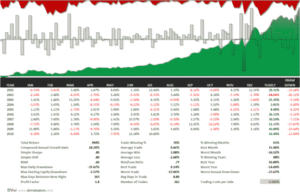

<!--yml
category: 未分类
date: 2024-05-12 18:20:31
-->

# DVI and SPY Performance | CSSA

> 来源：[https://cssanalytics.wordpress.com/2010/07/29/dvi-and-spy-performance/#0001-01-01](https://cssanalytics.wordpress.com/2010/07/29/dvi-and-spy-performance/#0001-01-01)

Michael at MarketSci has been reviewing some statistics on the  DVI: [http://marketsci.wordpress.com/2010/07/29/exploring-the-dvi-indicator-extreme-readings/](http://marketsci.wordpress.com/2010/07/29/exploring-the-dvi-indicator-extreme-readings/) . The tests that MarketSci has covered are long only going back to 1970\. Michael has done an excellent job showing overall how the DVI works.  To provide some added information, the DVI considers two factors in determining overbought (>.5) or oversold (<.5) readings: 1) the magnitude of the returns over an intermediate interval and 2) the stretch in terms of the ratio of up to down days over an intermediate interval. Some smoothing is built in intentionally to make the indicator an “axis of value” rather than a peak/valley indicator–such as conventional momentum oscillators (RSI2, DV2, Stochastics etc). This is reflected in the analysis by MarketSci in the recent post. The smoothed DVI takes longer to move from oversold to overbought and vice versa. This makes it a great complement to moving average strategies like the golden cross. Below is a backtest of going long/short the DVI at the median .5 levels. We used our upcoming tool DVixl to generate the backtest. DVixl is an excel-based platform that is extremely practical and easy to use. It will be available very soon with details to follow. Note that the DVI has absolutely crushed the S&P500 in the last few months.

