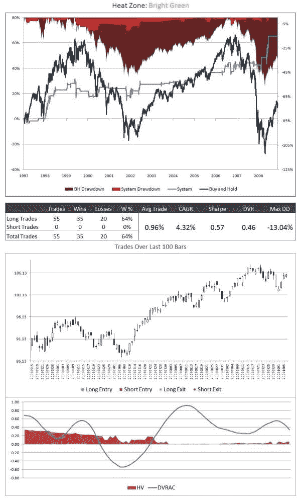

<!--yml
category: 未分类
date: 2024-05-12 18:45:51
-->

# DVRAC and Trading in the Zone | CSSA

> 来源：[https://cssanalytics.wordpress.com/2009/10/09/dvrac-and-trading-in-the-zone/#0001-01-01](https://cssanalytics.wordpress.com/2009/10/09/dvrac-and-trading-in-the-zone/#0001-01-01)

The DVRAC is a fantastic indicator and a better replacement for the ADX or any other trend filters. The smoothness of the readings allow for very simple trend following strategies to be profitable with less whipsaws. It is also a great way to help break the market into zones. Here is a simple example where the DVRAC indicates the presence of an uptrend and HV is above average. Trading in this zone is very low risk as you can see. ***to get more zone research and the DVRAC send us an email at*** [***dvindicators@gmail.com***](mailto:dvindicators@gmail.com)

***[click for larger image](https://cssanalytics.files.wordpress.com/2009/10/dvracheatzone-bg.jpg)***

