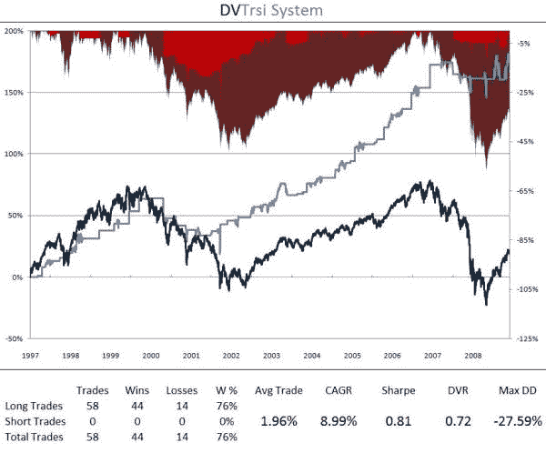

<!--yml
category: 未分类
date: 2024-05-12 18:46:43
-->

# DVTrsi | CSSA

> 来源：[https://cssanalytics.wordpress.com/2009/10/02/dvtrsi/#0001-01-01](https://cssanalytics.wordpress.com/2009/10/02/dvtrsi/#0001-01-01)

Ok folks, here is a preview of the DVTrsi trend system which also makes use of the RSI14\. Very good numbers for a trend-following system and strong accuracy and gains per trade. To get the indicator specs as well as the trading system rules, email us at  [dvindicators@gmail.com](mailto:dvindicators@gmail.com) and you will gain exclusive access to several free indicators and mini-trading systems prior to the launch of our new site **DV Indicators**. A complete DV Indicators package will be available soon with: 1) standard DV Indicators discussed in this blog 2) indicators that were discussed but were not disclosed 3) the supercharged DV2 and many other new indicators that have never been revealed.

