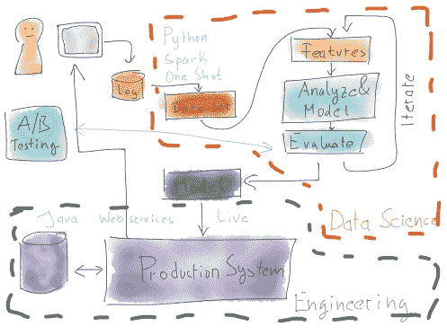

<!--yml
category: 未分类
date: 2024-05-18 05:29:04
-->

# Data Science into Production | Tales from a Trading Desk

> 来源：[https://mdavey.wordpress.com/2016/10/19/data-science-into-production/#0001-01-01](https://mdavey.wordpress.com/2016/10/19/data-science-into-production/#0001-01-01)

## Data Science into Production

“What is hardcore data science—in practice?” is a great [article](https://www.oreilly.com/ideas/what-is-hardcore-data-science-in-practice) on moving data science into production.  Figure 5 (image from article courtesy of Mikio Braun) nicely captures the two worlds,  capturing the data science exploratory world where “done” is a model that can be used in production.

The article is spot on with regards to the conclusion, don’t silo data scientist and engineers.  My preference is to have them all sitting together as part of one team 🙂

~ by mdavey on October 19, 2016.

Posted in [Agile](https://mdavey.wordpress.com/category/agile/), [Data](https://mdavey.wordpress.com/category/data/), [Uncategorized](https://mdavey.wordpress.com/category/uncategorized/)
Tags: [AI](https://mdavey.wordpress.com/tag/ai/), [DataAnalysis](https://mdavey.wordpress.com/tag/dataanalysis/)