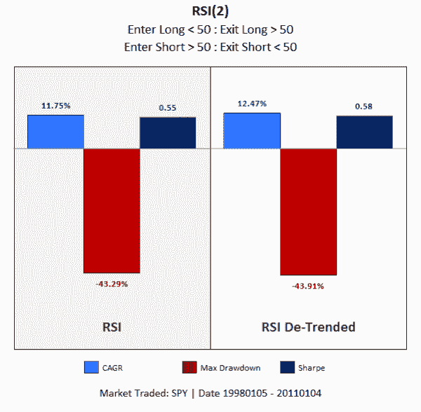
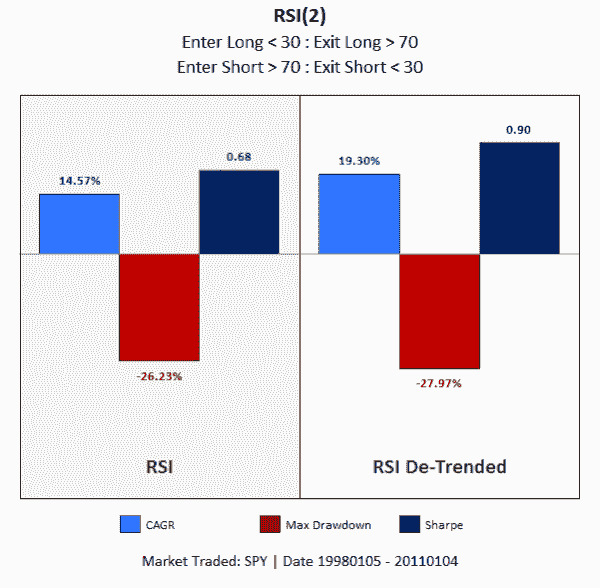

<!--yml
category: 未分类
date: 2024-05-12 18:14:05
-->

# De-Trending Indicators | CSSA

> 来源：[https://cssanalytics.wordpress.com/2011/01/11/de-trending-indicators/#0001-01-01](https://cssanalytics.wordpress.com/2011/01/11/de-trending-indicators/#0001-01-01)

*I would like to apologize to readers for my prolonged hiatus from writing educational material. I recently accepted the role of Chief Investment Officer at an asset management firm that I will formally introduce in the near future. The firm is based in Los Angeles, California. We have spent  several months conducting internal research and development to support the firm strategy.*

One of the common concepts in testing trading systems is to observe how systems perform on de-trended market data. That is, we would like to see how the performance of a system has benefited from the prevailing trend. If performance is unduly influenced by the long-term trend then it is possible that it does not in fact provide a significant trading edge. What CSS prefers to do to achieve this goal  is to either: 1) normalize the data for the current/historical environment or 2) create de-trended indicators. The latter method is the subject of this article.

The logic underlying de-trending the indicators versus de-trending the data from a performance measurement standpoint is straightforward: why not remove the influence of the trend on an oscillator to increase the profitability of its entries/exits versus merely using it as a tool for evaluation? Unbounded oscillators such as the DVU or the RSI are especially susceptible to being influenced by the current trend. Most traders vividly remember many examples in 2009 where RSI readings stayed above 90 for more than 5- 10 days at a time. This did not imply that the market was due for a correction, but in fact was just an indication of how strong momentum was during this period. In the examples below we have removed the 1-year trend from both indicators by subtracting out the net difference between the average values from center point (either zero in the case of DVU or 50 in the case of RSI). We used the 1-year average of the indicator values in this case, but you can use different lag periods depending upon which one best captures the dominant trend. As you can see, the de-trended indicators outperform the standard indicators in terms of both absolute and risk-adjusted returns. Small changes often make big differences– and big differences add up!

