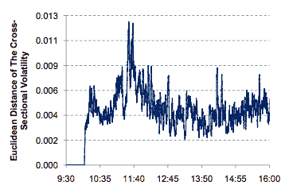

<!--yml
category: 未分类
date: 2024-05-18 13:44:50
-->

# Delay Embedding as Regime Signal | Quantivity

> 来源：[https://quantivity.wordpress.com/2011/02/24/delay-embedding-as-regime-signal/#0001-01-01](https://quantivity.wordpress.com/2011/02/24/delay-embedding-as-regime-signal/#0001-01-01)

Infantino and Itzhaki, in their 2010 thesis [Developing High-Frequency Equities Trading Models](http://hdl.handle.net/1721.1/59122), utilize a regime switching signal based upon *time delay embedding*. The intuition underlying this signal and use for [regime discovery](https://quantivity.wordpress.com/2010/02/15/regime-discovery/) are unexpectedly interesting.

 Conceptually, their signal is framed within the context of a *two-state switching regime* (interpreted in the classic technical sense): “momentum” or “mean reversion”. With high frequency equities portfolio data, they informally observe the familiar *volatility-regime correlation*: high volatility implies momentum (*e.g.* herd effects), low volatility implies mean reversion (*e.g.* market making).

In their words: “As the short-term changes in  appeared to be more pronounced — identified by very narrow peaks in the  time series — cumulative returns from the basic mean-reverting strategy seemed to decrease” (p. 44). Note  is a measure of cross-sectional volatility on dimensionally reduced returns (*i.e.* standard deviation of returns projected on dominant PCA eigenvectors). This relationship is illustrated in the right graphic.

How they translate this intuitive volatility-regime correlation into a switching signal is the fun part. They define the difference of  as , then define the following distance metric (illustrated in left image):

     ![E_H (t) = \sqrt{\sum\limits_{i=1}^H{[\psi(t - i)]^2}} = \sqrt{\sum\limits_{i=1}^H{[\sigma_D(t - i) - \sigma_D (t - i - 1)]^2}} ](img/a791147f939bc1094f96932289a5adeb.png)

This is an interesting starting point, as [dynamical systems](http://en.wikipedia.org/wiki/Dynamical_system) reminds us that  is a *phase space reconstruction for *, given  is the delayed chain of discrete i.i.d. steps walking backwards in time for . In other words, the following are vectors reconstructing the volatility from which mutual distance is being measured for each observed time :

![[ \psi(t - 1), \psi(t - 2), \cdots , \psi(t - H) ] ](img/25fdcccc0ca0f19bd694ec7f3534bcf7.png)

 From which they define a *binary regime signal*  as the positive first difference of :

    ![\omega = [ E_H(t) - E_H(t - 1) ] > 0 ](img/358a491cf76e06eb79ddc1005231f658.png)

From which the regime switch is defined:  indicates volatility is increasing and thus a “momentum” regime is appropriate. On the contrary,  indicates volatility is decreasing and thus a “mean-reverting” regime is appropriate.

This signal is quite interesting when considered within the larger context of several familiar time series analysis traditions:

Undoubtedly not by accident, the authors conveniently omit their choice of embedding dimension . Such is presumably left as an exercise for the reader, as selecting optimal embedding dimension is indeed well-known to be one of the most significant challenges in reconstruction.