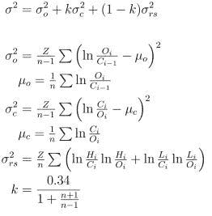
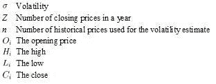
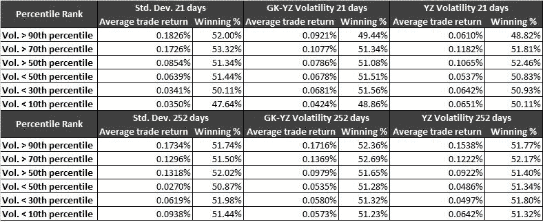

<!--yml
category: 未分类
date: 2024-05-18 14:05:34
-->

# Different Volatility Measures Effect on Daily MR – Quantum Financier

> 来源：[https://quantumfinancier.wordpress.com/2010/05/05/different-volatility-measures-effects-on-daily-mr/#0001-01-01](https://quantumfinancier.wordpress.com/2010/05/05/different-volatility-measures-effects-on-daily-mr/#0001-01-01)

Daily swing trading strategies these days are usually inclined towards MR rather than trend FT. While there is a lot of factor that moderate a daily MR strategy, one of particular interest is volatility. Usually, higher volatility is favorable for short-term strategies (think RSI 2). For this bit of research I tried several volatility formulas on several time frames and compared the effect on RSI 2 returns.

Methodology: I Applied RSI 2 strategy to SPY’s returns from 2000 then classified volatility in percentile. I used three different methods to compute volatility figures, the classic standard deviation, the Garman Klass – Yang Zhang and the Yang Zhang method. The following formulas explain how I came up with the figures; I used the volatility function of the [TTR package](http://cran.r-project.org/web/packages/TTR/index.html) in R:

Garman Klass – Yang Zhang method:

Yang Zhang method:

Where:

*The GK-YZ method allows for opening gaps while the YZ method is independent of both drift and opening gaps.

The table below shows average trade result and winning percentage by percentile for monthly (21 days) and annual (252 days) time frames. Note that these time frames were arbitrarily chosen and a future post will likely expand on this with different time frames.

At first glance, it seems that the added computation complexity does not significantly improve our system accuracy. On the monthly time frame though, the system average trade returns in the lower percentile was higher when mitigated by the YZ indicator. Regardless, the rest of the results were not significant enough for me to pronounce a volatility indicator better suited for a MR system. Traders might want to KISS and stay with the good old classic standard deviation.

QF