<!--yml
category: 未分类
date: 2024-05-18 13:45:32
-->

# Direction of Change Forecasting | Quantivity

> 来源：[https://quantivity.wordpress.com/2012/01/16/sign-direction-of-change-forecasting/#0001-01-01](https://quantivity.wordpress.com/2012/01/16/sign-direction-of-change-forecasting/#0001-01-01)

[Index Return Decomposition](https://quantivity.wordpress.com/2011/12/14/index-return-decomposition/) prompted several readers to inquire about *forecasting the signs of returns*, as implied by the 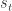 decomposition variable. This is an interesting topic worth review, quick survey of intuition from the literature, and some R code for exploratory analysis.

This topic is known as *direction-of-change* forecasting in the literature. Needless to say, successful prediction of the sign for future returns is quite interesting from a trading perspective. Traditionally, only univariate return series were considered; [Anatolyev (2008)](http://www.nes.ru/~sanatoly/Papers/DepRatio.pdf) is an exception, modeling two or more interrelated markets via dependence ratios. This literature tends to be a bit obtuse, due to commonly unstated stylistic assumptions regarding conditional return dynamics.

The traditional formulation for this topic considers the estimation of the probabilities of returns exceeding an upper or lower threshold 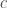, optionally conditioned on an information set 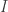 from the previous time step:

   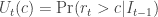
   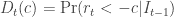

If , the probabilities reduce to forecasting positive or negative returns; for trading, a natural choice for  is roundtrip transaction costs:

   
   

Estimating these probabilities can be undertaken via several techniques. One approach is to use a logit model, based upon the logistic function:

   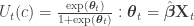

Where 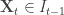 are explanatory variables from the previous time step. Challenge of this model is proper selection of explanatory variables.

An alternative approach is to consider the following functional decomposition for univariate return series:

   

Where 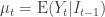 is the conditional expected value,  is the conditional variance, and 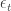 is a martingale with zero mean, unity variance, and conditional distribution function . From which the direction of change probabilities can be expressed:

   ![U_t(c) = \text{Pr} \left[ (\mu_t + \sigma_t \epsilon_t) > c \right] = \text{Pr} \left[ \epsilon_t > \left( \frac{c - \mu_t}{\sigma_t} \right) \right] ](img/5a217bea741b4e94a59967cae9effe28.png)

   ![D_t(c) = \text{Pr} \left[ (\mu_t + \sigma_t \epsilon_t) < -c \right] = \text{Pr} \left[ \epsilon_t < \left( \frac{-c - \mu_t}{\sigma_t} \right) \right] ](img/1340ed7a5fc3a9ffc00553dad4735f7b.png)

With corresponding conditional expectations:

   ![\text{E} \left[U_t(c) | I_{t-1} \right] = 1 - F_r(c | I_{t-1}) = 1 - F_{\epsilon} \left( \frac{c - \mu_t}{\sigma_t} | I_{t-1} \right) ](img/fc622942bec3329d45ee513239a781c8.png)
   ![\text{E} \left[D_t(c) | I_{t-1} \right] = F_r(c | I_{t-1}) = F_{\epsilon} \left( \frac{-c - \mu_t}{\sigma_t} | I_{t-1} \right) ](img/c1d512788180b38ef53d4eac92fba339.png)

These expectations simplify to the following when , assuming  (otherwise, expectation is constant and thus uninteresting):

   ![\text{E} \left[U_t(c) | I_{t-1} \right] = 1 - F_{\epsilon} \left( \frac{- \mu_t}{\sigma_t} | I_{t-1} \right) ](img/bf794237745a9b7c6cb6e4611a5653d6.png)
   ![\text{E} \left[D_t(c) | I_{t-1} \right] = F_{\epsilon} \left( \frac{- \mu_t}{\sigma_t} | I_{t-1} \right) ](img/c1d46838dcfedbe72144d2f383e48788.png)

These expectations can be evaluated explicitly via calculating the empirical distribution function  (requiring assumption of a parametric distribution), where  is the indicator function:

   

Alternatively, this decomposition suggests one potential formulation for the logit parameters 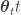 from the above model, where  is estimated by the logit and  are historical observations:

   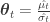

Of course, the non-trivial work is generating forecast estimates for next-step average conditional return  and conditional variance .

An alternative way to model the logit parameters  is to apply ARMA intuition with a binary autoregression (BARMA) due to [Startz (2006)](papers.ssrn.com/sol3/papers.cfm?abstract_id=886092), including lags for both autoregressive parameters and past indicator values, due to [Anatolyev (2008)](http://www.nes.ru/~sanatoly/Papers/DepRatio.pdf):

   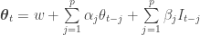

A survey of estimation techniques may be considered in a subsequent post, depending on reader interest.

* * *

One exploratory analysis technique relevant to sign forecasting is visualizing up/down runs, signed difference (*i.e.* up-down), and corresponding averages for a return series.

```

returnRuns <- function(r, bound=0, doPlot=TRUE, startAvg=5, avgLen=-1)
{
  # Generate up/down runs and average runs for a return series, optionally
  # plotting them.
  #
  # Args:
  #   r: return series
  #   bound: symmetric upper and lower bound, aka c
  #   doPlot: flag indicating whether plots should be generated for runs
  #   startAvg: Number of average runs which should be excluded for
  #             eliminating unstable average with few leading observations
  #   avgLen: number of periods over which to generate average; of -1 for
  #           entire period
  #
  # Returns: none

  up <- cumsum(ifelse(r > bound, 1, 0))
  down <- cumsum(ifelse(r < -bound, 1, 0))

  if (doPlot)
  {
    plot(up, main='Signed Runs: Up & Down', ylim=range(up,down))
    lines(down, col='red')
    legend("topleft",legend=c("Up","Down"), fill=colors, cex=0.5)

    plot(up-down, main="Signed Run Difference (up-down)")
  }

  if (avgLen == -1)
  {
    avgUp <- xts(sapply(c(1:length(up)), function(i) {
      up[i]/i
    }), order.by=index(up))
    avgDown <- xts(sapply(c(1:length(down)), function(i) {
      down[i]/i
    }), order.by=index(up))
  } else
  {
    avgUp <- xts(sapply(c(avgLen:length(up)), function(i) {
      start <- i - avgLen + 1
      last(cumsum(ifelse(r[start:i] > bound, 1, 0))) / avgLen
    }), order.by=index(up[avgLen:length(up)]))
    avgDown <- xts(sapply(c(avgLen:length(down)), function(i) {
      start <- i - avgLen + 1
      last(cumsum(ifelse(r[start:i] < bound, 1, 0))) / avgLen
    }), order.by=index(up[avgLen:length(up)]))
  }

  if (doPlot)
  {
    n <- length(avgUp)
    plot(avgUp[startAvg:n], main=paste("Average Runs: Up & Down (",avgLen," periods)",sep=""), type='l', ylim=range(avgUp,avgDown))
    lines(avgDown[startAvg:n], col='red')
    legend("topleft",legend=c("Up","Down"), fill=colors, cex=0.5)
  }

  return (list(up=up, down=down, avgUp=avgUp, avgDown=avgDown))
}

```

For example, the following plots illustrate CRM run dynamics from 2005 to present. First plot illustrates the running sums for both up and down returns, indicating negative returns are more prevalent:

[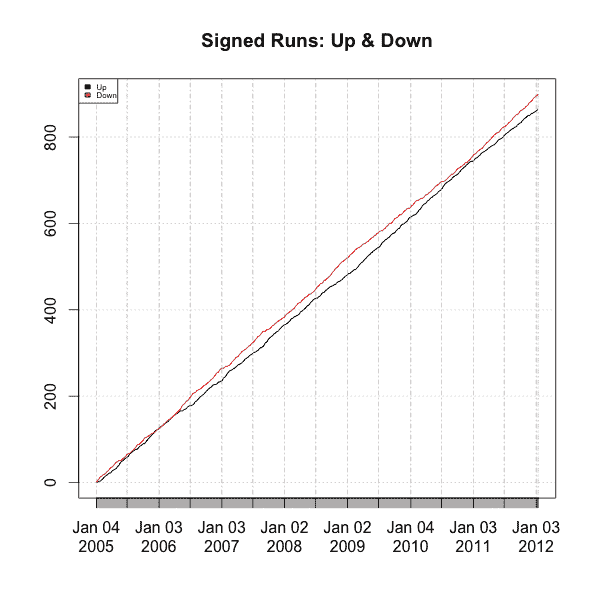](https://quantivity.wordpress.com/wp-content/uploads/2011/10/runs-signed.png)

Second plot illustrates the difference in signed sums, showing time-dynamics for the difference in up and down returns. Not surprising, this difference mirrors the CRM price curve closely:

[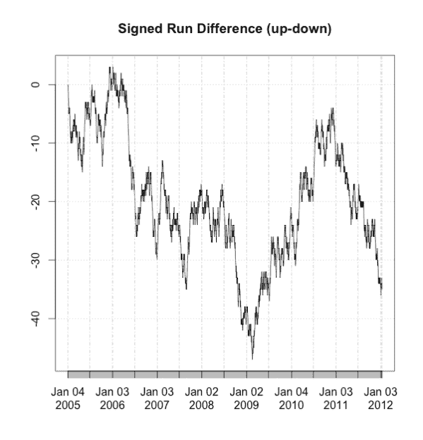](https://quantivity.wordpress.com/wp-content/uploads/2011/10/runs-diff.png)

Third plot illustrates the average probabilities for both up and down, running incrementally over the entire timeframe:

[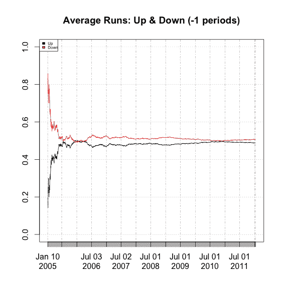](https://quantivity.wordpress.com/wp-content/uploads/2011/10/runs-avg.png)

* * *

The following are representative papers from the direction-of-change literature, ignoring the early papers focused on evaluating market efficiency (*e.g.* run tests):

*   [Forecasting Stock Indices: A Comparison of Classification and Level Estimation Models](http://www.neurogest.com/papers/forecasting_stock_indices.pdf), by Leunga, Daoukb, and Chenc (2000)
*   [Financial, Asset Returns, Market Timing, and Volatility Dynamics](http://papers.ssrn.com/sol3/papers.cfm?abstract_id=306127), by Christoffersen and Diebold (2002)
*   [Direction-of-Change Forecasts Based on Conditional Variance, Skewness and Kurtosis Dynamics: International Evidence](http://papers.ssrn.com/sol3/papers.cfm?abstract_id=908317), by Christoffersen *et al* (2004)
*   [Are the Directions of Stock Price Changes Predictable? Statistical Theory and Evidence](http://www.ims.nus.edu.sg/Programs/econometrics/files/ymh_paper.pdf), by Hong and Chung (2003)
*   [Evaluating Direction-of-change Forecasting: Neurofuzzy Models vs. Neural Networks](http://papers.ssrn.com/sol3/papers.cfm?abstract_id=675623), by Bekiros and Georgoutsos (2005)
*   [Modeling Financial Return Dynamics via Decomposition](http://www.cefir.ru/papers/WP95Anatolyev.pdf), by Anatolyev and Gospodinov (2007)
*   [Direction-of-change Forecasts and Trading Strategy Profitability at Intra-Day Horizons](http://www.nes.ru/dataupload/files/programs/econ/preprints/2007/Deliya.pdf), by Deliya (2007)
*   [Multi-Market Direction-of-Change Modeling Using Dependence Ratios](http://www.nes.ru/~sanatoly/Papers/DepRatio.pdf), by Anatolyev (2008)
*   [Forecasting the Direction of the U.S. Stock Market with Dynamic Binary Probit Models](http://ethesis.helsinki.fi/julkaisut/eri/hecer/disc/227/forecast.pdf), by Nyberg (2008)
*   [Direction-of-Change Financial Time Series Forecasting using Bayesian Learning for MLPs](http://www.iaeng.org/publication/WCE2008/WCE2008_pp1160-1165.pdf), by Skabar (2008)
*   [A Kernel-Based Technique for Direction-of-Change Financial Time Series Forecasting](http://www.springerlink.com/content/f53731054u1761w7/), by Skabar (2008)

*   [Optimal Probabilistic and Directional Predictions of Financial Returns](http://econlab.uom.gr/econdep/images/stories/tpanag/Thomacos_seminar.pdf), by Thomakos and Wang (2009)
*   [Directional Prediction of Returns under Asymmetric Loss: Direct and Indirect Approaches](http://www.cefir.ru/papers/WP136.pdf), by Anatolyev and Kryzhanovskaya (2009)
*   [Markets Change Every Day: Evidence from the Memory of Trade Direction](http://papers.ssrn.com/sol3/papers.cfm?abstract_id=1735352), Skouras and Axioglou (2011)

Finally, Kinlay briefly surveyed this topic in two posts on [volatility sign prediction](http://jonathankinlay.com/index.php/category/volatility-sign-prediction-forecasting-engle/).