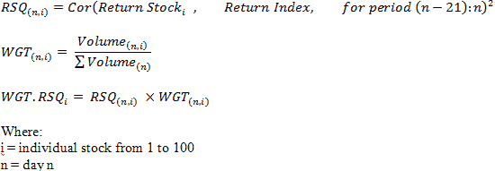
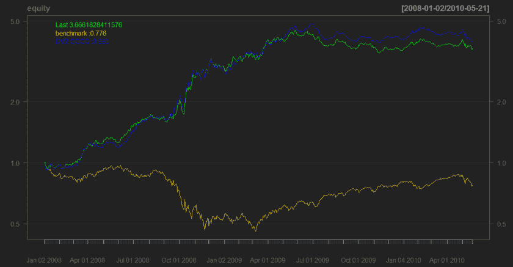
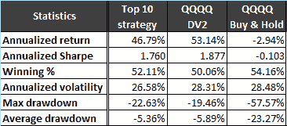

<!--yml
category: 未分类
date: 2024-05-18 14:04:59
-->

# Drivers of MR Performance – Quantum Financier

> 来源：[https://quantumfinancier.wordpress.com/2010/05/24/drivers-of-mr-performance/#0001-01-01](https://quantumfinancier.wordpress.com/2010/05/24/drivers-of-mr-performance/#0001-01-01)

A lot of the daily mean reversion strategies discussed in the blogosphere are designed for equity index ETFs or equity index mutual funds. Indexes being a group of individual stocks, if we could determine which stocks will drive the index returns or in this case, the behavior, we could adapt a strategy to profit from the prevailing market paradigm as indicated by the drivers of the index.

For example if the stocks affecting the index the most are exhibit mostly mean reverting behavior, we can expect the index to exhibit the same behavior. The same conclusion holds for trending behavior. The important point here is that indices are not an entity in themselves; they are made to reflect a certain sector/type of stocks/area etc. To illustrate the concept, I performed a simple test using the popular unbounded DV 2.

I used the Nasdaq 100 and its related ETF QQQQ to perform this test. First I needed a way to quantitatively identify the drivers of the market. For this purpose, I used a weighted r-squared. Many of you know that the r-square under its other name: the coefficient of determination. The statistic provides an indication of the level in which a series is predicted by another (i.e. the goodness of fit). To obtain it you can just elevate the correlation coefficient to the power 2\. For this test I looked at the r-squared only for the 21 previous days on a rolling basis. Then I looked at the volume of each individual component of the index relative to the total volume of all the components, and then weighted the r-squared with the proportion of the volume of this particular stock.

In a more rigorous form:

After this computation for every stock at every period n, I take the top 10 weighted r-squared stocks and compute their DV2 values, average it and trade the QQQQ using the signal given by the DV2 (long/short from 0). The results below compare this strategy, buy & hold QQQQ, and DV2 on the QQQQ data.

As you can see, the results are quite similar and as expected, highly correlated. It shows that in an index formed with 100 stocks, looking at only a select group with a big influence on the returns can help determine the MR performance of the index itself.

QF