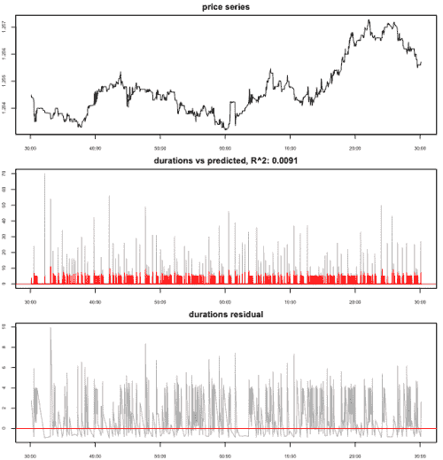
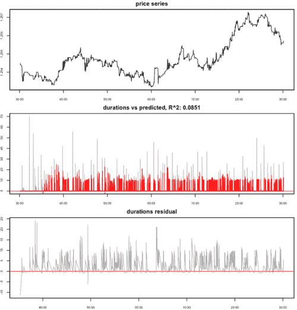
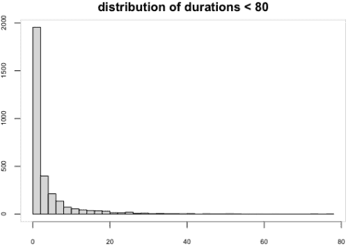
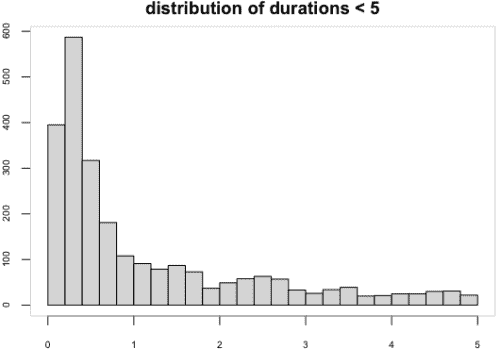

<!--yml
category: 未分类
date: 2024-05-18 15:36:35
-->

# Duration Estimation | Tr8dr

> 来源：[https://tr8dr.wordpress.com/2009/11/30/duration-estimation/#0001-01-01](https://tr8dr.wordpress.com/2009/11/30/duration-estimation/#0001-01-01)

November 30, 2009 · 8:35 pm

In a prior post mentioned that for intra-day variance prediction it made sense to separate variance into 2 processes:

1.  **intensity process**
    When is the next event going to occur;  lets call this Tprior + Δt.   This is the more complex process of the two to predict.
2.  **power process**
    What is the amplitude of the event at time Tnow + Δt.   The power or amplitude process seems to be fairly well behaved.   An ARMA style process seems like a likely candidate.

Towards this end, I have been exploring models for the intensity process.   Very often this is modeled in terms of duration.   Below is a summary of some results:

**ACD Models** ACD processes make overreaching assumptions.  In particular ACD models assume a constant AR decay and innovation contribution across time.   Unfortunately this is not supported by empirical observations.   Here are some results for the best-fitting Wiebull ACD model on HF data:

The R^2 level of 0.0091 does not inspire confidence.

**SVR Model** I used an iterative non-parametric machine learning approach (SVR) with a training set of 20 prior observations and a lagged series of the derivatives of the prior 20 durations as the input vector.   Training across the entire series, one gets an in-sample prediction R^2 of 0.9980.   Unfortunately, incremental out of sample does not fair as well:

**Distribution of Durations**
Here are 2 views on the distribution of durations:

**Alternative Models** Some possibilities:

1.  **markov chain** (probabalistic state system)
    We model the patterns by categorizing the durations into K separate levels.   To train we observe the chain of states, say {K1, K8, K1,K1,K1,K4} and determine a graph describing the approximate event chains, factorizing and assigning probabilities.
2.  **ANN**
    Use a simple feed-forward network, trained with a GA or DE.   This is easy to implement but subject to a variety of problems such as overfitting.

As the ANN is easy to compose, will start there.