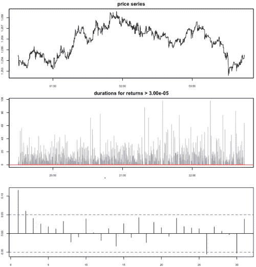
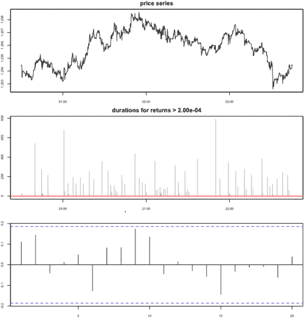

<!--yml
category: 未分类
date: 2024-05-18 15:36:55
-->

# Durations on Intraday Price Series | Tr8dr

> 来源：[https://tr8dr.wordpress.com/2009/11/27/durations-on-intraday-price-series/#0001-01-01](https://tr8dr.wordpress.com/2009/11/27/durations-on-intraday-price-series/#0001-01-01)

November 27, 2009 · 1:55 pm

As mentioned in a [previous post](https://tr8dr.wordpress.com/2009/11/26/rethinking-variance/), I intend to model quadratic variation in terms of multiple pairings of intensity (duration) and return level processes.   At a minimum want a pairing for “non-jump” related returns and a pairing for “jump” related returns.

To do this it is necessary to partition returns into the categories based on threshold.   We may further want to disregard price movements below a certain level unless they cumulatively add up to a return with significance within a period.   Towards this end my duration measurement function uses a threshold to determine whether a return is to be considered as an event or not.  In pseudocode:

```
r ← {0} ∪ diff(log(series))
t ← times (series)
durations ← {}
for (i in 2:length(r))
{
    # determine cumulative return since last acceptance
    cumr ← *<cummulative return since last event or max cum window>*

    # determine whether qualifying event has occurred
    if (|cumr| ≥ threshold or |r[i]| ≥ threshold)
        durations ← durations ∪ {t[i] - *<Tlastevent>*}
}

```

For the diffusion portion of the process, in this 2 second sampled data set (EUR/USD low-liquidity period), a threshold of 3e-5 (equivalent of about 1/2 pip), seems to work well:

[](https://tr8dr.wordpress.com/wp-content/uploads/2009/11/picture-115.png)

The jump portion of the process should be set so as to capture desired jump features and not much more, here I show with a threshold of 2e-4 (equivalent to about 3 pips):

[](https://tr8dr.wordpress.com/wp-content/uploads/2009/11/picture-215.png)