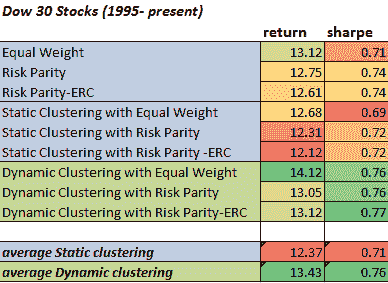

<!--yml
category: 未分类
date: 2024-05-12 18:02:17
-->

# Dynamic versus Static Clustering: Dow 30 Stocks 1995- Present | CSSA

> 来源：[https://cssanalytics.wordpress.com/2013/01/14/dynamic-versus-static-clustering-dow-30-stocks-1995-present/#0001-01-01](https://cssanalytics.wordpress.com/2013/01/14/dynamic-versus-static-clustering-dow-30-stocks-1995-present/#0001-01-01)

A natural comparison for an allocation method that makes use of [dynamic clustering](https://cssanalytics.wordpress.com/2013/01/11/a-backtest-using-dynamic-clustering-versus-conventional-risk-parity-methods/ "A Backtest Using Dynamic Clustering versus Conventional Risk Parity Methods") is to use a static clustering method. An example of the use of static clustering are the sector classifications made by large index firms. Typically clusters are formed based on the type of business or industry associated with a company (ie utilities, energy etc). The Dow Jones Industrial Average contains 30 large cap stocks that have a very long trading history. Furthermore, each stock can be easily classified by their respective [S&P sector ](http://www.sectorspdr.com/) . This static clustering can also form as the basis for incorporating [risk parity](https://cssanalytics.wordpress.com/2012/07/19/not-equal-a-comparison-of-risk-parity-and-equal-risk-contribution/ "Not Equal: A Comparison of “Risk Parity” and “Equal Risk Contribution”") methods for  portfolio allocation. The following tests were done in R by **Michael Kapler** at **[Systematic Investor](http://systematicinvestor.wordpress.com/) **using [Principal Components](http://systematicinvestor.wordpress.com/2012/12/29/clustering-with-selected-principal-components/) for dynamic clustering.

As you can see, dynamic clustering holds a small but consistent advantage over static clustering. The dynamic method produces higher returns and risk-adjusted returns over a long backtest period. Once again, [Cluster Risk Parity](https://cssanalytics.wordpress.com/2013/01/06/cluster-risk-parity-crp-versus-risk-parity-rp-and-equal-risk-contribution-erc/ "Cluster Risk Parity (CRP) versus Risk Parity (RP) and Equal Risk Contribution (ERC)") (dynamic clustering with risk parity or risk parity-erc) does better than any other risk parity variant. Furthermore, **dynamic clustering also produces better returns and risk adjusted returns than non-clustering methods**. Interestingly, static clustering was not as effective as ignoring clusters altogether. This suggests that the changing volatility and correlation contain information that is exploitable on a dynamic basis. This finding is intuitive with respect to volatility —which is highly forecastable–but may be surprising to many critics that claim correlations are not useful. In fact, looking at dynamic clustering with equal weight versus just regular equal weight suggests that they have the greatest contribution to excess performance in this dataset. This makes sense considering that most stocks have similar volatility, but their correlations can be time-varying.

While this test is by no means conclusive- it again supports the logical and theoretical conclusion that clustering is valuable within a dynamic approach to portfolio allocation.  It also suggests that dynamic clustering is a viable alternative to static clustering-which is cumbersome and may not have a precedent for a given universe of stocks or assets. The usefulness of dynamic clustering versus static clustering depends on the predictability of the distance metric- which in this case were the sample correlations.While I agree that correlations can be noisy and need to be stabilized, it is better to attempt to incorporate information that is likely to be useful if there is a reasonable expectation that it can be forecasted than to omit such information altogether. One can always improve the correlation forecast or use a different set of distance metrics.