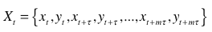
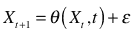
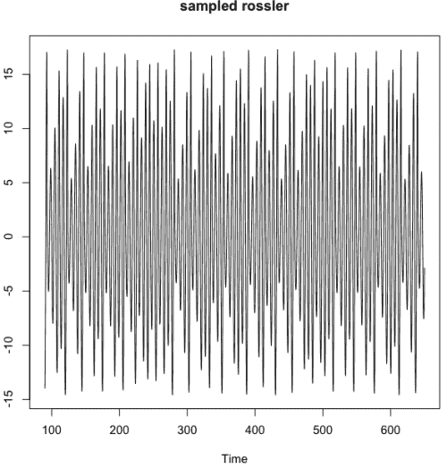
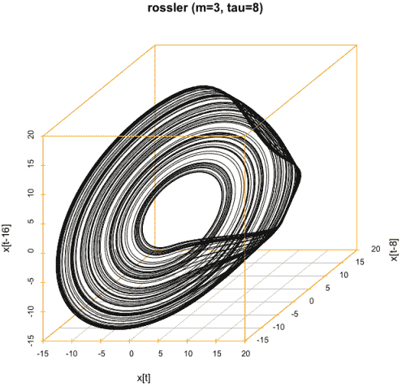
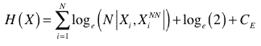
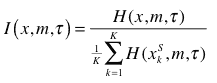

<!--yml
category: 未分类
date: 2024-05-18 15:31:21
-->

# Embedding | Tr8dr

> 来源：[https://tr8dr.wordpress.com/2010/09/16/embedding/#0001-01-01](https://tr8dr.wordpress.com/2010/09/16/embedding/#0001-01-01)

One of my strategies uses a nearest neighbor approach on a set of multivariate vectors.   I had not formalized the process of choosing the variables / composing the vectors in the model.  It turns out that chaos theory provides a strong grounding and closely relates in that both use near-neighbor analysis extensively.

Given a multivariate timeseries (say 2 variables x,y), is there some “embedding” of:

such that Xt+1 can be predicted by a stationary or locally stationary mapping θ based on the prior embedding tuple:

This formalism is used in non-linear dynamics to reconstruct the phase space of chaotic dynamic systems that have periodicity around an attractor.   In finance there are multiple attractors:

1.  the mean is an attractor
    In the case of returns, 0 tends to be the attractor
2.  long run elliptical distribution
    Short-term observed distributions come in various forms, but tend to revert to elliptical over longer periods.

With embedding one needs to determine the variable set, the number of lagged values (the embedding dimension **m**) and the embedding lag **τ**.  The idea with the embedding is that it provides exactly enough information to construct the reproducing function.

Here is an example of the Rossler attractor.  Looking at the samples of one of its dimensions (X) we see the following timeseries:

We are able to reconstruct the phase space with an embedding of 3 and optimal lag of 8:

In practice the trajectory of the embedding should have the following attributes

1.  spreads out the trajectory smoothly through its phase space hypercube
2.  keeps periodic trajectories close to each other in space
3.  Most importantly reduces the entropy in its phase space

The optimal choice of embedding makes the mapping of θ all the more effective.   I won’t go into all of the theory of the above, would involve a text.   However, there are some problems to be solved.    How does one choose an optimal embedding (dimension and lag) and what about the mapping function?

**Standard Approach to Determining Optimal Embedding
Surprisingly the standard approach seems to be rather ad-hoc.   The “false nearest neighbor” algorithm is usually used to determine the embedding dimension.  The algorithm is applied to successively higher dimensions to find the minimum “false neighbors”.   The nearest neighbor for a given point in time on a trajectory should be spacially within some epsilon, otherwise is considered not to be a true neighbor.**

**Rather than go into what that means and the algorithm, the problem is that one has to choose appropriate epsilon and also this only optimises one variable of the problem (embedding dimension).   Tau is not completely orthogonal to embedding dimension.**

**Tau in turn is traditionally computed using mutual information or correlation dimension analysis.   With precautions one can use these, but is not a good approach if automation is required.**

****Information Theoretic Approach
Gautama, Mandic, and Van Hulle provided a new approach to selecting optimal embedding dimension m and lag τ which optimises these together and with less subjective measures.   Their approach uses the Kozachenko-Leonenko estimate of differential entropy:****

********

****where the |·| portion is the euclidean distance between the ith vector and its nearest neighbor.   Ce is the Euler constant 0.5772.****

****The notion is that the optimal choice of dimension and lag will have minimal entropy.   We can parameterize as H(x,m,τ) to provide a measure on the data for differing dimension and lag.****

****Finally due to bias introduced with increasing dimension in the context of autocorrelation, the value needs to be normalized with an average of whitened (randomly shuffled) series.**** ****In their implementation they produce K=5 whitened series and take the average.****

Ultimately the measure is as follows:

****

This function can then be minimized for **m** and **τ**.

****Mapping Function
I will discuss mapping functions at a later date.   For noisy data, the most common approach is to apply a polynomial basis across the X[t-1] near-neighbor successors to arrive at a next period estimate.****