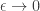
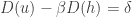
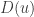
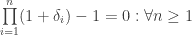
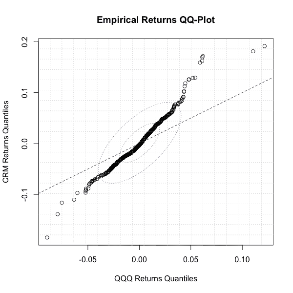

<!--yml
category: 未分类
date: 2024-05-18 13:48:30
-->

# Empirical Quantiles and Proxy Selection | Quantivity

> 来源：[https://quantivity.wordpress.com/2011/10/03/empirical-quantiles-proxy-cross-hedging-selection/#0001-01-01](https://quantivity.wordpress.com/2011/10/03/empirical-quantiles-proxy-cross-hedging-selection/#0001-01-01)

The previous post on [Proxy / Cross Hedging](https://quantivity.wordpress.com/2011/10/02/proxy-cross-hedging/) left open an important question: how to choose an appropriate hedge instrument, especially amongst several alternatives. Prior to diving into full exploratory data analysis for proxy hedging (in a forthcoming post), this question is worth careful consideration.

One way to approach this problem is via visualization of *empirical quantiles*.

Consider the defining characteristic of an *ideal proxy* for neutralizing price: the difference in weighted prices of  and  is zero for *arbitrarily few samples* (where sampling frequency is assumed to be no larger than the rebalancing period). The hard part is the requirement for arbitrarily few samples; more formally, the  time series for ideal must satisfy:

   

Rather than the much looser requirement that  in .

Contrast this requirement with how statistics normally approaches this problem, using techniques essentially derived from [moment generating functions](http://en.wikipedia.org/wiki/Moment_generating_function). Measure theory would incorporate [almost sure equality](http://en.wikipedia.org/wiki/Random_variable#Almost_sure_equality). Yet, the ideal proxy conceptually demands more than both; it demands *equality in empirical distribution*. Hence, any prospective solution must be framed in terms of both empirical samples and the *entire* distribution of both  and .

Thus, the question boils down to evaluating joint comparison and equality of empirical distributions. Doing this using raw prices is unnatural, as the two instruments use different metrics. Instead, transform into *linear* returns for both (not log) and convert into a single returns metric. Thus, reformulating the proxy hedge model, using the discrete derivative operator :

   

From which the empirical distributions for  and  can be generated, and ideal proxy reformulated as:

   

When this equality holds, the empirical distributions are strictly equal, subject to the linear  scaling. Now, the question boils down to evaluating distributional equality while ignoring . For this, we appeal to quantile analysis (previously discussed in the context of [stability](https://quantivity.wordpress.com/2009/08/03/stability-by-quantile/), and nicely exemplified in research by [Koenker](http://www.econ.uiuc.edu/~roger/)). Specifically, use of [quantile-quantile (QQ) plot](http://en.wikipedia.org/wiki/Q-Q_plot).

Consider the QQ for both empirical distributions  and , rather than traditional comparison between theoretical and empirical. Thus, the plot illustrates the desired visualization of empirical distributional similarity. Most importantly, the  scaling disappears due to measurement in units of quantile. Further, this approach is non-parametric, obviating the need to posit distributional assumptions on either instrument.

From this QQ, the evaluation of proxy optimality is made visible:

*   **Optimality**: ideal proxy hedge will have a qq line which passes through all observations
*   **Divergence**: divergence from optimality is manifest by observations away from the quantile line, whose respective distance away from the (0,0) origin reflects its corresponding frequency of occurrence

For example, consider the following *proxy QQ plot*:
[](https://quantivity.wordpress.com/wp-content/uploads/2011/10/empirical-proxy-qq-plot.png)

Which plots the *empirical quantiles* of daily returns for a well-known high tech company (CRM) versus the Nasdaq-100 Index (QQQ). The solid dashed line is the `(0,1)` line, reflecting distributional equality. The dotted blue and red ellipses are location dispersion ellipsoids for the two distributions (following [Meucci 2010](http://papers.ssrn.com/sol3/papers.cfm?abstract_id=1548162)).

Thus, visual inspection of this plot quickly rules QQQ out as an effective proxy:

*   Observations across all quantiles are off the line, indicating ineffectiveness at all quantiles
*   Dispersion ellipsoids are significantly rotated, indicating the principal component is strong misaligned
*   Outliers in the tails demonstrate both extreme divergence and non-linearity

Thus, not only is QQQ a bad proxy, it is arguably a dangerous proxy from tail risk standpoint: big moves in CRM will be badly underhedged by QQQ. So much for the standard hedging claims of QQQ futures.

What is particularly notable is these observations are drawn from a single plot. As the next post on full exploratory data analysis for proxy hedging will illustrate, this is further notable as numerous other more popular visualizations illustrate the *contrary* conclusion.

For readers interested in further study, [Doyle (2010)](http://papers.ssrn.com/sol3/papers.cfm?abstract_id=1596602) discusses several further mathematical nuances of empirical QQ plots.

* * *

R code to generate the proxy QQ plot:

```

proxyQQPlot <- function(p)
{
  # Plot proxy QQ plot, including empirical quantiles and location dispersion ellipsoids.
  #
  # Args:
  #   p: xts of instrument price data, including valid colnames
  #
  # Returns: None

  p1ROC <- ROC(p[,1], type="discrete", na.pad=FALSE)
  p2ROC <- ROC(p[,2], type="discrete", na.pad=FALSE)

  qqplot(coredata(p2ROC), coredata(p1ROC), xlab=paste(colnames(p)[2], "Returns Quantiles"), ylab=paste(colnames(p)[1], "Returns Quantiles"), main="Empirical Returns QQ-Plot")
  abline(0,1,lty=2)
  grid(20)
  par(xpd=TRUE)
  d <- dataEllipse(as.vector(coredata(p2ROC)),as.vector(coredata(p1ROC)),draw=FALSE)
  lines(d[[1]], col=colors[2], lty=3)
  lines(d[[2]], col=colors[3], lty=3)
  par(xpd=FALSE)
}

```