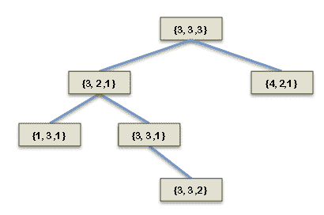

<!--yml
category: 未分类
date: 2024-05-18 15:32:14
-->

# Evaluating High Dimensional Expectation | Tr8dr

> 来源：[https://tr8dr.wordpress.com/2010/08/31/evaluating-high-dimensional-expectation/#0001-01-01](https://tr8dr.wordpress.com/2010/08/31/evaluating-high-dimensional-expectation/#0001-01-01)

Here I am going to outline a simple approach to evaluating a high dimensional discrete expectation on empirical data.   For example, if one considers the evaluating an expectation like:

Let’s say X is of dimension 10 and we have a 10000 x 10 matrix of observations.   Furthermore each of the 10 variables can take 5 possible states:

X0 = { 1,4,4,1,1,1,1,3,3,2 }
X1 = { 1,2,2,2,1,1,1,5,5,2 }
….

The total number of possible distinct state vectors is 5^10 or over 9 million.   A naive approach to the above integral is to consider all possible sequences of X, but this would be enormously expensive and will not scale as the dimension or number of individual states grows.

The distribution is going to be sparse.  We know this because 5^10 >> 10,000 observations.   The worst case algorithm would involve a scan for a given pattern, calculating the frequency.   This poor approach would have complexity  **O(N S^d)**, where **N** is the number of samples, **S** is the number of distinct symbols, and **d** is the dimension.

Some simple observations:

1.  It makes sense to restrict the domain of the integral to existant sequences (get rid of complexity S^d)
2.  It makes sense to avoid multiple passes, where naively there would be a pass for each frequency calculation

Since we are dealing with a finite sample and known symbols there is an approach that is **O (N log N)**.   We create a binary or n-nary tree ordered lexically by symbol sequence.   Iterating through the samples, for each sample locate or insert a node in the tree, tracking its frequency.   Increment frequency.

The tree is rearranged as necessary to create balance and reduce the average path length to log N.  In one pass we now know both the domain of the distribution and the frequencies.   The expectation is now straight-forward to evaluate.

Note that instead of using a tree, one can use a hash-table keyed off of sequences.   This will result in an O(N) algorithm.   For some applications, though, it is useful to have a tree that places neighbors close to each other (for instance if we want to run a near neighbor analysis).