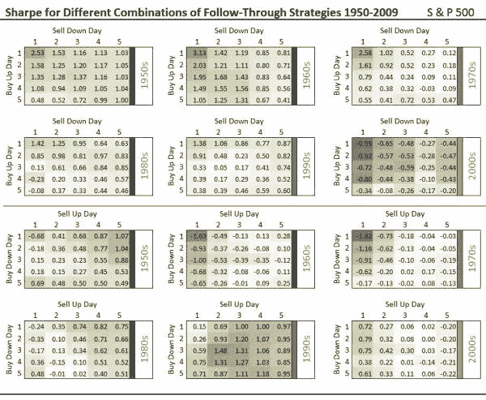
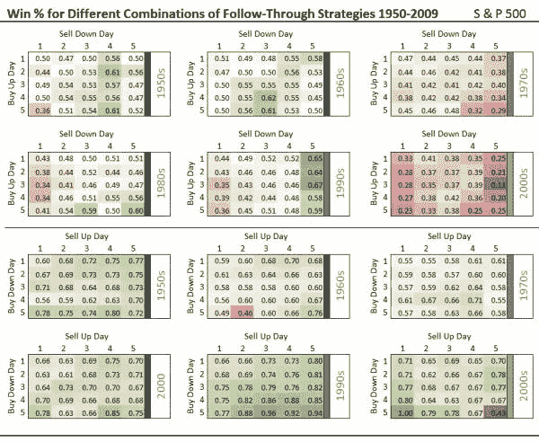

<!--yml
category: 未分类
date: 2024-05-12 18:47:45
-->

# Evidence Regarding Run Frequency Using Time Machine Strategy Data | CSSA

> 来源：[https://cssanalytics.wordpress.com/2009/09/22/evidence-regarding-run-frequency-using-time-machine-strategy-data/#0001-01-01](https://cssanalytics.wordpress.com/2009/09/22/evidence-regarding-run-frequency-using-time-machine-strategy-data/#0001-01-01)

**click on image to see full size**

